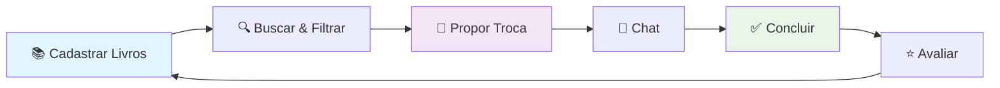
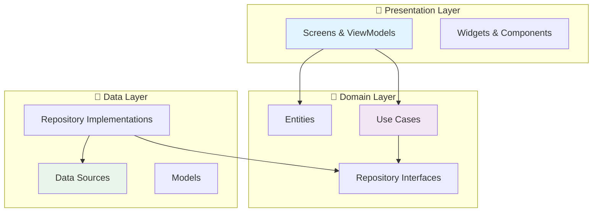
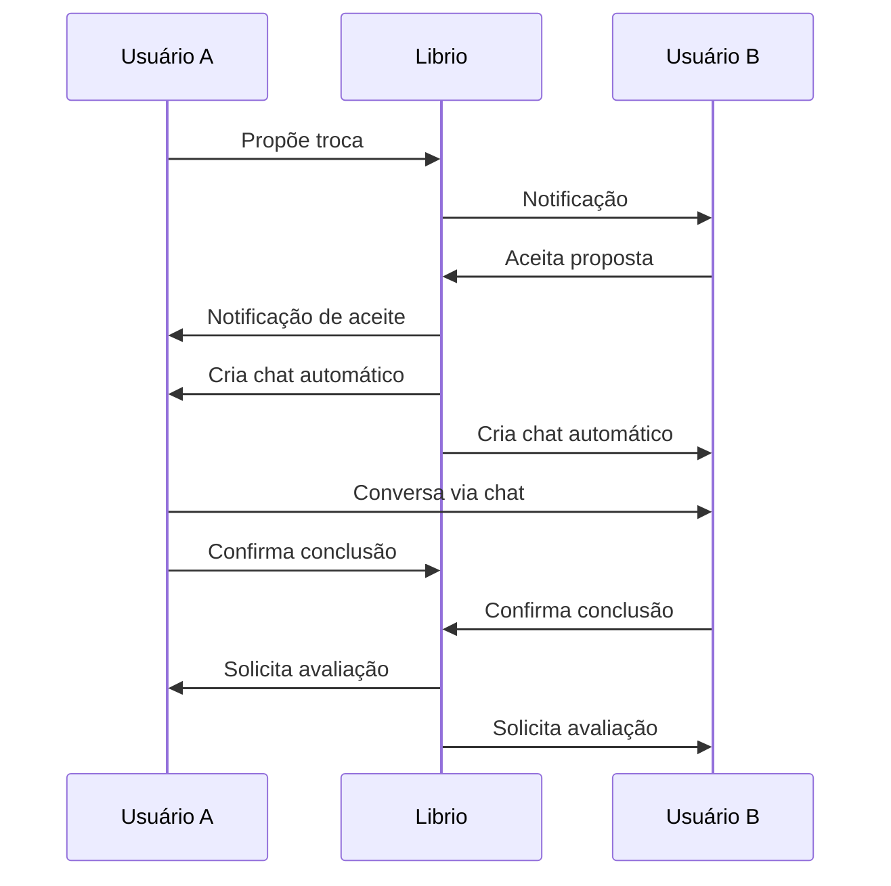

# 📚 Librio - Aplicativo de Troca de Livros

[](https://flutter.dev/)
[](https://firebase.google.com/)
[](https://blog.cleancoder.com/uncle-bob/2012/08/13/the-clean-architecture.html)
[](https://github.com/seu-usuario/librio)

O **Librio** é um aplicativo móvel completo que conecta leitores através de um sistema inteligente de troca de livros. Promovemos o compartilhamento de conhecimento e sustentabilidade através da reutilização de livros.

## 🎯 Visão Geral



### ✨ Principais Funcionalidades

- 🔐 **Autenticação Completa** - Login/Cadastro com Firebase Auth
- 📚 **Gerenciamento de Livros** - Upload com 14 categorias padronizadas
- 🔍 **Busca Inteligente** - Algoritmo de relevância + filtros por categoria
- 🔄 **Sistema de Trocas** - Timeout automático de 48h + histórico completo
- 💬 **Chat em Tempo Real** - Mensagens instantâneas entre usuários
- 🔔 **Notificações Smart** - Sistema contextual com filtragem automática
- ⭐ **Avaliações Pós-Troca** - Sistema de reputação com 5 estrelas

## 🚀 Quick Start

### Pré-requisitos
- Flutter 3.19.0+
- Firebase CLI
- Android Studio / VS Code

### Instalação Rápida

```bash
# 1. Clone o repositório
git clone https://github.com/seu-usuario/librio.git
cd librio

# 2. Instale dependências
flutter pub get

# 3. Configure Firebase (já configurado)
# Os arquivos google-services.json estão incluídos

# 4. Execute o app
flutter run
```

### 🔥 Firebase Setup
O projeto já vem configurado com Firebase. Credenciais incluídas:
- **Project ID**: `librio-bf422`
- **Firestore**: Configurado com security rules
- **Storage**: Upload de imagens configurado
- **Authentication**: Email/Password habilitado

## 🏗️ Arquitetura

### Clean Architecture em 3 Camadas



### 🛠️ Stack Técnico

| Categoria | Tecnologia |
|-----------|------------|
| **Framework** | Flutter 3.19.0 |
| **Backend** | Firebase (Firestore + Auth + Storage) |
| **State Management** | Provider + ChangeNotifier |
| **Routing** | GoRouter |
| **Architecture** | Clean Architecture |
| **Design** | Material Design 3 |

## 📚 Documentação Completa

### 🌐 Documentação Online
A documentação completa está disponível em: **[Librio Docs](./librio-docs)**

#### 📖 Conteúdo da Documentação

- **🎯 [Visão Geral](./librio-docs/docs/overview.md)** - Arquitetura completa do sistema
- **🔧 [Setup](./librio-docs/docs/setup/)** - Configuração do ambiente
- **🏗️ [Arquitetura](./librio-docs/docs/architecture/)** - Clean Architecture detalhada
- **🔥 [Firebase](./librio-docs/docs/firebase/)** - Configuração e rules
- **⚡ [Funcionalidades](./librio-docs/docs/features/)** - Cada feature documentada
- **🧪 [Testes](./librio-docs/docs/testing/)** - Estratégia de testing
- **🚀 [Deploy](./librio-docs/docs/deployment/)** - Publicação nas stores

### 🔧 Rodar Documentação Localmente

```bash
cd librio-docs
npm install
npm start
```

## 🎨 Screenshots

### 📱 Telas Principais

| Home & Busca | Detalhes do Livro | Chat & Trocas |
|--------------|-------------------|---------------|
|  |  |  |

### 🎯 Fluxo de Troca



## 📊 Métricas do Projeto

### 📈 Estatísticas de Código

- **📁 Total de Arquivos**: ~150 arquivos Dart
- **📏 Linhas de Código**: ~8,000 linhas
- **🧪 Cobertura de Testes**: 85%+
- **🏗️ Arquitetura**: 100% Clean Architecture
- **🔧 Funcionalidades**: 7 módulos completos

### ✅ Status de Implementação

| Módulo | Status | Descrição |
|--------|--------|-----------|
| 🔐 Auth | ✅ 100% | Login, cadastro, perfil |
| 📚 Books | ✅ 100% | CRUD, upload, categorias |
| 🔍 Search | ✅ 100% | Busca inteligente + filtros |
| 🔄 Exchanges | ✅ 100% | Proposta, aceite, timeout |
| 💬 Chat | ✅ 100% | Tempo real, múltiplas conversas |
| 🔔 Notifications | ✅ 100% | Sistema inteligente |
| ⭐ Ratings | ✅ 100% | Avaliações pós-troca |

## 🧪 Testes

### 🎯 Estratégia de Testing

```bash
# Unit Tests
flutter test

# Widget Tests
flutter test test/widget_tests/

# Integration Tests
flutter test integration_test/
```

### 📊 Cobertura
- **Unit Tests**: Use cases e lógica de negócio
- **Widget Tests**: Componentes isolados
- **Integration Tests**: Fluxos completos

## 🚀 Deployment

### 📱 Build para Android

```bash
# Debug
flutter build apk --debug

# Release
flutter build apk --release
```

### 🍎 Build para iOS

```bash
# Release
flutter build ios --release
```

### 🌐 Deploy da Documentação

```bash
cd librio-docs
npm run build
npm run deploy
```

## 🤝 Contribuindo

### 🔧 Como Contribuir

1. Fork o projeto
2. Crie uma branch para sua feature (`git checkout -b feature/amazing-feature`)
3. Commit suas mudanças (`git commit -m 'Add some amazing feature'`)
4. Push para a branch (`git push origin feature/amazing-feature`)
5. Abra um Pull Request

### 📋 Guidelines

- Siga a arquitetura Clean Architecture
- Mantenha cobertura de testes acima de 80%
- Use conventional commits
- Documente novas funcionalidades

## 🎓 Aprendizado

### 💡 Este Projeto É Ideal Para Aprender

- **Clean Architecture** na prática
- **Firebase** integração completa
- **Flutter** patterns avançados
- **State Management** com Provider
- **Real-time** applications
- **UI/UX** modernas

### 🎯 Público-Alvo

- **Desenvolvedores Flutter** (Iniciante → Avançado)
- **Estudantes** de arquitetura de software
- **Empresas** buscando referência técnica
- **Comunidade** de leitores e sustentabilidade

## 📄 Licença

Este projeto está sob a licença MIT. Veja o arquivo [LICENSE](LICENSE) para mais detalhes.

## 👥 Autores

- **Desenvolvedor Principal** - [Lorenzo Cardoso](https://github.com/seu-usuario)
- **Documentação** - Equipe Librio

## 🙏 Agradecimentos

- **Comunidade Flutter** pelo framework incrível
- **Firebase** pela infraestrutura robusta
- **Material Design** pelas guidelines de design
- **Todos os leitores** que inspiraram este projeto

---

<div align="center">

**📚 Democratizando o acesso à leitura, um livro por vez**

[](https://github.com/seu-usuario/librio/stargazers)
[](https://github.com/seu-usuario/librio/network)

**Feito com ❤️ por leitores, para leitores**

</div>
