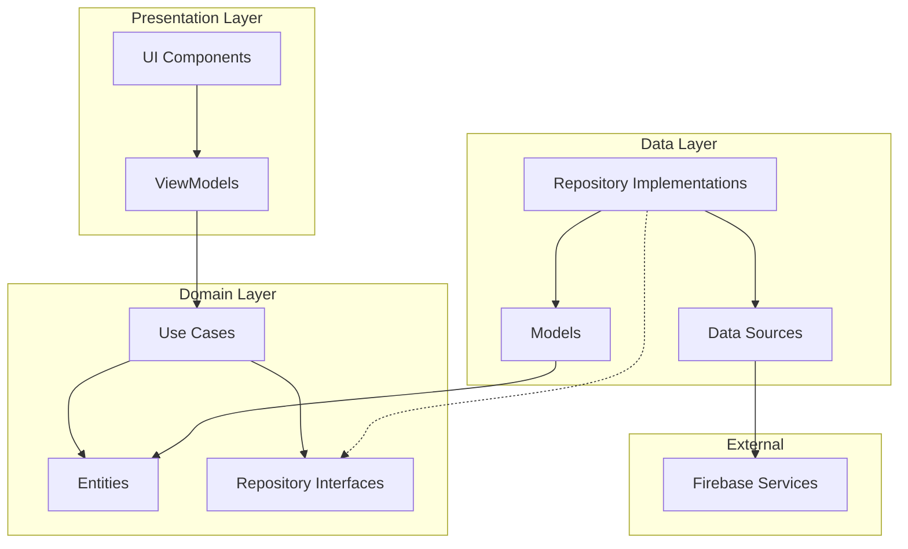

# Clean Architecture - Estrutura Detalhada

O projeto Librio segue os princípios da **Clean Architecture** proposta por Robert C. Martin, garantindo separação de responsabilidades, testabilidade e manutenibilidade do código.

## Estrutura de Camadas



## Camada de Domínio (Domain Layer)

### Entidades

As entidades representam as regras de negócio fundamentais:

```dart
// lib/src/domain/entities/user.dart
class User {
  final String id;
  final String email;
  final String name;
  final String? photoUrl;
  final DateTime createdAt;
  final DateTime updatedAt;

  const User({
    required this.id,
    required this.email,
    required this.name,
    this.photoUrl,
    required this.createdAt,
    required this.updatedAt,
  });

  // Regra de negócio: usuário válido deve ter email e nome
  bool get isValid => email.isNotEmpty && name.isNotEmpty;
}
```

### Use Cases

Encapsulam as regras de negócio específicas:

```dart
// lib/src/domain/usecases/create_exchange_usecase.dart
class CreateExchangeUseCase {
  final ExchangeRepository _repository;

  CreateExchangeUseCase(this._repository);

  Future<Either<Failure, Exchange>> call(CreateExchangeParams params) async {
    // Validação de regras de negócio
    if (params.requestedBookId == params.offeredBookId) {
      return Left(InvalidDataFailure('Não é possível trocar o mesmo livro'));
    }

    if (params.requesterId == params.ownerId) {
      return Left(InvalidDataFailure('Não é possível criar troca consigo mesmo'));
    }

    return await _repository.createExchange(
      requesterId: params.requesterId,
      ownerId: params.ownerId,
      requestedBookId: params.requestedBookId,
      offeredBookId: params.offeredBookId,
    );
  }
}
```

### Repository Interfaces

Definem contratos para acesso a dados:

```dart
// lib/src/domain/repositories/book_repository.dart
abstract class BookRepository {
  Future<Either<Failure, List<Book>>> getAllBooks();
  Future<Either<Failure, List<Book>>> getUserBooks(String userId);
  Future<Either<Failure, Book>> addBook(Book book);
  Future<Either<Failure, void>> updateBookAvailability(String bookId, bool isAvailable);
  Future<Either<Failure, void>> deleteBook(String bookId);
  Future<Either<Failure, List<Book>>> searchBooks(String query);
}
```

## Camada de Dados (Data Layer)

### Models

Implementam serialização/deserialização:

```dart
// lib/src/data/models/book_model.dart
class BookModel extends Book {
  const BookModel({
    required super.id,
    required super.title,
    required super.author,
    required super.description,
    required super.category,
    required super.condition,
    required super.isAvailable,
    required super.userId,
    super.imageUrl,
    required super.createdAt,
    required super.updatedAt,
  });

  factory BookModel.fromFirestore(Map<String, dynamic> json, String id) {
    return BookModel(
      id: id,
      title: json['title'] ?? '',
      author: json['author'] ?? '',
      description: json['description'] ?? '',
      category: json['category'] ?? '',
      condition: json['condition'] ?? '',
      isAvailable: json['isAvailable'] ?? true,
      userId: json['userId'] ?? '',
      imageUrl: json['imageUrl'],
      createdAt: DateTime.parse(json['createdAt']),
      updatedAt: DateTime.parse(json['updatedAt']),
    );
  }

  Map<String, dynamic> toFirestore() {
    return {
      'title': title,
      'author': author,
      'description': description,
      'category': category,
      'condition': condition,
      'isAvailable': isAvailable,
      'userId': userId,
      'imageUrl': imageUrl,
      'createdAt': createdAt.toIso8601String(),
      'updatedAt': updatedAt.toIso8601String(),
    };
  }
}
```

### Repository Implementations

Implementam as interfaces definidas no domínio:

```dart
// lib/src/data/repositories/book_repository_impl.dart
class BookRepositoryImpl implements BookRepository {
  final FirestoreService _firestoreService;

  BookRepositoryImpl(this._firestoreService);

  @override
  Future<Either<Failure, List<Book>>> getAllBooks() async {
    try {
      final books = await _firestoreService.getAllBooks();
      return Right(books);
    } catch (e) {
      return Left(ServerFailure(e.toString()));
    }
  }

  @override
  Future<Either<Failure, Book>> addBook(Book book) async {
    try {
      final bookModel = BookModel(
        id: '',
        title: book.title,
        author: book.author,
        description: book.description,
        category: book.category,
        condition: book.condition,
        isAvailable: book.isAvailable,
        userId: book.userId,
        imageUrl: book.imageUrl,
        createdAt: DateTime.now(),
        updatedAt: DateTime.now(),
      );

      final createdBook = await _firestoreService.addBook(bookModel);
      return Right(createdBook);
    } catch (e) {
      return Left(ServerFailure(e.toString()));
    }
  }
}
```

## Camada de Apresentação (Presentation Layer)

### ViewModels com Provider

Gerenciam estado e lógica de apresentação:

```dart
// lib/src/presentation/home/screens/home/home_viewmodel.dart
class HomeViewModel extends ChangeNotifier {
  final GetAllBooksUseCase _getAllBooksUseCase;
  final SearchBooksUseCase _searchBooksUseCase;

  List<Book> _books = [];
  List<Book> _filteredBooks = [];
  bool _isLoading = false;
  String? _error;
  String _selectedCategory = 'Todos';
  String _searchQuery = '';

  // Getters
  List<Book> get books => _filteredBooks;
  bool get isLoading => _isLoading;
  String? get error => _error;
  String get selectedCategory => _selectedCategory;

  HomeViewModel(this._getAllBooksUseCase, this._searchBooksUseCase);

  Future<void> loadBooks() async {
    _setLoading(true);
    _setError(null);

    final result = await _getAllBooksUseCase();

    result.fold(
      (failure) => _setError(failure.message),
      (books) {
        _books = books;
        _applyFilters();
      },
    );

    _setLoading(false);
  }

  void searchBooks(String query) {
    _searchQuery = query;
    _applyFilters();
  }

  void filterByCategory(String category) {
    _selectedCategory = category;
    _applyFilters();
  }

  void _applyFilters() {
    _filteredBooks = _books.where((book) {
      final matchesCategory = _selectedCategory == 'Todos' ||
                             book.category == _selectedCategory;
      final matchesSearch = _searchQuery.isEmpty ||
                           book.title.toLowerCase().contains(_searchQuery.toLowerCase()) ||
                           book.author.toLowerCase().contains(_searchQuery.toLowerCase());

      return matchesCategory && matchesSearch && book.isAvailable;
    }).toList();

    notifyListeners();
  }

  void _setLoading(bool loading) {
    _isLoading = loading;
    notifyListeners();
  }

  void _setError(String? error) {
    _error = error;
    notifyListeners();
  }
}
```

## Injeção de Dependências

### Provider Tree Setup

```dart
// lib/main.dart
void main() async {
  WidgetsFlutterBinding.ensureInitialized();
  await Firebase.initializeApp(options: DefaultFirebaseOptions.currentPlatform);

  runApp(
    MultiProvider(
      providers: [
        // Data Sources
        Provider<AuthService>(create: (_) => AuthService()),
        Provider<FirestoreService>(create: (_) => FirestoreService()),

        // Repositories
        ProxyProvider<FirestoreService, BookRepository>(
          update: (_, firestoreService, __) => BookRepositoryImpl(firestoreService),
        ),
        ProxyProvider<FirestoreService, ExchangeRepository>(
          update: (_, firestoreService, __) => ExchangeRepositoryImpl(firestoreService),
        ),

        // Use Cases
        ProxyProvider<BookRepository, GetAllBooksUseCase>(
          update: (_, repository, __) => GetAllBooksUseCase(repository),
        ),
        ProxyProvider<ExchangeRepository, CreateExchangeUseCase>(
          update: (_, repository, __) => CreateExchangeUseCase(repository),
        ),

        // ViewModels
        ChangeNotifierProxyProvider2<GetAllBooksUseCase, SearchBooksUseCase, HomeViewModel>(
          create: (_) => HomeViewModel(
            Provider.of<GetAllBooksUseCase>(_, listen: false),
            Provider.of<SearchBooksUseCase>(_, listen: false),
          ),
          update: (_, getAllBooks, searchBooks, previous) =>
              previous ?? HomeViewModel(getAllBooks, searchBooks),
        ),
      ],
      child: const LibrioApp(),
    ),
  );
}
```

## Vantagens da Implementação

### 1. Testabilidade
- Cada camada pode ser testada independentemente
- Fácil criação de mocks para interfaces
- Isolamento de regras de negócio

### 2. Manutenibilidade
- Código organizado e bem estruturado
- Fácil localização de funcionalidades
- Mudanças isoladas por responsabilidade

### 3. Escalabilidade
- Adição de novas funcionalidades sem impacto nas existentes
- Reutilização de use cases e entidades
- Flexibilidade para mudanças de tecnologia

### 4. Conformidade com SOLID
- **S**ingle Responsibility: Cada classe tem uma responsabilidade única
- **O**pen/Closed: Extensível sem modificação do código existente
- **L**iskov Substitution: Implementações podem ser substituídas
- **I**nterface Segregation: Interfaces específicas e pequenas
- **D**ependency Inversion: Dependência de abstrações, não implementações
