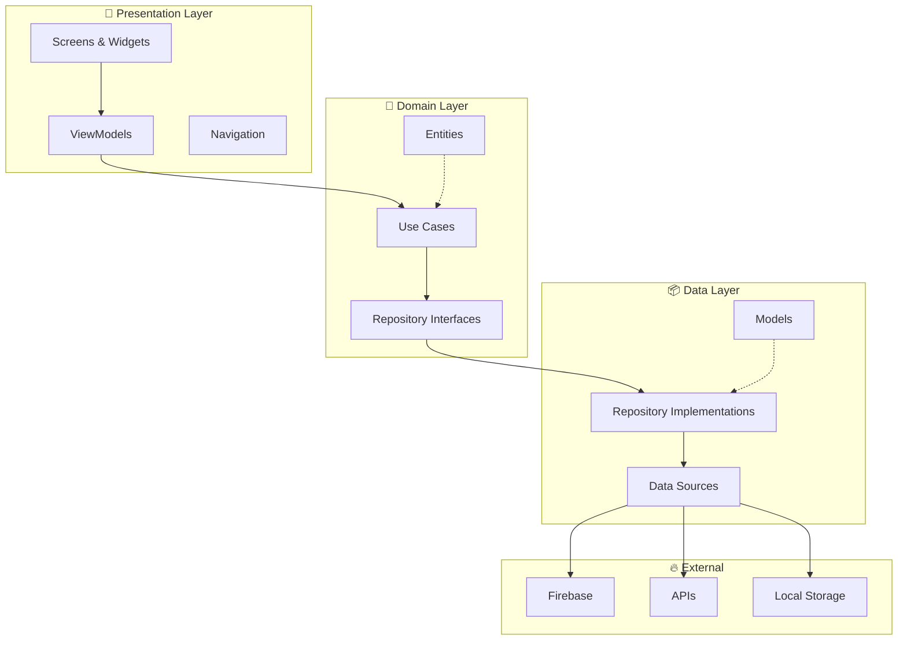
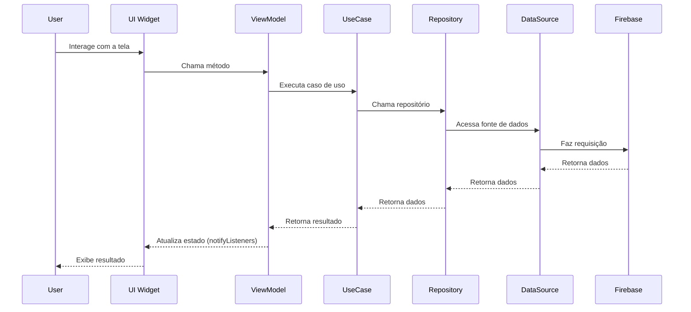
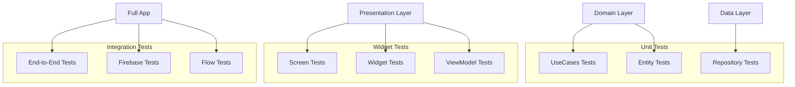

# Visão Geral da Arquitetura

O Librio foi desenvolvido seguindo os princípios da **Clean Architecture**, garantindo separação clara de responsabilidades, testabilidade e manutenibilidade do código.

## 🏗️ Arquitetura Clean

A Clean Architecture organiza o código em camadas concêntricas, onde as camadas internas não dependem das externas.



## 📁 Estrutura de Pastas

```
lib/
├── main.dart                          # Ponto de entrada
├── firebase_options.dart              # Configuração Firebase
└── src/
    ├── 📦 data/                       # Camada de Dados
    │   ├── datasources/               # Fontes de dados
    │   │   ├── auth_service.dart      # Serviço de autenticação
    │   │   └── firestore_service.dart # Serviço Firestore
    │   ├── models/                    # Modelos de dados
    │   │   ├── user_model.dart        # Modelo de usuário
    │   │   ├── book_model.dart        # Modelo de livro
    │   │   └── exchange_model.dart    # Modelo de troca
    │   └── repositories/              # Implementações de repositórios
    │       ├── user_repository_impl.dart
    │       ├── book_repository_impl.dart
    │       └── exchange_repository_impl.dart
    ├── 💼 domain/                     # Camada de Domínio
    │   ├── entities/                  # Entidades de negócio
    │   │   ├── user.dart              # Entidade usuário
    │   │   ├── book.dart              # Entidade livro
    │   │   └── exchange.dart          # Entidade troca
    │   ├── repositories/              # Interfaces de repositórios
    │   │   ├── user_repository.dart
    │   │   ├── book_repository.dart
    │   │   └── exchange_repository.dart
    │   └── usecases/                  # Casos de uso
    │       ├── login_usecase.dart
    │       ├── add_book_usecase.dart
    │       └── create_exchange_usecase.dart
    ├── 🎨 presentation/               # Camada de Apresentação
    │   ├── auth/                      # Telas de autenticação
    │   │   └── screens/
    │   │       ├── login/
    │   │       └── signup/
    │   ├── home/                      # Telas principais
    │   │   ├── screens/
    │   │   └── widgets/
    │   └── common/                    # Widgets compartilhados
    ├── 🛣️ routes/                     # Configuração de rotas
    │   ├── app_router.dart            # Configuração do GoRouter
    │   └── app_routes.dart            # Definição das rotas
    └── 🔧 shared/                     # Utilitários compartilhados
        └── book_data_manager.dart     # Gerenciador de dados global
```

## 🔄 Fluxo de Dados

O fluxo de dados no Librio segue uma direção unidirecional, garantindo previsibilidade:



## 🏛️ Camadas da Arquitetura

### 1. 🎨 Presentation Layer

**Responsabilidade**: Interface do usuário e interações.

**Componentes**:
- **Screens**: Telas da aplicação
- **Widgets**: Componentes de UI reutilizáveis
- **ViewModels**: Gerenciamento de estado das telas

**Tecnologias**:
- Flutter Widgets
- Provider (ChangeNotifier)
- GoRouter para navegação

```dart
// Exemplo de ViewModel
class LoginViewModel extends ChangeNotifier {
  final LoginUseCase _loginUseCase;

  bool isLoading = false;
  String? error;

  Future<void> login(String email, String password) async {
    isLoading = true;
    notifyListeners();

    try {
      await _loginUseCase.execute(email, password);
      // Navegar para home
    } catch (e) {
      error = e.toString();
    } finally {
      isLoading = false;
      notifyListeners();
    }
  }
}
```

### 2. 💼 Domain Layer

**Responsabilidade**: Regras de negócio e lógica da aplicação.

**Componentes**:
- **Entities**: Modelos de negócio puros
- **Use Cases**: Casos de uso específicos
- **Repository Interfaces**: Contratos para acesso a dados

**Características**:
- Independente de frameworks
- Contém apenas lógica de negócio
- Testável isoladamente

```dart
// Exemplo de UseCase
class CreateExchangeUseCase {
  final ExchangeRepository repository;

  CreateExchangeUseCase(this.repository);

  Future<void> execute({
    required String proposerBookId,
    required String receiverBookId,
    required String receiverId,
    String? message,
  }) {
    return repository.createExchange(
      proposerBookId: proposerBookId,
      receiverBookId: receiverBookId,
      receiverId: receiverId,
      message: message,
    );
  }
}
```

### 3. 📦 Data Layer

**Responsabilidade**: Acesso e persistência de dados.

**Componentes**:
- **Repository Implementations**: Implementações concretas
- **Data Sources**: Fontes de dados (Firebase, APIs)
- **Models**: Modelos de dados com serialização

**Tecnologias**:
- Firebase Firestore
- Firebase Authentication
- Cloud Storage

```dart
// Exemplo de Repository Implementation
class BookRepositoryImpl implements BookRepository {
  final FirebaseFirestore _firestore;

  @override
  Future<List<Book>> getAllBooks({String? excludeUserId}) async {
    final query = await _firestore
        .collection('books')
        .where('available', isEqualTo: true)
        .get();

    return query.docs.map((doc) => Book(
      id: doc.id,
      title: doc.data()['title'],
      // ... outros campos
    )).toList();
  }
}
```

## 🔧 Gerenciamento de Estado

O app utiliza **Provider** com **ChangeNotifier** para gerenciamento de estado:

```mermaid
graph LR
    UI[UI Widget] --> LISTEN[Consumer/Selector]
    LISTEN --> VM[ViewModel]
    VM --> NOTIFY[notifyListeners()]
    NOTIFY --> UPDATE[UI Update]
    UPDATE --> UI

    ACTION[User Action] --> VM
    VM --> UC[UseCase]
    UC --> REPO[Repository]
    REPO --> VM
```

### Vantagens do Provider:
- ✅ Simplicidade
- ✅ Performance (rebuilds otimizados)
- ✅ Testabilidade
- ✅ Integração nativa com Flutter

## 🧪 Testabilidade

A arquitetura facilita diferentes tipos de teste:



## 🔄 Dependency Injection

As dependências são injetadas manualmente nos construtores:

```dart
// Configuração típica em uma tela
class LoginScreen extends StatefulWidget {
  @override
  _LoginScreenState createState() => _LoginScreenState();
}

class _LoginScreenState extends State<LoginScreen> {
  late LoginViewModel viewModel;

  @override
  void initState() {
    super.initState();

    // Injeção manual de dependências
    final authService = AuthService();
    final userRepository = UserRepositoryImpl(authService);
    final loginUseCase = LoginUseCase(userRepository);

    viewModel = LoginViewModel(loginUseCase);
  }
}
```

## 🎯 Benefícios da Arquitetura

### ✅ Separação de Responsabilidades
- Cada camada tem uma responsabilidade específica
- Facilita manutenção e evolução

### ✅ Testabilidade
- Camadas podem ser testadas isoladamente
- Mocking simplificado através de interfaces

### ✅ Escalabilidade
- Estrutura suporta crescimento do projeto
- Adição de features é organizada

### ✅ Reutilização
- Use Cases podem ser reutilizados
- Widgets são componentizados

## 🎯 Próximos Passos

Para entender melhor a arquitetura:

1. **[Clean Architecture](clean-architecture)** - Aprofunde nos conceitos
2. **[State Management](state-management)** - Entenda o Provider
3. **[Firebase Integration](../firebase/firestore)** - Veja a integração

---

:::tip Dica de Arquitetura
Sempre pense na direção das dependências: as camadas internas nunca devem conhecer as externas.
:::

:::info Pattern MVVM
O projeto usa MVVM (Model-View-ViewModel) na camada de apresentação para separar lógica de UI da lógica de negócio.
:::
