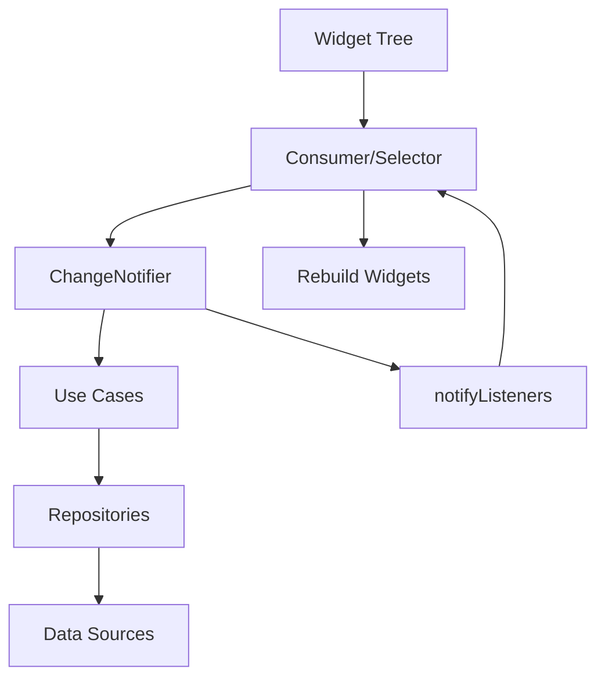

# Gerenciamento de Estado com Provider

O projeto Librio utiliza o **Provider** como solução de gerenciamento de estado, oferecendo uma abordagem reativa e eficiente para controlar o estado da aplicação.

## Arquitetura do Estado



## Padrão ViewModel

### Estrutura Base do ViewModel

```dart
// lib/src/presentation/base/base_viewmodel.dart
abstract class BaseViewModel extends ChangeNotifier {
  bool _isLoading = false;
  String? _error;
  bool _disposed = false;

  bool get isLoading => _isLoading;
  String? get error => _error;

  void setLoading(bool loading) {
    if (_disposed) return;
    _isLoading = loading;
    notifyListeners();
  }

  void setError(String? error) {
    if (_disposed) return;
    _error = error;
    notifyListeners();
  }

  void clearError() {
    if (_disposed) return;
    _error = null;
    notifyListeners();
  }

  @override
  void dispose() {
    _disposed = true;
    super.dispose();
  }

  void safeNotifyListeners() {
    if (!_disposed) {
      notifyListeners();
    }
  }
}
```

## ViewModels Específicos

### 1. HomeViewModel - Gerenciamento da Tela Principal

```dart
// lib/src/presentation/home/screens/home/home_viewmodel.dart
class HomeViewModel extends BaseViewModel {
  final GetAllBooksUseCase _getAllBooksUseCase;
  final SearchBooksUseCase _searchBooksUseCase;

  List<Book> _allBooks = [];
  List<Book> _filteredBooks = [];
  String _searchQuery = '';
  String _selectedCategory = 'Todos';
  final List<String> _categories = [
    'Todos', 'Ficção', 'Romance', 'Mistério', 'Fantasia',
    'Biografia', 'História', 'Ciência', 'Tecnologia'
  ];

  // Getters
  List<Book> get books => _filteredBooks;
  String get searchQuery => _searchQuery;
  String get selectedCategory => _selectedCategory;
  List<String> get categories => _categories;
  bool get hasBooks => _filteredBooks.isNotEmpty;

  HomeViewModel(this._getAllBooksUseCase, this._searchBooksUseCase);

  Future<void> loadBooks() async {
    setLoading(true);
    clearError();

    final result = await _getAllBooksUseCase();

    result.fold(
      (failure) => setError(failure.message),
      (books) {
        _allBooks = books;
        _applyFilters();
      },
    );

    setLoading(false);
  }

  void searchBooks(String query) {
    _searchQuery = query;
    _applyFilters();
  }

  void filterByCategory(String category) {
    _selectedCategory = category;
    _applyFilters();
  }

  void _applyFilters() {
    _filteredBooks = _allBooks.where((book) {
      final matchesCategory = _selectedCategory == 'Todos' ||
                             book.category == _selectedCategory;
      final matchesSearch = _searchQuery.isEmpty ||
                           _searchMatches(book, _searchQuery);

      return matchesCategory && matchesSearch && book.isAvailable;
    }).toList();

    safeNotifyListeners();
  }

  bool _searchMatches(Book book, String query) {
    final lowercaseQuery = query.toLowerCase();
    return book.title.toLowerCase().contains(lowercaseQuery) ||
           book.author.toLowerCase().contains(lowercaseQuery) ||
           book.description.toLowerCase().contains(lowercaseQuery);
  }

  Future<void> refreshBooks() async {
    await loadBooks();
  }
}
```

### 2. BookDetailsViewModel - Detalhes e Ações do Livro

```dart
// lib/src/presentation/home/screens/book_details/book_details_viewmodel.dart
class BookDetailsViewModel extends BaseViewModel {
  final CreateExchangeUseCase _createExchangeUseCase;
  final GetUserBooksUseCase _getUserBooksUseCase;
  final AuthService _authService;

  Book? _book;
  List<Book> _userBooks = [];
  Book? _selectedBookForExchange;
  bool _isCreatingExchange = false;

  // Getters
  Book? get book => _book;
  List<Book> get userBooks => _userBooks;
  Book? get selectedBookForExchange => _selectedBookForExchange;
  bool get isCreatingExchange => _isCreatingExchange;
  bool get canCreateExchange => _selectedBookForExchange != null &&
                                book != null &&
                                book!.userId != _authService.currentUser?.uid;

  BookDetailsViewModel(
    this._createExchangeUseCase,
    this._getUserBooksUseCase,
    this._authService,
  );

  void setBook(Book book) {
    _book = book;
    safeNotifyListeners();
  }

  Future<void> loadUserBooks() async {
    final currentUser = _authService.currentUser;
    if (currentUser == null) return;

    setLoading(true);
    final result = await _getUserBooksUseCase(currentUser.uid);

    result.fold(
      (failure) => setError(failure.message),
      (books) {
        _userBooks = books.where((book) => book.isAvailable).toList();
      },
    );

    setLoading(false);
  }

  void selectBookForExchange(Book book) {
    _selectedBookForExchange = book;
    safeNotifyListeners();
  }

  Future<void> createExchange() async {
    if (!canCreateExchange) return;

    _isCreatingExchange = true;
    safeNotifyListeners();

    final currentUser = _authService.currentUser!;

    final result = await _createExchangeUseCase(CreateExchangeParams(
      requesterId: currentUser.uid,
      ownerId: book!.userId,
      requestedBookId: book!.id,
      offeredBookId: selectedBookForExchange!.id,
    ));

    result.fold(
      (failure) => setError(failure.message),
      (exchange) {
        // Sucesso - navegação será tratada na UI
      },
    );

    _isCreatingExchange = false;
    safeNotifyListeners();
  }
}
```

### 3. ChatViewModel - Sistema de Mensagens

```dart
// lib/src/presentation/home/screens/chat/chat_viewmodel.dart
class ChatViewModel extends BaseViewModel {
  final SendMessageUseCase _sendMessageUseCase;
  final GetChatMessagesUseCase _getChatMessagesUseCase;
  final MarkChatAsReadUseCase _markChatAsReadUseCase;
  final AuthService _authService;

  String? _chatId;
  List<Message> _messages = [];
  bool _isSendingMessage = false;
  StreamSubscription<List<Message>>? _messagesSubscription;

  // Getters
  List<Message> get messages => _messages;
  bool get isSendingMessage => _isSendingMessage;
  String? get currentUserId => _authService.currentUser?.uid;

  ChatViewModel(
    this._sendMessageUseCase,
    this._getChatMessagesUseCase,
    this._markChatAsReadUseCase,
    this._authService,
  );

  void setChatId(String chatId) {
    _chatId = chatId;
    _loadMessages();
    _markAsRead();
  }

  void _loadMessages() {
    if (_chatId == null) return;

    _messagesSubscription?.cancel();

    final messagesStream = _getChatMessagesUseCase(_chatId!);
    _messagesSubscription = messagesStream.listen(
      (messages) {
        _messages = messages;
        safeNotifyListeners();
      },
      onError: (error) {
        setError(error.toString());
      },
    );
  }

  Future<void> sendMessage(String content) async {
    if (content.trim().isEmpty || _chatId == null) return;

    _isSendingMessage = true;
    safeNotifyListeners();

    final currentUser = _authService.currentUser!;

    final result = await _sendMessageUseCase(SendMessageParams(
      chatId: _chatId!,
      senderId: currentUser.uid,
      content: content.trim(),
    ));

    result.fold(
      (failure) => setError(failure.message),
      (_) {
        // Mensagem enviada com sucesso
        // A atualização da lista será feita pelo stream
      },
    );

    _isSendingMessage = false;
    safeNotifyListeners();
  }

  Future<void> _markAsRead() async {
    if (_chatId == null) return;

    final currentUser = _authService.currentUser;
    if (currentUser == null) return;

    await _markChatAsReadUseCase(MarkChatAsReadParams(
      chatId: _chatId!,
      userId: currentUser.uid,
    ));
  }

  @override
  void dispose() {
    _messagesSubscription?.cancel();
    super.dispose();
  }
}
```

## Configuração do Provider Tree

### Setup Principal da Aplicação

```dart
// lib/main.dart
void main() async {
  WidgetsFlutterBinding.ensureInitialized();
  await Firebase.initializeApp(options: DefaultFirebaseOptions.currentPlatform);

  runApp(
    MultiProvider(
      providers: [
        // === DATA SOURCES ===
        Provider<AuthService>(
          create: (_) => AuthService(),
          dispose: (_, authService) => authService.dispose(),
        ),
        Provider<FirestoreService>(
          create: (_) => FirestoreService(),
        ),

        // === REPOSITORIES ===
        ProxyProvider<FirestoreService, BookRepository>(
          update: (_, firestoreService, __) => BookRepositoryImpl(firestoreService),
        ),
        ProxyProvider<FirestoreService, ExchangeRepository>(
          update: (_, firestoreService, __) => ExchangeRepositoryImpl(firestoreService),
        ),
        ProxyProvider<FirestoreService, ChatRepository>(
          update: (_, firestoreService, __) => ChatRepositoryImpl(firestoreService),
        ),

        // === USE CASES ===
        ProxyProvider<BookRepository, GetAllBooksUseCase>(
          update: (_, repository, __) => GetAllBooksUseCase(repository),
        ),
        ProxyProvider<BookRepository, GetUserBooksUseCase>(
          update: (_, repository, __) => GetUserBooksUseCase(repository),
        ),
        ProxyProvider<ExchangeRepository, CreateExchangeUseCase>(
          update: (_, repository, __) => CreateExchangeUseCase(repository),
        ),
        ProxyProvider<ChatRepository, SendMessageUseCase>(
          update: (_, repository, __) => SendMessageUseCase(repository),
        ),

        // === VIEW MODELS ===
        ChangeNotifierProxyProvider2<GetAllBooksUseCase, SearchBooksUseCase, HomeViewModel>(
          create: (context) => HomeViewModel(
            Provider.of<GetAllBooksUseCase>(context, listen: false),
            Provider.of<SearchBooksUseCase>(context, listen: false),
          ),
          update: (_, getAllBooks, searchBooks, previous) =>
              previous ?? HomeViewModel(getAllBooks, searchBooks),
        ),

        ChangeNotifierProxyProvider3<CreateExchangeUseCase, GetUserBooksUseCase, AuthService, BookDetailsViewModel>(
          create: (context) => BookDetailsViewModel(
            Provider.of<CreateExchangeUseCase>(context, listen: false),
            Provider.of<GetUserBooksUseCase>(context, listen: false),
            Provider.of<AuthService>(context, listen: false),
          ),
          update: (_, createExchange, getUserBooks, authService, previous) =>
              previous ?? BookDetailsViewModel(createExchange, getUserBooks, authService),
        ),
      ],
      child: const LibrioApp(),
    ),
  );
}
```

## Consumo de Estado na UI

### Consumer vs Selector

```dart
// Exemplo com Consumer - Escuta todas as mudanças
Consumer<HomeViewModel>(
  builder: (context, homeViewModel, child) {
    if (homeViewModel.isLoading) {
      return const Center(child: CircularProgressIndicator());
    }

    if (homeViewModel.error != null) {
      return Center(
        child: Text('Erro: ${homeViewModel.error}'),
      );
    }

    return ListView.builder(
      itemCount: homeViewModel.books.length,
      itemBuilder: (context, index) {
        final book = homeViewModel.books[index];
        return BookCard(book: book);
      },
    );
  },
)

// Exemplo com Selector - Escuta apenas mudanças específicas
Selector<HomeViewModel, bool>(
  selector: (context, viewModel) => viewModel.isLoading,
  builder: (context, isLoading, child) {
    return isLoading
        ? const CircularProgressIndicator()
        : const SizedBox.shrink();
  },
)

// Selector para lista de livros
Selector<HomeViewModel, List<Book>>(
  selector: (context, viewModel) => viewModel.books,
  builder: (context, books, child) {
    return ListView.builder(
      itemCount: books.length,
      itemBuilder: (context, index) => BookCard(book: books[index]),
    );
  },
)
```

### Provider.of vs context.read vs context.watch

```dart
class _BookDetailsScreenState extends State<BookDetailsScreen> {
  @override
  void initState() {
    super.initState();
    // Usando Provider.of para ações no initState
    Provider.of<BookDetailsViewModel>(context, listen: false)
        .setBook(widget.book);
  }

  @override
  Widget build(BuildContext context) {
    return Scaffold(
      appBar: AppBar(
        title: Text(widget.book.title),
        actions: [
          // Usando context.read para ações (não escuta mudanças)
          IconButton(
            onPressed: () => context.read<BookDetailsViewModel>().loadUserBooks(),
            icon: const Icon(Icons.refresh),
          ),
        ],
      ),
      body: Column(
        children: [
          // Usando context.watch para escutar mudanças
          if (context.watch<BookDetailsViewModel>().isLoading)
            const LinearProgressIndicator(),

          Expanded(
            child: Consumer<BookDetailsViewModel>(
              builder: (context, viewModel, child) {
                return BookDetailsContent(
                  book: viewModel.book!,
                  userBooks: viewModel.userBooks,
                  selectedBook: viewModel.selectedBookForExchange,
                  onBookSelected: viewModel.selectBookForExchange,
                  onCreateExchange: viewModel.createExchange,
                );
              },
            ),
          ),
        ],
      ),
    );
  }
}
```

## Otimizações de Performance

### 1. Uso do Selector para Reconstruções Específicas

```dart
class BookCounter extends StatelessWidget {
  @override
  Widget build(BuildContext context) {
    return Selector<HomeViewModel, int>(
      selector: (_, viewModel) => viewModel.books.length,
      builder: (context, bookCount, child) {
        return Text('$bookCount livros disponíveis');
      },
    );
  }
}
```

### 2. Child Widget para Partes Estáticas

```dart
Consumer<HomeViewModel>(
  builder: (context, viewModel, staticChild) {
    return Column(
      children: [
        Text('Livros: ${viewModel.books.length}'),
        staticChild!, // Este widget não será reconstruído
      ],
    );
  },
  child: const Padding(
    padding: EdgeInsets.all(16.0),
    child: Text('Widget estático que não muda'),
  ),
)
```

### 3. Disposição Adequada dos ViewModels

```dart
class BookDetailsScreen extends StatefulWidget {
  @override
  _BookDetailsScreenState createState() => _BookDetailsScreenState();
}

class _BookDetailsScreenState extends State<BookDetailsScreen> {
  @override
  void dispose() {
    // ViewModels são automaticamente dispostos pelo Provider
    // quando o widget é removido da árvore
    super.dispose();
  }
}
```

## Tratamento de Estados Complexos

### Estados de Loading Granulares

```dart
class ExchangeViewModel extends BaseViewModel {
  bool _isLoadingExchanges = false;
  bool _isCreatingExchange = false;
  bool _isAcceptingExchange = false;

  bool get isLoadingExchanges => _isLoadingExchanges;
  bool get isCreatingExchange => _isCreatingExchange;
  bool get isAcceptingExchange => _isAcceptingExchange;
  bool get hasAnyLoading => _isLoadingExchanges || _isCreatingExchange || _isAcceptingExchange;

  void setLoadingExchanges(bool loading) {
    _isLoadingExchanges = loading;
    safeNotifyListeners();
  }

  void setCreatingExchange(bool creating) {
    _isCreatingExchange = creating;
    safeNotifyListeners();
  }

  void setAcceptingExchange(bool accepting) {
    _isAcceptingExchange = accepting;
    safeNotifyListeners();
  }
}
```

### Estados de Erro Específicos

```dart
class ErrorState {
  final String message;
  final ErrorType type;
  final DateTime timestamp;

  ErrorState({
    required this.message,
    required this.type,
    required this.timestamp,
  });
}

enum ErrorType { network, validation, authentication, server }

class BaseViewModel extends ChangeNotifier {
  ErrorState? _error;

  ErrorState? get error => _error;

  void setError(String message, ErrorType type) {
    _error = ErrorState(
      message: message,
      type: type,
      timestamp: DateTime.now(),
    );
    safeNotifyListeners();
  }
}
```

## Vantagens do Provider

1. **Simplicidade**: Fácil de entender e implementar
2. **Performance**: Reconstruções otimizadas com Selector
3. **Flexibilidade**: Múltiplos providers e hierarquia
4. **Testabilidade**: Fácil de mockar e testar
5. **Integração**: Funciona bem com Clean Architecture
6. **Comunidade**: Amplamente adotado e bem documentado
