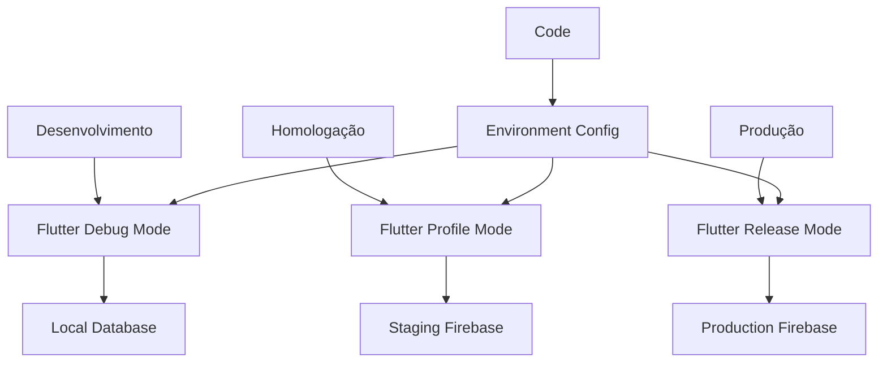

# Build e Compilação

Este documento detalha o processo completo de build e compilação do aplicativo Librio para diferentes plataformas e ambientes.

## Configuração de Ambientes

### Estrutura de Ambientes



### Configuração por Ambiente

```dart
// lib/src/config/environment.dart
enum Environment { development, staging, production }

class EnvironmentConfig {
  static Environment _environment = Environment.development;

  static Environment get environment => _environment;

  static void setEnvironment(Environment env) {
    _environment = env;
  }

  static bool get isDevelopment => _environment == Environment.development;
  static bool get isStaging => _environment == Environment.staging;
  static bool get isProduction => _environment == Environment.production;

  static String get apiBaseUrl {
    switch (_environment) {
      case Environment.development:
        return 'https://api-dev.librio.com';
      case Environment.staging:
        return 'https://api-staging.librio.com';
      case Environment.production:
        return 'https://api.librio.com';
    }
  }

  static String get firebaseProjectId {
    switch (_environment) {
      case Environment.development:
        return 'librio-dev';
      case Environment.staging:
        return 'librio-staging';
      case Environment.production:
        return 'librio-prod';
    }
  }

  static bool get enableLogging => !isProduction;
  static bool get enableCrashlytics => isProduction || isStaging;
}
```

### Arquivos de Configuração Firebase

```dart
// lib/firebase_options_dev.dart
class DefaultFirebaseOptions {
  static FirebaseOptions get currentPlatform {
    switch (defaultTargetPlatform) {
      case TargetPlatform.android:
        return androidDev;
      case TargetPlatform.iOS:
        return iosDev;
      default:
        throw UnsupportedError('Platform not supported');
    }
  }

  static const FirebaseOptions androidDev = FirebaseOptions(
    apiKey: 'AIzaSyD...-dev',
    appId: '1:123456789:android:dev123',
    messagingSenderId: '123456789',
    projectId: 'librio-dev',
    storageBucket: 'librio-dev.appspot.com',
  );

  static const FirebaseOptions iosDev = FirebaseOptions(
    apiKey: 'AIzaSyD...-dev',
    appId: '1:123456789:ios:dev123',
    messagingSenderId: '123456789',
    projectId: 'librio-dev',
    storageBucket: 'librio-dev.appspot.com',
    iosBundleId: 'com.lorenzocardoso.librio.dev',
  );
}
```

## Build para Android

### Configuração do Gradle

```gradle
// android/app/build.gradle
android {
    compileSdkVersion 34

    compileOptions {
        sourceCompatibility JavaVersion.VERSION_1_8
        targetCompatibility JavaVersion.VERSION_1_8
    }

    defaultConfig {
        applicationId "com.lorenzocardoso.librio"
        minSdkVersion 21
        targetSdkVersion 34
        versionCode flutterVersionCode.toInteger()
        versionName flutterVersionName

        multiDexEnabled true
    }

    signingConfigs {
        debug {
            storeFile file('debug.keystore')
            storePassword 'android'
            keyAlias 'androiddebugkey'
            keyPassword 'android'
        }

        release {
            keyAlias keystoreProperties['keyAlias']
            keyPassword keystoreProperties['keyPassword']
            storeFile keystoreProperties['storeFile'] ? file(keystoreProperties['storeFile']) : null
            storePassword keystoreProperties['storePassword']
        }
    }

    buildTypes {
        debug {
            signingConfig signingConfigs.debug
            applicationIdSuffix ".debug"
            versionNameSuffix "-debug"
            debuggable true
            minifyEnabled false
        }

        profile {
            signingConfig signingConfigs.debug
            applicationIdSuffix ".profile"
            versionNameSuffix "-profile"
            debuggable false
            minifyEnabled false
        }

        release {
            signingConfig signingConfigs.release
            debuggable false
            minifyEnabled true
            shrinkResources true
            proguardFiles getDefaultProguardFile('proguard-android-optimize.txt'), 'proguard-rules.pro'
        }
    }

    flavorDimensions "environment"
    productFlavors {
        dev {
            dimension "environment"
            applicationId "com.lorenzocardoso.librio.dev"
            versionNameSuffix "-dev"
        }

        staging {
            dimension "environment"
            applicationId "com.lorenzocardoso.librio.staging"
            versionNameSuffix "-staging"
        }

        prod {
            dimension "environment"
            applicationId "com.lorenzocardoso.librio"
        }
    }
}
```

### Configuração de Assinatura

```properties
# android/key.properties
storePassword=your_store_password
keyPassword=your_key_password
keyAlias=your_key_alias
storeFile=../keystore/release.keystore
```

### Comandos de Build Android

```bash
# Debug build
flutter build apk --debug --flavor dev

# Profile build
flutter build apk --profile --flavor staging

# Release build
flutter build apk --release --flavor prod

# App Bundle para Play Store
flutter build appbundle --release --flavor prod

# Build com target específico
flutter build apk --release --flavor prod --target=lib/main_prod.dart

# Build com parâmetros customizados
flutter build apk --release \
  --flavor prod \
  --dart-define=ENVIRONMENT=production \
  --dart-define=API_URL=https://api.librio.com
```

### Otimizações Android

```gradle
// android/app/proguard-rules.pro
-keep class io.flutter.app.** { *; }
-keep class io.flutter.plugin.**  { *; }
-keep class io.flutter.util.**  { *; }
-keep class io.flutter.view.**  { *; }
-keep class io.flutter.**  { *; }
-keep class io.flutter.plugins.**  { *; }

# Firebase
-keep class com.google.firebase.** { *; }
-keep class com.google.android.gms.** { *; }

# Image loading
-keep class com.bumptech.glide.** { *; }

# Keep model classes
-keep class com.lorenzocardoso.librio.src.data.models.** { *; }

# Obfuscation
-renamesourcefileattribute SourceFile
-keepattributes SourceFile,LineNumberTable
```

## Build para iOS

### Configuração do Xcode

```xml
<!-- ios/Runner/Info.plist -->
<?xml version="1.0" encoding="UTF-8"?>
<!DOCTYPE plist PUBLIC "-//Apple//DTD PLIST 1.0//EN" "http://www.apple.com/DTDs/PropertyList-1.0.dtd">
<plist version="1.0">
<dict>
    <key>CFBundleDevelopmentRegion</key>
    <string>$(DEVELOPMENT_LANGUAGE)</string>
    <key>CFBundleDisplayName</key>
    <string>Librio</string>
    <key>CFBundleExecutable</key>
    <string>$(EXECUTABLE_NAME)</string>
    <key>CFBundleIdentifier</key>
    <string>$(PRODUCT_BUNDLE_IDENTIFIER)</string>
    <key>CFBundleInfoDictionaryVersion</key>
    <string>6.0</string>
    <key>CFBundleName</key>
    <string>librio</string>
    <key>CFBundlePackageType</key>
    <string>APPL</string>
    <key>CFBundleShortVersionString</key>
    <string>$(FLUTTER_BUILD_NAME)</string>
    <key>CFBundleSignature</key>
    <string>????</string>
    <key>CFBundleVersion</key>
    <string>$(FLUTTER_BUILD_NUMBER)</string>

    <!-- Permissions -->
    <key>NSCameraUsageDescription</key>
    <string>O Librio precisa de acesso à câmera para fotografar livros</string>
    <key>NSPhotoLibraryUsageDescription</key>
    <string>O Librio precisa de acesso às fotos para selecionar imagens de livros</string>
    <key>NSLocationWhenInUseUsageDescription</key>
    <string>O Librio usa sua localização para facilitar trocas próximas</string>

    <!-- Network -->
    <key>NSAppTransportSecurity</key>
    <dict>
        <key>NSAllowsArbitraryLoads</key>
        <false/>
    </dict>
</dict>
</plist>
```

### Configuração de Schemes

```xml
<!-- ios/Runner.xcworkspace/xcshareddata/xcschemes/Runner.xcscheme -->
<key>BuildConfiguration</key>
<string>Release</string>

<!-- Configurações por ambiente -->
<BuildActionEntry>
    <BuildableReference>
        <BuildableIdentifier>primary</BuildableIdentifier>
        <BlueprintIdentifier>97C146ED1CF9000F007C117D</BlueprintIdentifier>
        <BuildableName>Runner.app</BuildableName>
        <BlueprintName>Runner</BlueprintName>
        <ReferencedContainer>container:Runner.xcodeproj</ReferencedContainer>
    </BuildableReference>
</BuildActionEntry>
```

### Comandos de Build iOS

```bash
# Debug build
flutter build ios --debug --flavor dev

# Profile build
flutter build ios --profile --flavor staging

# Release build
flutter build ios --release --flavor prod

# Build IPA para distribuição
flutter build ipa --release --flavor prod

# Build com certificados específicos
flutter build ios --release \
  --flavor prod \
  --export-options-plist=ios/ExportOptions.plist

# Build para simulador
flutter build ios --debug --simulator
```

### Export Options

```xml
<!-- ios/ExportOptions.plist -->
<?xml version="1.0" encoding="UTF-8"?>
<!DOCTYPE plist PUBLIC "-//Apple//DTD PLIST 1.0//EN" "http://www.apple.com/DTDs/PropertyList-1.0.dtd">
<plist version="1.0">
<dict>
    <key>method</key>
    <string>app-store</string>
    <key>teamID</key>
    <string>YOUR_TEAM_ID</string>
    <key>uploadBitcode</key>
    <false/>
    <key>uploadSymbols</key>
    <true/>
    <key>compileBitcode</key>
    <false/>
</dict>
</plist>
```

## Scripts de Build Automatizados

### Script Principal de Build

```bash
#!/bin/bash
# scripts/build.sh

set -e

# Cores para output
RED='\033[0;31m'
GREEN='\033[0;32m'
YELLOW='\033[1;33m'
NC='\033[0m' # No Color

# Parâmetros
PLATFORM=""
FLAVOR=""
BUILD_TYPE="release"
OUTPUT_DIR="build"

# Função de ajuda
show_help() {
    echo "Usage: $0 [OPTIONS]"
    echo "Options:"
    echo "  -p, --platform    Target platform (android|ios|web)"
    echo "  -f, --flavor      Build flavor (dev|staging|prod)"
    echo "  -t, --type        Build type (debug|profile|release)"
    echo "  -o, --output      Output directory"
    echo "  -h, --help        Show this help message"
}

# Parse arguments
while [[ $# -gt 0 ]]; do
    case $1 in
        -p|--platform)
            PLATFORM="$2"
            shift 2
            ;;
        -f|--flavor)
            FLAVOR="$2"
            shift 2
            ;;
        -t|--type)
            BUILD_TYPE="$2"
            shift 2
            ;;
        -o|--output)
            OUTPUT_DIR="$2"
            shift 2
            ;;
        -h|--help)
            show_help
            exit 0
            ;;
        *)
            echo "Unknown option $1"
            show_help
            exit 1
            ;;
    esac
done

# Validações
if [ -z "$PLATFORM" ]; then
    echo -e "${RED}Error: Platform is required${NC}"
    show_help
    exit 1
fi

if [ -z "$FLAVOR" ]; then
    echo -e "${RED}Error: Flavor is required${NC}"
    show_help
    exit 1
fi

# Limpar builds anteriores
echo -e "${YELLOW}Cleaning previous builds...${NC}"
flutter clean
flutter pub get

# Gerar código (se necessário)
echo -e "${YELLOW}Generating code...${NC}"
flutter packages pub run build_runner build --delete-conflicting-outputs

# Executar testes
echo -e "${YELLOW}Running tests...${NC}"
flutter test

# Build por plataforma
case $PLATFORM in
    android)
        echo -e "${YELLOW}Building for Android...${NC}"
        if [ "$BUILD_TYPE" = "release" ]; then
            flutter build apk --release --flavor $FLAVOR
            flutter build appbundle --release --flavor $FLAVOR
        else
            flutter build apk --$BUILD_TYPE --flavor $FLAVOR
        fi
        ;;
    ios)
        echo -e "${YELLOW}Building for iOS...${NC}"
        if [ "$BUILD_TYPE" = "release" ]; then
            flutter build ipa --release --flavor $FLAVOR
        else
            flutter build ios --$BUILD_TYPE --flavor $FLAVOR
        fi
        ;;
    web)
        echo -e "${YELLOW}Building for Web...${NC}"
        flutter build web --$BUILD_TYPE
        ;;
    *)
        echo -e "${RED}Error: Unknown platform $PLATFORM${NC}"
        exit 1
        ;;
esac

echo -e "${GREEN}Build completed successfully!${NC}"
```

### Script de Deploy

```bash
#!/bin/bash
# scripts/deploy.sh

set -e

ENVIRONMENT=""
PLATFORM=""
VERSION=""

# Parse arguments
while [[ $# -gt 0 ]]; do
    case $1 in
        -e|--environment)
            ENVIRONMENT="$2"
            shift 2
            ;;
        -p|--platform)
            PLATFORM="$2"
            shift 2
            ;;
        -v|--version)
            VERSION="$2"
            shift 2
            ;;
    esac
done

# Deploy para Firebase Hosting (Web)
deploy_web() {
    echo "Deploying web to Firebase Hosting..."

    # Build
    flutter build web --release --dart-define=ENVIRONMENT=$ENVIRONMENT

    # Deploy
    firebase use $ENVIRONMENT
    firebase deploy --only hosting
}

# Deploy para Google Play (Android)
deploy_android() {
    echo "Deploying Android to Google Play..."

    # Build
    flutter build appbundle --release --flavor prod

    # Upload via Fastlane (opcional)
    # fastlane supply --aab build/app/outputs/bundle/prodRelease/app-prod-release.aab
}

# Deploy para App Store (iOS)
deploy_ios() {
    echo "Deploying iOS to App Store..."

    # Build
    flutter build ipa --release --flavor prod

    # Upload via Fastlane (opcional)
    # fastlane pilot upload --ipa build/ios/ipa/librio.ipa
}

# Executar deploy baseado na plataforma
case $PLATFORM in
    web)
        deploy_web
        ;;
    android)
        deploy_android
        ;;
    ios)
        deploy_ios
        ;;
    *)
        echo "Error: Unknown platform $PLATFORM"
        exit 1
        ;;
esac

echo "Deploy completed successfully!"
```

## Configuração de Versionamento

### Automação de Versão

```dart
// scripts/version_manager.dart
import 'dart:io';
import 'package:yaml/yaml.dart';

class VersionManager {
  static const String pubspecPath = 'pubspec.yaml';

  static void incrementVersion(String type) {
    final file = File(pubspecPath);
    final content = file.readAsStringSync();
    final yaml = loadYaml(content);

    final currentVersion = yaml['version'] as String;
    final parts = currentVersion.split('+');
    final versionParts = parts[0].split('.');
    final buildNumber = parts.length > 1 ? int.parse(parts[1]) : 1;

    int major = int.parse(versionParts[0]);
    int minor = int.parse(versionParts[1]);
    int patch = int.parse(versionParts[2]);

    switch (type) {
      case 'major':
        major++;
        minor = 0;
        patch = 0;
        break;
      case 'minor':
        minor++;
        patch = 0;
        break;
      case 'patch':
        patch++;
        break;
    }

    final newVersion = '$major.$minor.$patch+${buildNumber + 1}';

    final newContent = content.replaceFirst(
      RegExp(r'version: .*'),
      'version: $newVersion',
    );

    file.writeAsStringSync(newContent);
    print('Version updated to: $newVersion');
  }
}

void main(List<String> args) {
  if (args.isEmpty) {
    print('Usage: dart version_manager.dart <major|minor|patch>');
    return;
  }

  VersionManager.incrementVersion(args[0]);
}
```

## Otimizações de Build

### Redução do Tamanho do APK

```yaml
# pubspec.yaml
flutter:
  assets:
    - assets/images/
    # Evitar incluir assets desnecessários

  # Fontes otimizadas
  fonts:
    - family: Roboto
      fonts:
        - asset: fonts/Roboto-Regular.ttf
        - asset: fonts/Roboto-Bold.ttf
          weight: 700
```

### Tree Shaking e Minificação

```dart
// lib/src/config/build_config.dart
class BuildConfig {
  static const bool kDebugMode = bool.fromEnvironment('dart.vm.product') == false;
  static const bool kProfileMode = bool.fromEnvironment('dart.vm.profile');
  static const bool kReleaseMode = bool.fromEnvironment('dart.vm.product');

  static void optimizeForRelease() {
    if (kReleaseMode) {
      // Desabilitar logs em produção
      Logger.root.level = Level.OFF;

      // Configurações de performance
      WidgetsApp.debugAllowBannerOverride = false;

      // Remover debugging tools
      assert(() {
        debugPrint = (String? message, {int? wrapWidth}) {};
        return true;
      }());
    }
  }
}
```

### Análise de Bundle

```bash
# Analisar tamanho do APK
flutter build apk --analyze-size --target-platform android-arm64

# Gerar relatório de dependências
flutter deps

# Analisar performance
flutter build apk --release --verbose

# Bundle analysis para iOS
flutter build ios --analyze-size
```

## Troubleshooting

### Problemas Comuns Android

```bash
# Limpar cache do Gradle
cd android && ./gradlew clean && cd ..

# Recriar projeto Android
flutter create --platforms android .

# Verificar configuração do SDK
flutter doctor -v

# Debug de dependências
cd android && ./gradlew app:dependencies && cd ..
```

### Problemas Comuns iOS

```bash
# Limpar build do Xcode
cd ios && xcodebuild clean && cd ..

# Reinstalar pods
cd ios && rm -rf Pods Podfile.lock && pod install && cd ..

# Verificar certificados
security find-identity -v -p codesigning

# Debug de esquemas
xcodebuild -list -project ios/Runner.xcodeproj
```

### Logs de Debug

```dart
// lib/src/utils/debug_logger.dart
class DebugLogger {
  static void logBuild(String message) {
    if (kDebugMode) {
      print('🔨 BUILD: $message');
    }
  }

  static void logDeploy(String message) {
    if (kDebugMode) {
      print('🚀 DEPLOY: $message');
    }
  }

  static void logError(String message, [dynamic error]) {
    print('❌ ERROR: $message');
    if (error != null) {
      print('Details: $error');
    }
  }
}
```

O processo de build e compilação do Librio é robusto e automatizado, garantindo builds consistentes e otimizadas para todos os ambientes e plataformas suportadas.
