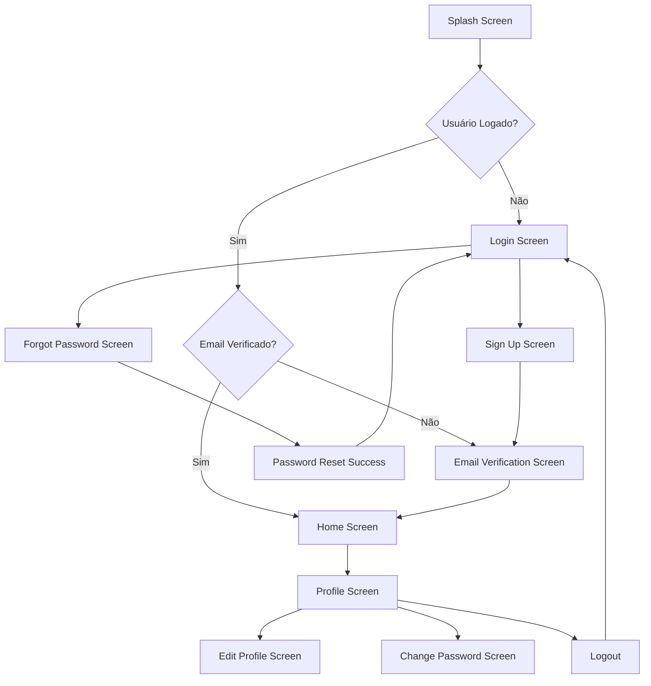

# Autenticação

O sistema de autenticação do Librio é baseado no Firebase Authentication, fornecendo login seguro e gerenciamento de usuários.

## Funcionalidades

### Login e Registro
- Login com email e senha
- Registro de novos usuários
- Validação de formulários em tempo real
- Tratamento de erros específicos do Firebase

### Gerenciamento de Sessão
- Estado de autenticação persistente
- Logout seguro com limpeza de dados
- Proteção de rotas autenticadas
- Renovação automática de tokens

## Resolução de Problemas de Permissão

### Erro de Permissão do Firestore

Se você encontrar o erro:
```
PERMISSION_DENIED: The caller does not have permission to execute the specified operation
```

**Soluções:**

1. **Logout e Login Novamente**
   - Acesse Perfil > Configurações > Sair
   - Ou use o botão "Fazer Logout" que aparece na tela de erro
   - Faça login novamente

2. **Limpar Dados do App**
   - Configurações do dispositivo > Apps > Librio > Armazenamento > Limpar dados
   - Reabra o app e faça login

3. **Verificar Conexão**
   - Confirme se está conectado à internet
   - Tente novamente após alguns minutos

### Como Acessar o Logout

1. **Via Perfil**: Home > Perfil (ícone no bottom navigation) > Configurações (ícone no AppBar) > Sair
2. **Via Tela de Erro**: Quando há erro de permissão, aparece um botão "Fazer Logout" na tela

## Implementação Técnica

## Visão Geral das Telas



## Telas de Autenticação

### 1. Login Screen

```dart
// lib/src/presentation/auth/screens/login/login_screen.dart
class LoginScreen extends StatefulWidget {
  @override
  _LoginScreenState createState() => _LoginScreenState();
}

class _LoginScreenState extends State<LoginScreen> {
  final _formKey = GlobalKey<FormState>();
  final _emailController = TextEditingController();
  final _passwordController = TextEditingController();
  bool _obscurePassword = true;
  bool _rememberMe = false;

  @override
  Widget build(BuildContext context) {
    return Scaffold(
      body: SafeArea(
        child: Consumer<LoginViewModel>(
          builder: (context, viewModel, child) {
            return SingleChildScrollView(
              padding: const EdgeInsets.all(24.0),
              child: Form(
                key: _formKey,
                child: Column(
                  crossAxisAlignment: CrossAxisAlignment.stretch,
                  children: [
                    const SizedBox(height: 60),

                    // Logo
                    Center(
                      child: Image.asset(
                        'assets/images/logo.png',
                        height: 120,
                      ),
                    ),

                    const SizedBox(height: 40),

                    // Título
                    Text(
                      'Bem-vindo de volta!',
                      style: Theme.of(context).textTheme.headlineMedium?.copyWith(
                        fontWeight: FontWeight.bold,
                        color: Theme.of(context).primaryColor,
                      ),
                      textAlign: TextAlign.center,
                    ),

                    const SizedBox(height: 8),

                    Text(
                      'Entre na sua conta para continuar',
                      style: Theme.of(context).textTheme.bodyLarge?.copyWith(
                        color: Colors.grey[600],
                      ),
                      textAlign: TextAlign.center,
                    ),

                    const SizedBox(height: 40),

                    // Campo Email
                    TextFormField(
                      controller: _emailController,
                      keyboardType: TextInputType.emailAddress,
                      decoration: InputDecoration(
                        labelText: 'Email',
                        hintText: 'Digite seu email',
                        prefixIcon: const Icon(Icons.email_outlined),
                        border: OutlineInputBorder(
                          borderRadius: BorderRadius.circular(12),
                        ),
                      ),
                      validator: EmailValidator.validateEmail,
                      enabled: !viewModel.isLoading,
                    ),

                    const SizedBox(height: 16),

                    // Campo Senha
                    TextFormField(
                      controller: _passwordController,
                      obscureText: _obscurePassword,
                      decoration: InputDecoration(
                        labelText: 'Senha',
                        hintText: 'Digite sua senha',
                        prefixIcon: const Icon(Icons.lock_outlined),
                        suffixIcon: IconButton(
                          icon: Icon(
                            _obscurePassword ? Icons.visibility : Icons.visibility_off,
                          ),
                          onPressed: () {
                            setState(() {
                              _obscurePassword = !_obscurePassword;
                            });
                          },
                        ),
                        border: OutlineInputBorder(
                          borderRadius: BorderRadius.circular(12),
                        ),
                      ),
                      validator: (value) {
                        if (value == null || value.isEmpty) {
                          return 'Senha é obrigatória';
                        }
                        return null;
                      },
                      enabled: !viewModel.isLoading,
                    ),

                    const SizedBox(height: 16),

                    // Lembrar-me e Esqueci a senha
                    Row(
                      children: [
                        Checkbox(
                          value: _rememberMe,
                          onChanged: viewModel.isLoading ? null : (value) {
                            setState(() {
                              _rememberMe = value ?? false;
                            });
                          },
                        ),
                        const Text('Lembrar-me'),
                        const Spacer(),
                        TextButton(
                          onPressed: viewModel.isLoading ? null : () {
                            context.push('/forgot-password');
                          },
                          child: const Text('Esqueci a senha'),
                        ),
                      ],
                    ),

                    const SizedBox(height: 24),

                    // Botão Login
                    ElevatedButton(
                      onPressed: viewModel.isLoading ? null : () => _login(viewModel),
                      style: ElevatedButton.styleFrom(
                        padding: const EdgeInsets.symmetric(vertical: 16),
                        shape: RoundedRectangleBorder(
                          borderRadius: BorderRadius.circular(12),
                        ),
                      ),
                      child: viewModel.isLoading
                          ? const SizedBox(
                              height: 20,
                              width: 20,
                              child: CircularProgressIndicator(
                                strokeWidth: 2,
                                valueColor: AlwaysStoppedAnimation<Color>(Colors.white),
                              ),
                            )
                          : const Text(
                              'Entrar',
                              style: TextStyle(fontSize: 16, fontWeight: FontWeight.bold),
                            ),
                    ),

                    const SizedBox(height: 24),

                    // Divider
                    Row(
                      children: [
                        const Expanded(child: Divider()),
                        Padding(
                          padding: const EdgeInsets.symmetric(horizontal: 16),
                          child: Text(
                            'ou',
                            style: TextStyle(color: Colors.grey[600]),
                          ),
                        ),
                        const Expanded(child: Divider()),
                      ],
                    ),

                    const SizedBox(height: 24),

                    // Botão Google
                    OutlinedButton.icon(
                      onPressed: viewModel.isLoading ? null : () => viewModel.signInWithGoogle(),
                      icon: Image.asset(
                        'assets/images/google_logo.png',
                        height: 20,
                      ),
                      label: const Text('Continuar com Google'),
                      style: OutlinedButton.styleFrom(
                        padding: const EdgeInsets.symmetric(vertical: 16),
                        shape: RoundedRectangleBorder(
                          borderRadius: BorderRadius.circular(12),
                        ),
                      ),
                    ),

                    const SizedBox(height: 32),

                    // Link para cadastro
                    Row(
                      mainAxisAlignment: MainAxisAlignment.center,
                      children: [
                        const Text('Não tem uma conta? '),
                        TextButton(
                          onPressed: viewModel.isLoading ? null : () {
                            context.push('/sign-up');
                          },
                          child: const Text(
                            'Cadastre-se',
                            style: TextStyle(fontWeight: FontWeight.bold),
                          ),
                        ),
                      ],
                    ),

                    const SizedBox(height: 20),

                    // Exibir erro
                    if (viewModel.error != null)
                      Container(
                        padding: const EdgeInsets.all(12),
                        decoration: BoxDecoration(
                          color: Colors.red.shade50,
                          borderRadius: BorderRadius.circular(8),
                          border: Border.all(color: Colors.red.shade200),
                        ),
                        child: Row(
                          children: [
                            Icon(Icons.error_outline, color: Colors.red.shade700),
                            const SizedBox(width: 8),
                            Expanded(
                              child: Text(
                                viewModel.error!,
                                style: TextStyle(color: Colors.red.shade700),
                              ),
                            ),
                          ],
                        ),
                      ),
                  ],
                ),
              ),
            );
          },
        ),
      ),
    );
  }

  void _login(LoginViewModel viewModel) {
    if (_formKey.currentState!.validate()) {
      viewModel.login(
        email: _emailController.text.trim(),
        password: _passwordController.text,
        rememberMe: _rememberMe,
      );
    }
  }

  @override
  void dispose() {
    _emailController.dispose();
    _passwordController.dispose();
    super.dispose();
  }
}
```

### 2. Sign Up Screen

```dart
// lib/src/presentation/auth/screens/signup/sign_up_screen.dart
class SignUpScreen extends StatefulWidget {
  @override
  _SignUpScreenState createState() => _SignUpScreenState();
}

class _SignUpScreenState extends State<SignUpScreen> {
  final _formKey = GlobalKey<FormState>();
  final _nameController = TextEditingController();
  final _emailController = TextEditingController();
  final _passwordController = TextEditingController();
  final _confirmPasswordController = TextEditingController();

  bool _obscurePassword = true;
  bool _obscureConfirmPassword = true;
  bool _acceptTerms = false;

  @override
  Widget build(BuildContext context) {
    return Scaffold(
      appBar: AppBar(
        title: const Text('Criar Conta'),
        backgroundColor: Colors.transparent,
        elevation: 0,
      ),
      body: SafeArea(
        child: Consumer<SignUpViewModel>(
          builder: (context, viewModel, child) {
            return SingleChildScrollView(
              padding: const EdgeInsets.all(24.0),
              child: Form(
                key: _formKey,
                child: Column(
                  crossAxisAlignment: CrossAxisAlignment.stretch,
                  children: [
                    const SizedBox(height: 20),

                    // Título
                    Text(
                      'Crie sua conta',
                      style: Theme.of(context).textTheme.headlineMedium?.copyWith(
                        fontWeight: FontWeight.bold,
                        color: Theme.of(context).primaryColor,
                      ),
                      textAlign: TextAlign.center,
                    ),

                    const SizedBox(height: 8),

                    Text(
                      'Preencha os dados para se cadastrar',
                      style: Theme.of(context).textTheme.bodyLarge?.copyWith(
                        color: Colors.grey[600],
                      ),
                      textAlign: TextAlign.center,
                    ),

                    const SizedBox(height: 32),

                    // Campo Nome
                    TextFormField(
                      controller: _nameController,
                      textCapitalization: TextCapitalization.words,
                      decoration: InputDecoration(
                        labelText: 'Nome completo',
                        hintText: 'Digite seu nome',
                        prefixIcon: const Icon(Icons.person_outlined),
                        border: OutlineInputBorder(
                          borderRadius: BorderRadius.circular(12),
                        ),
                      ),
                      validator: (value) {
                        if (value == null || value.trim().isEmpty) {
                          return 'Nome é obrigatório';
                        }
                        if (value.trim().length < 2) {
                          return 'Nome deve ter pelo menos 2 caracteres';
                        }
                        return null;
                      },
                      enabled: !viewModel.isLoading,
                    ),

                    const SizedBox(height: 16),

                    // Campo Email
                    TextFormField(
                      controller: _emailController,
                      keyboardType: TextInputType.emailAddress,
                      decoration: InputDecoration(
                        labelText: 'Email',
                        hintText: 'Digite seu email',
                        prefixIcon: const Icon(Icons.email_outlined),
                        border: OutlineInputBorder(
                          borderRadius: BorderRadius.circular(12),
                        ),
                      ),
                      validator: EmailValidator.validateEmail,
                      enabled: !viewModel.isLoading,
                    ),

                    const SizedBox(height: 16),

                    // Campo Senha
                    TextFormField(
                      controller: _passwordController,
                      obscureText: _obscurePassword,
                      decoration: InputDecoration(
                        labelText: 'Senha',
                        hintText: 'Digite sua senha',
                        prefixIcon: const Icon(Icons.lock_outlined),
                        suffixIcon: IconButton(
                          icon: Icon(
                            _obscurePassword ? Icons.visibility : Icons.visibility_off,
                          ),
                          onPressed: () {
                            setState(() {
                              _obscurePassword = !_obscurePassword;
                            });
                          },
                        ),
                        border: OutlineInputBorder(
                          borderRadius: BorderRadius.circular(12),
                        ),
                      ),
                      validator: PasswordValidator.validatePassword,
                      enabled: !viewModel.isLoading,
                      onChanged: (value) {
                        setState(() {}); // Para atualizar o indicador de força
                      },
                    ),

                    const SizedBox(height: 8),

                    // Indicador de força da senha
                    if (_passwordController.text.isNotEmpty)
                      PasswordStrengthIndicator(password: _passwordController.text),

                    const SizedBox(height: 16),

                    // Campo Confirmar Senha
                    TextFormField(
                      controller: _confirmPasswordController,
                      obscureText: _obscureConfirmPassword,
                      decoration: InputDecoration(
                        labelText: 'Confirmar senha',
                        hintText: 'Confirme sua senha',
                        prefixIcon: const Icon(Icons.lock_outlined),
                        suffixIcon: IconButton(
                          icon: Icon(
                            _obscureConfirmPassword ? Icons.visibility : Icons.visibility_off,
                          ),
                          onPressed: () {
                            setState(() {
                              _obscureConfirmPassword = !_obscureConfirmPassword;
                            });
                          },
                        ),
                        border: OutlineInputBorder(
                          borderRadius: BorderRadius.circular(12),
                        ),
                      ),
                      validator: (value) {
                        if (value == null || value.isEmpty) {
                          return 'Confirme sua senha';
                        }
                        if (value != _passwordController.text) {
                          return 'Senhas não coincidem';
                        }
                        return null;
                      },
                      enabled: !viewModel.isLoading,
                    ),

                    const SizedBox(height: 20),

                    // Aceitar termos
                    Row(
                      children: [
                        Checkbox(
                          value: _acceptTerms,
                          onChanged: viewModel.isLoading ? null : (value) {
                            setState(() {
                              _acceptTerms = value ?? false;
                            });
                          },
                        ),
                        Expanded(
                          child: GestureDetector(
                            onTap: () {
                              setState(() {
                                _acceptTerms = !_acceptTerms;
                              });
                            },
                            child: RichText(
                              text: TextSpan(
                                style: Theme.of(context).textTheme.bodyMedium,
                                children: [
                                  const TextSpan(text: 'Eu aceito os '),
                                  TextSpan(
                                    text: 'Termos de Uso',
                                    style: TextStyle(
                                      color: Theme.of(context).primaryColor,
                                      decoration: TextDecoration.underline,
                                    ),
                                    recognizer: TapGestureRecognizer()
                                      ..onTap = () => _showTermsDialog(),
                                  ),
                                  const TextSpan(text: ' e '),
                                  TextSpan(
                                    text: 'Política de Privacidade',
                                    style: TextStyle(
                                      color: Theme.of(context).primaryColor,
                                      decoration: TextDecoration.underline,
                                    ),
                                    recognizer: TapGestureRecognizer()
                                      ..onTap = () => _showPrivacyDialog(),
                                  ),
                                ],
                              ),
                            ),
                          ),
                        ),
                      ],
                    ),

                    const SizedBox(height: 24),

                    // Botão Cadastrar
                    ElevatedButton(
                      onPressed: (_acceptTerms && !viewModel.isLoading)
                          ? () => _signUp(viewModel)
                          : null,
                      style: ElevatedButton.styleFrom(
                        padding: const EdgeInsets.symmetric(vertical: 16),
                        shape: RoundedRectangleBorder(
                          borderRadius: BorderRadius.circular(12),
                        ),
                      ),
                      child: viewModel.isLoading
                          ? const SizedBox(
                              height: 20,
                              width: 20,
                              child: CircularProgressIndicator(
                                strokeWidth: 2,
                                valueColor: AlwaysStoppedAnimation<Color>(Colors.white),
                              ),
                            )
                          : const Text(
                              'Criar Conta',
                              style: TextStyle(fontSize: 16, fontWeight: FontWeight.bold),
                            ),
                    ),

                    const SizedBox(height: 24),

                    // Link para login
                    Row(
                      mainAxisAlignment: MainAxisAlignment.center,
                      children: [
                        const Text('Já tem uma conta? '),
                        TextButton(
                          onPressed: viewModel.isLoading ? null : () {
                            context.pop();
                          },
                          child: const Text(
                            'Faça login',
                            style: TextStyle(fontWeight: FontWeight.bold),
                          ),
                        ),
                      ],
                    ),

                    const SizedBox(height: 20),

                    // Exibir erro
                    if (viewModel.error != null)
                      Container(
                        padding: const EdgeInsets.all(12),
                        decoration: BoxDecoration(
                          color: Colors.red.shade50,
                          borderRadius: BorderRadius.circular(8),
                          border: Border.all(color: Colors.red.shade200),
                        ),
                        child: Row(
                          children: [
                            Icon(Icons.error_outline, color: Colors.red.shade700),
                            const SizedBox(width: 8),
                            Expanded(
                              child: Text(
                                viewModel.error!,
                                style: TextStyle(color: Colors.red.shade700),
                              ),
                            ),
                          ],
                        ),
                      ),
                  ],
                ),
              ),
            );
          },
        ),
      ),
    );
  }

  void _signUp(SignUpViewModel viewModel) {
    if (_formKey.currentState!.validate() && _acceptTerms) {
      viewModel.signUp(
        name: _nameController.text.trim(),
        email: _emailController.text.trim(),
        password: _passwordController.text,
        confirmPassword: _confirmPasswordController.text,
      );
    }
  }

  void _showTermsDialog() {
    showDialog(
      context: context,
      builder: (context) => AlertDialog(
        title: const Text('Termos de Uso'),
        content: const SingleChildScrollView(
          child: Text(
            'Aqui ficam os termos de uso da aplicação...\n\n'
            'Lorem ipsum dolor sit amet, consectetur adipiscing elit...',
          ),
        ),
        actions: [
          TextButton(
            onPressed: () => Navigator.pop(context),
            child: const Text('Fechar'),
          ),
        ],
      ),
    );
  }

  void _showPrivacyDialog() {
    showDialog(
      context: context,
      builder: (context) => AlertDialog(
        title: const Text('Política de Privacidade'),
        content: const SingleChildScrollView(
          child: Text(
            'Aqui fica a política de privacidade...\n\n'
            'Lorem ipsum dolor sit amet, consectetur adipiscing elit...',
          ),
        ),
        actions: [
          TextButton(
            onPressed: () => Navigator.pop(context),
            child: const Text('Fechar'),
          ),
        ],
      ),
    );
  }

  @override
  void dispose() {
    _nameController.dispose();
    _emailController.dispose();
    _passwordController.dispose();
    _confirmPasswordController.dispose();
    super.dispose();
  }
}
```

## Componentes Reutilizáveis

### Password Strength Indicator

```dart
// lib/src/presentation/auth/widgets/password_strength_indicator.dart
class PasswordStrengthIndicator extends StatelessWidget {
  final String password;

  const PasswordStrengthIndicator({
    Key? key,
    required this.password,
  }) : super(key: key);

  @override
  Widget build(BuildContext context) {
    final strength = PasswordValidator.getStrength(password);

    return Column(
      crossAxisAlignment: CrossAxisAlignment.start,
      children: [
        Row(
          children: [
            Expanded(
              child: LinearProgressIndicator(
                value: _getProgressValue(strength),
                backgroundColor: Colors.grey[300],
                valueColor: AlwaysStoppedAnimation<Color>(_getColor(strength)),
              ),
            ),
            const SizedBox(width: 8),
            Text(
              _getStrengthText(strength),
              style: TextStyle(
                color: _getColor(strength),
                fontSize: 12,
                fontWeight: FontWeight.w500,
              ),
            ),
          ],
        ),
        const SizedBox(height: 4),
        ..._buildRequirements(),
      ],
    );
  }

  double _getProgressValue(PasswordStrength strength) {
    switch (strength) {
      case PasswordStrength.veryWeak:
        return 0.2;
      case PasswordStrength.weak:
        return 0.4;
      case PasswordStrength.medium:
        return 0.6;
      case PasswordStrength.strong:
        return 0.8;
      case PasswordStrength.veryStrong:
        return 1.0;
    }
  }

  Color _getColor(PasswordStrength strength) {
    switch (strength) {
      case PasswordStrength.veryWeak:
        return Colors.red;
      case PasswordStrength.weak:
        return Colors.orange;
      case PasswordStrength.medium:
        return Colors.yellow[700]!;
      case PasswordStrength.strong:
        return Colors.lightGreen;
      case PasswordStrength.veryStrong:
        return Colors.green;
    }
  }

  String _getStrengthText(PasswordStrength strength) {
    switch (strength) {
      case PasswordStrength.veryWeak:
        return 'Muito fraca';
      case PasswordStrength.weak:
        return 'Fraca';
      case PasswordStrength.medium:
        return 'Média';
      case PasswordStrength.strong:
        return 'Forte';
      case PasswordStrength.veryStrong:
        return 'Muito forte';
    }
  }

  List<Widget> _buildRequirements() {
    return [
      _buildRequirement('Pelo menos 8 caracteres', PasswordValidator.hasMinLength(password)),
      _buildRequirement('Uma letra maiúscula', PasswordValidator.hasUppercase(password)),
      _buildRequirement('Uma letra minúscula', PasswordValidator.hasLowercase(password)),
      _buildRequirement('Um número', PasswordValidator.hasDigits(password)),
      _buildRequirement('Um caractere especial', PasswordValidator.hasSpecialCharacters(password)),
    ];
  }

  Widget _buildRequirement(String text, bool satisfied) {
    return Padding(
      padding: const EdgeInsets.symmetric(vertical: 2),
      child: Row(
        children: [
          Icon(
            satisfied ? Icons.check : Icons.close,
            size: 16,
            color: satisfied ? Colors.green : Colors.red,
          ),
          const SizedBox(width: 4),
          Text(
            text,
            style: TextStyle(
              fontSize: 12,
              color: satisfied ? Colors.green : Colors.red,
            ),
          ),
        ],
      ),
    );
  }
}
```

## ViewModels de Autenticação

### LoginViewModel

```dart
// lib/src/presentation/auth/screens/login/login_viewmodel.dart
class LoginViewModel extends BaseViewModel {
  final LoginUseCase _loginUseCase;
  final GoogleSignInUseCase _googleSignInUseCase;
  final AuthService _authService;

  LoginViewModel(
    this._loginUseCase,
    this._googleSignInUseCase,
    this._authService,
  );

  Future<void> login({
    required String email,
    required String password,
    bool rememberMe = false,
  }) async {
    setLoading(true);
    clearError();

    final result = await _loginUseCase(LoginParams(
      email: email,
      password: password,
    ));

    result.fold(
      (failure) => setError(failure.message),
      (user) {
        if (rememberMe) {
          _saveUserCredentials(email);
        }
        // Navegação será tratada pelo AuthWrapper
      },
    );

    setLoading(false);
  }

  Future<void> signInWithGoogle() async {
    setLoading(true);
    clearError();

    final result = await _googleSignInUseCase();

    result.fold(
      (failure) => setError(failure.message),
      (user) {
        // Navegação será tratada pelo AuthWrapper
      },
    );

    setLoading(false);
  }

  Future<void> _saveUserCredentials(String email) async {
    final prefs = await SharedPreferences.getInstance();
    await prefs.setString('saved_email', email);
  }
}
```

### SignUpViewModel

```dart
// lib/src/presentation/auth/screens/signup/sign_up_viewmodel.dart
class SignUpViewModel extends BaseViewModel {
  final SignUpUseCase _signUpUseCase;

  SignUpViewModel(this._signUpUseCase);

  Future<void> signUp({
    required String name,
    required String email,
    required String password,
    required String confirmPassword,
  }) async {
    setLoading(true);
    clearError();

    final result = await _signUpUseCase(SignUpParams(
      name: name,
      email: email,
      password: password,
      confirmPassword: confirmPassword,
    ));

    result.fold(
      (failure) => setError(failure.message),
      (user) {
        // Usuário criado com sucesso
        // Navegação para verificação de email será tratada pelo AuthWrapper
      },
    );

    setLoading(false);
  }
}
```

## Fluxos de Validação

### Validação em Tempo Real

```dart
// lib/src/presentation/auth/widgets/real_time_validator.dart
class RealTimeValidator extends StatefulWidget {
  final TextEditingController controller;
  final String? Function(String?) validator;
  final Widget child;

  const RealTimeValidator({
    Key? key,
    required this.controller,
    required this.validator,
    required this.child,
  }) : super(key: key);

  @override
  _RealTimeValidatorState createState() => _RealTimeValidatorState();
}

class _RealTimeValidatorState extends State<RealTimeValidator> {
  String? _errorText;
  bool _showError = false;

  @override
  void initState() {
    super.initState();
    widget.controller.addListener(_validateField);
  }

  void _validateField() {
    final text = widget.controller.text;
    final error = widget.validator(text);

    setState(() {
      _errorText = error;
      _showError = text.isNotEmpty && error != null;
    });
  }

  @override
  Widget build(BuildContext context) {
    return Column(
      crossAxisAlignment: CrossAxisAlignment.start,
      children: [
        widget.child,
        if (_showError && _errorText != null)
          Padding(
            padding: const EdgeInsets.only(top: 4, left: 12),
            child: Text(
              _errorText!,
              style: TextStyle(
                color: Theme.of(context).errorColor,
                fontSize: 12,
              ),
            ),
          ),
      ],
    );
  }

  @override
  void dispose() {
    widget.controller.removeListener(_validateField);
    super.dispose();
  }
}
```

## Gestão de Estado da Sessão

### Session Manager

```dart
// lib/src/shared/session_manager.dart
class SessionManager {
  static final _instance = SessionManager._internal();
  factory SessionManager() => _instance;
  SessionManager._internal();

  static const String _keyIsLoggedIn = 'is_logged_in';
  static const String _keyUserId = 'user_id';
  static const String _keyUserEmail = 'user_email';
  static const String _keyLastLoginTime = 'last_login_time';
  static const String _keyRememberMe = 'remember_me';

  Future<void> saveSession({
    required String userId,
    required String email,
    bool rememberMe = false,
  }) async {
    final prefs = await SharedPreferences.getInstance();

    await Future.wait([
      prefs.setBool(_keyIsLoggedIn, true),
      prefs.setString(_keyUserId, userId),
      prefs.setString(_keyUserEmail, email),
      prefs.setString(_keyLastLoginTime, DateTime.now().toIso8601String()),
      prefs.setBool(_keyRememberMe, rememberMe),
    ]);
  }

  Future<void> clearSession() async {
    final prefs = await SharedPreferences.getInstance();

    await Future.wait([
      prefs.remove(_keyIsLoggedIn),
      prefs.remove(_keyUserId),
      prefs.remove(_keyUserEmail),
      prefs.remove(_keyLastLoginTime),
      prefs.remove(_keyRememberMe),
    ]);
  }

  Future<bool> isLoggedIn() async {
    final prefs = await SharedPreferences.getInstance();
    return prefs.getBool(_keyIsLoggedIn) ?? false;
  }

  Future<String?> getSavedEmail() async {
    final prefs = await SharedPreferences.getInstance();
    final rememberMe = prefs.getBool(_keyRememberMe) ?? false;

    if (rememberMe) {
      return prefs.getString(_keyUserEmail);
    }

    return null;
  }

  Future<bool> shouldAutoLogin() async {
    final prefs = await SharedPreferences.getInstance();
    final isLoggedIn = prefs.getBool(_keyIsLoggedIn) ?? false;
    final rememberMe = prefs.getBool(_keyRememberMe) ?? false;

    if (!isLoggedIn || !rememberMe) return false;

    final lastLoginString = prefs.getString(_keyLastLoginTime);
    if (lastLoginString == null) return false;

    final lastLogin = DateTime.parse(lastLoginString);
    final daysSinceLogin = DateTime.now().difference(lastLogin).inDays;

    // Auto-login válido por 30 dias
    return daysSinceLogin <= 30;
  }
}
```

As funcionalidades de autenticação do Librio oferecem uma experiência completa e segura, com validações robustas, feedback visual adequado e gestão inteligente de sessão.
