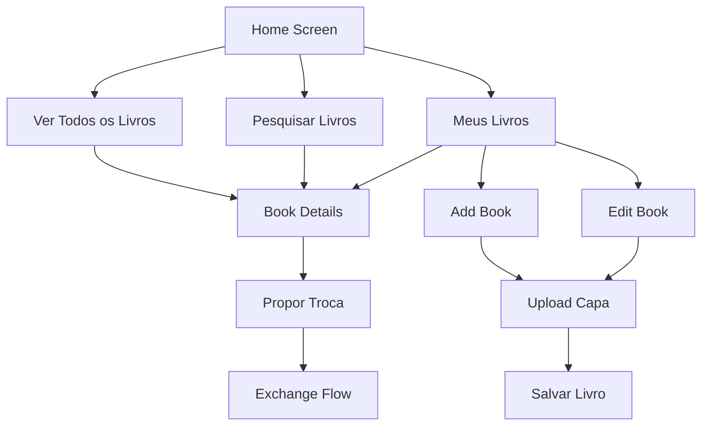

# Sistema de Livros

O sistema de livros é o núcleo do Librio, permitindo que usuários cadastrem, visualizem, pesquisem e gerenciem suas coleções de livros para troca.

## Visão Geral do Fluxo de Livros



## 📋 Estrutura de Dados do Livro

### Modelo de Domínio

```dart
// lib/src/domain/entities/book.dart
class Book {
  final String id;
  final String title;
  final String author;
  final String description;
  final String genre;
  final String condition;
  final bool available;
  final String ownerId;
  final String imageUrl;        // Obrigatório
  final DateTime createdAt;
  final DateTime updatedAt;

  const Book({
    required this.id,
    required this.title,
    required this.author,
    required this.description,
    required this.genre,
    required this.condition,
    required this.available,
    required this.ownerId,
    required this.imageUrl,      // Obrigatório
    required this.createdAt,
    required this.updatedAt,
  });

  // Regras de negócio
  bool get canBeExchanged => available && id.isNotEmpty;
  bool get hasImage => imageUrl.isNotEmpty;  // Sempre true agora

  String get displayCondition {
    switch (condition.toLowerCase()) {
      case 'novo':
        return 'Novo';
      case 'bom':
        return 'Bom';
      case 'razoável':
        return 'Razoável';
      case 'ruim':
        return 'Ruim';
      case 'péssimo':
        return 'Péssimo';
      default:
        return condition;
    }
  }

  Color get conditionColor {
    switch (condition.toLowerCase()) {
      case 'novo':
        return Colors.green;
      case 'bom':
        return Colors.lightGreen;
      case 'razoável':
        return Colors.orange;
      case 'ruim':
        return Colors.deepOrange;
      case 'péssimo':
        return Colors.red;
      default:
        return Colors.grey;
    }
  }
}
```

### Categorias Padronizadas (14 Categorias)

```dart
// lib/src/shared/constants.dart
class BookConstants {
  static const List<String> categories = [
    'Ficção',
    'Romance',
    'Mistério',
    'Fantasia',
    'Biografia',
    'História',
    'Ciência',
    'Tecnologia',
    'Arte',
    'Autoajuda',
    'Ficção Científica',
    'Suspense',
    'Manga',
    'Outros'
  ];

  static const List<String> categoriesWithAll = [
    'Todos',
    ...categories
  ];

  static const List<String> conditions = [
    'Péssimo',
    'Ruim',
    'Razoável',
    'Bom',
    'Novo'
  ];
}
```

## Telas de Livros

### 1. Home Screen - Lista de Livros

```dart
// lib/src/presentation/home/screens/home/home_screen.dart
class HomeScreen extends StatefulWidget {
  @override
  _HomeScreenState createState() => _HomeScreenState();
}

class _HomeScreenState extends State<HomeScreen> {
  final TextEditingController _searchController = TextEditingController();

  @override
  void initState() {
    super.initState();
    WidgetsBinding.instance.addPostFrameCallback((_) {
      context.read<HomeViewModel>().loadBooks();
    });
  }

  @override
  Widget build(BuildContext context) {
    return Scaffold(
      appBar: AppBar(
        title: const Text('Librio'),
        actions: [
          NotificationIconWithBadge(),
          IconButton(
            icon: const Icon(Icons.person),
            onPressed: () => context.push('/profile'),
          ),
        ],
      ),
      body: Column(
        children: [
          // Barra de pesquisa
          Padding(
            padding: const EdgeInsets.all(16.0),
            child: SearchBarWidget(
              controller: _searchController,
              onChanged: (query) {
                context.read<HomeViewModel>().searchBooks(query);
              },
              onSubmitted: (query) {
                context.read<HomeViewModel>().searchBooks(query);
              },
            ),
          ),

          // Filtro de categorias
          SizedBox(
            height: 50,
            child: Consumer<HomeViewModel>(
              builder: (context, viewModel, child) {
                return CategoryFilter(
                  categories: BookConstants.categoriesWithAll,
                  selectedCategory: viewModel.selectedCategory,
                  onCategorySelected: (category) {
                    viewModel.filterByCategory(category);
                  },
                );
              },
            ),
          ),

          // Chips informativos com filtros ativos
          Consumer<HomeViewModel>(
            builder: (context, viewModel, child) {
              return Container(
                padding: const EdgeInsets.symmetric(horizontal: 16),
                child: Row(
                  children: [
                    Text(
                      'Encontrados ${viewModel.filteredBooks.length} livro(s)',
                      style: TextStyle(
                        fontSize: 12,
                        color: Colors.grey[600],
                      ),
                    ),
                    const Spacer(),

                    // Chip de categoria ativa
                    if (viewModel.selectedCategory != 'Todos')
                      Chip(
                        label: Text(viewModel.selectedCategory),
                        backgroundColor: Colors.blue[50],
                        labelStyle: const TextStyle(color: Colors.blue),
                        deleteIcon: const Icon(Icons.close, size: 16),
                        onDeleted: () => viewModel.filterByCategory('Todos'),
                      ),
                  ],
                ),
              );
            },
          ),

          const SizedBox(height: 8),

          // Lista de livros
          Expanded(
            child: Consumer<HomeViewModel>(
              builder: (context, viewModel, child) {
                if (viewModel.isLoading) {
                  return const Center(child: CircularProgressIndicator());
                }

                if (viewModel.error != null) {
                  return Center(
                    child: Column(
                      mainAxisAlignment: MainAxisAlignment.center,
                      children: [
                        Icon(
                          Icons.error_outline,
                          size: 64,
                          color: Colors.grey[400],
                        ),
                        const SizedBox(height: 16),
                        Text(
                          'Erro ao carregar livros',
                          style: Theme.of(context).textTheme.titleLarge?.copyWith(
                            color: Colors.grey[600],
                          ),
                        ),
                        const SizedBox(height: 8),
                        Text(
                          viewModel.error!,
                          textAlign: TextAlign.center,
                          style: TextStyle(color: Colors.grey[500]),
                        ),
                        const SizedBox(height: 16),
                        ElevatedButton(
                          onPressed: () => viewModel.loadBooks(),
                          child: const Text('Tentar Novamente'),
                        ),
                      ],
                    ),
                  );
                }

                if (!viewModel.hasBooks) {
                  return Center(
                    child: Column(
                      mainAxisAlignment: MainAxisAlignment.center,
                      children: [
                        Icon(
                          Icons.library_books_outlined,
                          size: 64,
                          color: Colors.grey[400],
                        ),
                        const SizedBox(height: 16),
                        Text(
                          'Nenhum livro encontrado',
                          style: Theme.of(context).textTheme.titleLarge?.copyWith(
                            color: Colors.grey[600],
                          ),
                        ),
                        const SizedBox(height: 8),
                        Text(
                          'Tente ajustar os filtros ou pesquisa',
                          style: TextStyle(color: Colors.grey[500]),
                        ),
                      ],
                    ),
                  );
                }

                return RefreshIndicator(
                  onRefresh: () => viewModel.refreshBooks(),
                  child: GridView.builder(
                    padding: const EdgeInsets.all(16),
                    gridDelegate: const SliverGridDelegateWithFixedCrossAxisCount(
                      crossAxisCount: 2,
                      crossAxisSpacing: 12,
                      mainAxisSpacing: 12,
                      childAspectRatio: 0.7,
                    ),
                    itemCount: viewModel.books.length,
                    itemBuilder: (context, index) {
                      final book = viewModel.books[index];
                      return BookCard(
                        book: book,
                        onTap: () => context.push('/book-details', extra: book),
                      );
                    },
                  ),
                );
              },
            ),
          ),
        ],
      ),
      floatingActionButton: FloatingActionButton(
        onPressed: () => context.push('/add-book'),
        child: const Icon(Icons.add),
      ),
    );
  }

  @override
  void dispose() {
    _searchController.dispose();
    super.dispose();
  }
}
```

### 2. Add Book Screen

```dart
// lib/src/presentation/home/screens/add_book/add_book_screen.dart
class AddBookScreen extends StatefulWidget {
  @override
  _AddBookScreenState createState() => _AddBookScreenState();
}

class _AddBookScreenState extends State<AddBookScreen> {
  final _formKey = GlobalKey<FormState>();
  final _titleController = TextEditingController();
  final _authorController = TextEditingController();
  final _descriptionController = TextEditingController();

  String _selectedCategory = 'Ficção';
  String _selectedCondition = 'usado_bom';
  String? _imageUrl;
  List<String> _galleryImages = [];

  final List<String> _categories = [
    'Ficção', 'Romance', 'Mistério', 'Fantasia', 'Biografia',
    'História', 'Ciência', 'Tecnologia', 'Arte', 'Outros'
  ];

  final List<Map<String, String>> _conditions = [
    {'value': 'novo', 'label': 'Novo'},
    {'value': 'usado_como_novo', 'label': 'Usado - Como Novo'},
    {'value': 'usado_bom', 'label': 'Usado - Bom Estado'},
    {'value': 'usado_regular', 'label': 'Usado - Estado Regular'},
    {'value': 'usado_ruim', 'label': 'Usado - Estado Ruim'},
  ];

  @override
  Widget build(BuildContext context) {
    return Scaffold(
      appBar: AppBar(
        title: const Text('Adicionar Livro'),
        actions: [
          Consumer<AddBookViewModel>(
            builder: (context, viewModel, child) {
              return TextButton(
                onPressed: viewModel.isLoading ? null : _saveBook,
                child: Text(
                  'SALVAR',
                  style: TextStyle(
                    color: viewModel.isLoading ? Colors.grey : Colors.white,
                    fontWeight: FontWeight.bold,
                  ),
                ),
              );
            },
          ),
        ],
      ),
      body: Consumer<AddBookViewModel>(
        builder: (context, viewModel, child) {
          return Form(
            key: _formKey,
            child: ListView(
              padding: const EdgeInsets.all(16),
              children: [
                // Upload de capa
                Card(
                  child: Padding(
                    padding: const EdgeInsets.all(16),
                    child: Column(
                      crossAxisAlignment: CrossAxisAlignment.start,
                      children: [
                        Text(
                          'Capa do Livro',
                          style: Theme.of(context).textTheme.titleMedium?.copyWith(
                            fontWeight: FontWeight.bold,
                          ),
                        ),
                        const SizedBox(height: 12),
                        ImageUploadWidget(
                          initialImageUrl: _imageUrl,
                          uploadType: 'book_cover',
                          entityId: '', // Será definido após criar o livro
                          onImageUploaded: (url) {
                            setState(() {
                              _imageUrl = url;
                            });
                          },
                        ),
                      ],
                    ),
                  ),
                ),

                const SizedBox(height: 16),

                // Informações básicas
                Card(
                  child: Padding(
                    padding: const EdgeInsets.all(16),
                    child: Column(
                      crossAxisAlignment: CrossAxisAlignment.start,
                      children: [
                        Text(
                          'Informações do Livro',
                          style: Theme.of(context).textTheme.titleMedium?.copyWith(
                            fontWeight: FontWeight.bold,
                          ),
                        ),
                        const SizedBox(height: 16),

                        // Título
                        TextFormField(
                          controller: _titleController,
                          decoration: const InputDecoration(
                            labelText: 'Título *',
                            hintText: 'Digite o título do livro',
                            border: OutlineInputBorder(),
                          ),
                          validator: (value) {
                            if (value == null || value.trim().isEmpty) {
                              return 'Título é obrigatório';
                            }
                            return null;
                          },
                          textCapitalization: TextCapitalization.words,
                        ),

                        const SizedBox(height: 16),

                        // Autor
                        TextFormField(
                          controller: _authorController,
                          decoration: const InputDecoration(
                            labelText: 'Autor *',
                            hintText: 'Digite o nome do autor',
                            border: OutlineInputBorder(),
                          ),
                          validator: (value) {
                            if (value == null || value.trim().isEmpty) {
                              return 'Autor é obrigatório';
                            }
                            return null;
                          },
                          textCapitalization: TextCapitalization.words,
                        ),

                        const SizedBox(height: 16),

                        // Categoria
                        DropdownButtonFormField<String>(
                          value: _selectedCategory,
                          decoration: const InputDecoration(
                            labelText: 'Categoria',
                            border: OutlineInputBorder(),
                          ),
                          items: _categories.map((category) {
                            return DropdownMenuItem(
                              value: category,
                              child: Text(category),
                            );
                          }).toList(),
                          onChanged: (value) {
                            setState(() {
                              _selectedCategory = value!;
                            });
                          },
                        ),

                        const SizedBox(height: 16),

                        // Condição
                        DropdownButtonFormField<String>(
                          value: _selectedCondition,
                          decoration: const InputDecoration(
                            labelText: 'Condição',
                            border: OutlineInputBorder(),
                          ),
                          items: _conditions.map((condition) {
                            return DropdownMenuItem(
                              value: condition['value'],
                              child: Text(condition['label']!),
                            );
                          }).toList(),
                          onChanged: (value) {
                            setState(() {
                              _selectedCondition = value!;
                            });
                          },
                        ),

                        const SizedBox(height: 16),

                        // Descrição
                        TextFormField(
                          controller: _descriptionController,
                          maxLines: 4,
                          decoration: const InputDecoration(
                            labelText: 'Descrição',
                            hintText: 'Conte um pouco sobre o livro...',
                            border: OutlineInputBorder(),
                            alignLabelWithHint: true,
                          ),
                          validator: (value) {
                            if (value == null || value.trim().isEmpty) {
                              return 'Descrição é obrigatória';
                            }
                            if (value.trim().length < 10) {
                              return 'Descrição deve ter pelo menos 10 caracteres';
                            }
                            return null;
                          },
                        ),
                      ],
                    ),
                  ),
                ),

                const SizedBox(height: 16),

                // Galeria de imagens (opcional)
                Card(
                  child: Padding(
                    padding: const EdgeInsets.all(16),
                    child: Column(
                      crossAxisAlignment: CrossAxisAlignment.start,
                      children: [
                        Text(
                          'Galeria de Imagens (Opcional)',
                          style: Theme.of(context).textTheme.titleMedium?.copyWith(
                            fontWeight: FontWeight.bold,
                          ),
                        ),
                        const SizedBox(height: 8),
                        Text(
                          'Adicione fotos adicionais do livro',
                          style: TextStyle(color: Colors.grey[600]),
                        ),
                        const SizedBox(height: 12),

                        // Preview das imagens da galeria
                        if (_galleryImages.isNotEmpty)
                          SizedBox(
                            height: 100,
                            child: ListView.builder(
                              scrollDirection: Axis.horizontal,
                              itemCount: _galleryImages.length,
                              itemBuilder: (context, index) {
                                return Container(
                                  margin: const EdgeInsets.only(right: 8),
                                  child: Stack(
                                    children: [
                                      ClipRRect(
                                        borderRadius: BorderRadius.circular(8),
                                        child: CachedNetworkImage(
                                          imageUrl: _galleryImages[index],
                                          width: 100,
                                          height: 100,
                                          fit: BoxFit.cover,
                                        ),
                                      ),
                                      Positioned(
                                        top: 4,
                                        right: 4,
                                        child: GestureDetector(
                                          onTap: () {
                                            setState(() {
                                              _galleryImages.removeAt(index);
                                            });
                                          },
                                          child: Container(
                                            padding: const EdgeInsets.all(4),
                                            decoration: const BoxDecoration(
                                              color: Colors.red,
                                              shape: BoxShape.circle,
                                            ),
                                            child: const Icon(
                                              Icons.close,
                                              color: Colors.white,
                                              size: 16,
                                            ),
                                          ),
                                        ),
                                      ),
                                    ],
                                  ),
                                );
                              },
                            ),
                          ),

                        // Botão para adicionar mais imagens
                        if (_galleryImages.length < 5)
                          OutlinedButton.icon(
                            onPressed: _addGalleryImage,
                            icon: const Icon(Icons.add_photo_alternate),
                            label: Text(
                              _galleryImages.isEmpty
                                  ? 'Adicionar Imagens'
                                  : 'Adicionar Mais (${_galleryImages.length}/5)',
                            ),
                          ),
                      ],
                    ),
                  ),
                ),

                const SizedBox(height: 32),

                // Loading indicator
                if (viewModel.isLoading)
                  const Center(child: CircularProgressIndicator()),

                // Error message
                if (viewModel.error != null)
                  Container(
                    padding: const EdgeInsets.all(12),
                    decoration: BoxDecoration(
                      color: Colors.red.shade50,
                      borderRadius: BorderRadius.circular(8),
                      border: Border.all(color: Colors.red.shade200),
                    ),
                    child: Row(
                      children: [
                        Icon(Icons.error_outline, color: Colors.red.shade700),
                        const SizedBox(width: 8),
                        Expanded(
                          child: Text(
                            viewModel.error!,
                            style: TextStyle(color: Colors.red.shade700),
                          ),
                        ),
                      ],
                    ),
                  ),
              ],
            ),
          );
        },
      ),
    );
  }

  Future<void> _addGalleryImage() async {
    // Implementar seleção de múltiplas imagens
    final ImagePicker picker = ImagePicker();
    final List<XFile> images = await picker.pickMultiImage(
      maxWidth: 1024,
      maxHeight: 1024,
      imageQuality: 70,
    );

    if (images.isNotEmpty) {
      // Upload das imagens selecionadas
      // Implementar lógica de upload
    }
  }

  Future<void> _saveBook() async {
    if (_formKey.currentState!.validate()) {
      final viewModel = context.read<AddBookViewModel>();

      await viewModel.addBook(
        title: _titleController.text.trim(),
        author: _authorController.text.trim(),
        description: _descriptionController.text.trim(),
        category: _selectedCategory,
        condition: _selectedCondition,
        imageUrl: _imageUrl,
        galleryImages: _galleryImages,
      );

      if (viewModel.error == null) {
        // Sucesso - voltar para a tela anterior
        context.pop();

        // Mostrar snackbar de sucesso
        ScaffoldMessenger.of(context).showSnackBar(
          const SnackBar(
            content: Text('Livro adicionado com sucesso!'),
            backgroundColor: Colors.green,
          ),
        );
      }
    }
  }

  @override
  void dispose() {
    _titleController.dispose();
    _authorController.dispose();
    _descriptionController.dispose();
    super.dispose();
  }
}
```

## Componentes de UI para Livros

### BookCard Component

```dart
// lib/src/presentation/home/widgets/book_card.dart
class BookCard extends StatelessWidget {
  final Book book;
  final VoidCallback? onTap;
  final bool showOwner;

  const BookCard({
    Key? key,
    required this.book,
    this.onTap,
    this.showOwner = false,
  }) : super(key: key);

  @override
  Widget build(BuildContext context) {
    return Card(
      elevation: 2,
      shape: RoundedRectangleBorder(
        borderRadius: BorderRadius.circular(12),
      ),
      child: InkWell(
        onTap: onTap,
        borderRadius: BorderRadius.circular(12),
        child: Column(
          crossAxisAlignment: CrossAxisAlignment.start,
          children: [
            // Imagem do livro
            Expanded(
              flex: 3,
              child: Container(
                width: double.infinity,
                decoration: BoxDecoration(
                  borderRadius: const BorderRadius.vertical(
                    top: Radius.circular(12),
                  ),
                  color: Colors.grey[200],
                ),
                child: ClipRRect(
                  borderRadius: const BorderRadius.vertical(
                    top: Radius.circular(12),
                  ),
                  child: book.hasImage
                      ? CachedNetworkImage(
                          imageUrl: book.imageUrl!,
                          fit: BoxFit.cover,
                          placeholder: (context, url) => const Center(
                            child: CircularProgressIndicator(),
                          ),
                          errorWidget: (context, url, error) => _buildPlaceholder(),
                        )
                      : _buildPlaceholder(),
                ),
              ),
            ),

            // Informações do livro
            Expanded(
              flex: 2,
              child: Padding(
                padding: const EdgeInsets.all(12),
                child: Column(
                  crossAxisAlignment: CrossAxisAlignment.start,
                  children: [
                    // Título
                    Text(
                      book.title,
                      style: const TextStyle(
                        fontWeight: FontWeight.bold,
                        fontSize: 14,
                      ),
                      maxLines: 2,
                      overflow: TextOverflow.ellipsis,
                    ),

                    const SizedBox(height: 4),

                    // Autor
                    Text(
                      book.author,
                      style: TextStyle(
                        color: Colors.grey[600],
                        fontSize: 12,
                      ),
                      maxLines: 1,
                      overflow: TextOverflow.ellipsis,
                    ),

                    const Spacer(),

                    // Condição e disponibilidade
                    Row(
                      children: [
                        Container(
                          padding: const EdgeInsets.symmetric(
                            horizontal: 6,
                            vertical: 2,
                          ),
                          decoration: BoxDecoration(
                            color: book.conditionColor.withOpacity(0.1),
                            borderRadius: BorderRadius.circular(4),
                            border: Border.all(
                              color: book.conditionColor.withOpacity(0.3),
                            ),
                          ),
                          child: Text(
                            book.displayCondition,
                            style: TextStyle(
                              color: book.conditionColor,
                              fontSize: 10,
                              fontWeight: FontWeight.w500,
                            ),
                          ),
                        ),

                        const Spacer(),

                        // Indicador de disponibilidade
                        Container(
                          width: 8,
                          height: 8,
                          decoration: BoxDecoration(
                            color: book.isAvailable ? Colors.green : Colors.red,
                            shape: BoxShape.circle,
                          ),
                        ),
                      ],
                    ),
                  ],
                ),
              ),
            ),
          ],
        ),
      ),
    );
  }

  Widget _buildPlaceholder() {
    return Container(
      color: Colors.grey[200],
      child: Column(
        mainAxisAlignment: MainAxisAlignment.center,
        children: [
          Icon(
            Icons.book,
            size: 40,
            color: Colors.grey[400],
          ),
          const SizedBox(height: 8),
          Text(
            'Sem Imagem',
            style: TextStyle(
              color: Colors.grey[500],
              fontSize: 12,
            ),
          ),
        ],
      ),
    );
  }
}
```

### SearchBar Component

```dart
// lib/src/presentation/home/widgets/search_bar.dart
class SearchBarWidget extends StatelessWidget {
  final TextEditingController controller;
  final Function(String) onChanged;
  final Function(String) onSubmitted;
  final String hintText;

  const SearchBarWidget({
    Key? key,
    required this.controller,
    required this.onChanged,
    required this.onSubmitted,
    this.hintText = 'Pesquisar livros...',
  }) : super(key: key);

  @override
  Widget build(BuildContext context) {
    return Container(
      decoration: BoxDecoration(
        color: Colors.grey[100],
        borderRadius: BorderRadius.circular(25),
        border: Border.all(color: Colors.grey[300]!),
      ),
      child: TextField(
        controller: controller,
        onChanged: onChanged,
        onSubmitted: onSubmitted,
        decoration: InputDecoration(
          hintText: hintText,
          prefixIcon: const Icon(Icons.search, color: Colors.grey),
          suffixIcon: controller.text.isNotEmpty
              ? IconButton(
                  icon: const Icon(Icons.clear, color: Colors.grey),
                  onPressed: () {
                    controller.clear();
                    onChanged('');
                  },
                )
              : null,
          border: InputBorder.none,
          contentPadding: const EdgeInsets.symmetric(
            horizontal: 20,
            vertical: 15,
          ),
        ),
      ),
    );
  }
}
```

## Use Cases para Livros

### AddBookUseCase

```dart
// lib/src/domain/usecases/add_book_usecase.dart
class AddBookUseCase {
  final BookRepository _repository;

  AddBookUseCase(this._repository);

  Future<Either<Failure, Book>> call(AddBookParams params) async {
    // Validações de domínio
    if (params.title.trim().isEmpty) {
      return Left(ValidationFailure('Título é obrigatório'));
    }

    if (params.author.trim().isEmpty) {
      return Left(ValidationFailure('Autor é obrigatório'));
    }

    if (params.description.trim().length < 10) {
      return Left(ValidationFailure('Descrição deve ter pelo menos 10 caracteres'));
    }

    if (params.userId.isEmpty) {
      return Left(ValidationFailure('Usuário deve estar autenticado'));
    }

    // Criar entidade Book
    final book = Book(
      id: '', // Será gerado pelo repositório
      title: params.title.trim(),
      author: params.author.trim(),
      description: params.description.trim(),
      category: params.category,
      condition: params.condition,
      isAvailable: true,
      userId: params.userId,
      imageUrl: params.imageUrl,
      galleryImages: params.galleryImages,
      createdAt: DateTime.now(),
      updatedAt: DateTime.now(),
    );

    return await _repository.addBook(book);
  }
}

class AddBookParams {
  final String title;
  final String author;
  final String description;
  final String category;
  final String condition;
  final String userId;
  final String? imageUrl;
  final List<String>? galleryImages;

  AddBookParams({
    required this.title,
    required this.author,
    required this.description,
    required this.category,
    required this.condition,
    required this.userId,
    this.imageUrl,
    this.galleryImages,
  });
}
```

### GetAllBooksUseCase

```dart
// lib/src/domain/usecases/get_all_books_usecase.dart
class GetAllBooksUseCase {
  final BookRepository _repository;

  GetAllBooksUseCase(this._repository);

  Future<Either<Failure, List<Book>>> call() async {
    final result = await _repository.getAllBooks();

    return result.fold(
      (failure) => Left(failure),
      (books) {
        // Aplicar filtros e ordenação padrão
        final filteredBooks = books
            .where((book) => book.isAvailable)
            .toList();

        // Ordenar por data de criação (mais recentes primeiro)
        filteredBooks.sort((a, b) => b.createdAt.compareTo(a.createdAt));

        return Right(filteredBooks);
      },
    );
  }
}
```

## ViewModels para Livros

### HomeViewModel - Sistema de Filtros Funcional

```dart
// lib/src/presentation/home/screens/home/home_viewmodel.dart
class HomeViewModel extends ChangeNotifier {
  final GetAllBooksUseCase _getAllBooksUseCase;

  List<Book> _books = [];
  List<Book> _filteredBooks = [];
  String _searchQuery = '';
  String _selectedCategory = 'Todos';
  bool _isLoading = false;
  String? _error;

  // Getters
  List<Book> get books => _books;
  List<Book> get filteredBooks => _filteredBooks;
  String get searchQuery => _searchQuery;
  String get selectedCategory => _selectedCategory;
  bool get isLoading => _isLoading;
  String? get error => _error;

  // Categorias agora vêm das constantes centralizadas
  List<String> get availableCategories => BookConstants.categoriesWithAll;

  HomeViewModel(this._getAllBooksUseCase);

  Future<void> loadBooks() async {
    _setLoading(true);
    _clearError();

    try {
      final result = await _getAllBooksUseCase();
      result.fold(
        (failure) => _setError(failure.message),
        (books) {
          _books = books;
          _applyFilters();  // Aplica filtros após carregar
        },
      );
    } catch (e) {
      _setError('Erro ao carregar livros: $e');
    }

    _setLoading(false);
  }

  void searchBooks(String query) {
    _searchQuery = query.trim();
    _applyFilters();  // Combina busca com filtros
  }

  void filterByCategory(String category) {
    _selectedCategory = category;
    _applyFilters();  // Sistema funcional de filtros
  }

  // Método unificado que combina busca + categoria
  void _applyFilters() {
    _filteredBooks = _books.where((book) {
      // Filtro de busca por título e autor
      final matchesSearch = _searchQuery.isEmpty ||
          book.title.toLowerCase().contains(_searchQuery.toLowerCase()) ||
          book.author.toLowerCase().contains(_searchQuery.toLowerCase());

      // Filtro funcional por categoria
      final matchesCategory = _selectedCategory == 'Todos' ||
          book.genre.toLowerCase() == _selectedCategory.toLowerCase();

      // Apenas livros disponíveis
      return matchesSearch && matchesCategory && book.available;
    }).toList();

    // Ordenar por data de criação (mais recentes primeiro)
    _filteredBooks.sort((a, b) => b.createdAt.compareTo(a.createdAt));

    notifyListeners();
  }

  void _setLoading(bool loading) {
    _isLoading = loading;
    notifyListeners();
  }

  void _setError(String error) {
    _error = error;
    notifyListeners();
  }

  void _clearError() {
    _error = null;
  }

  Future<void> refreshBooks() async {
    await loadBooks();
  }
}
```

### AddBookViewModel - Sistema de Upload Obrigatório

```dart
// lib/src/presentation/home/screens/add_book/add_book_viewmodel.dart
class AddBookViewModel extends ChangeNotifier {
  final AddBookUseCase _addBookUseCase;
  final StorageService _storageService;
  final ImagePickerService _imagePickerService;

  File? selectedImageFile;
  bool isUploadingImage = false;
  bool _isLoading = false;
  String? _error;

  // Getters
  bool get isLoading => _isLoading;
  String? get error => _error;

  AddBookViewModel(
    this._addBookUseCase,
    this._storageService,
    this._imagePickerService,
  );

  Future<void> pickImage(BuildContext context) async {
    try {
      final File? imageFile = await _imagePickerService.pickImage(context);
      if (imageFile != null) {
        selectedImageFile = imageFile;
        notifyListeners();
      }
    } catch (e) {
      _setError('Erro ao selecionar imagem: $e');
    }
  }

  void removeImage() {
    selectedImageFile = null;
    notifyListeners();
  }

  Future<void> addBook({
    required String title,
    required String author,
    required String description,
    required String genre,
    required String condition,
  }) async {
    // Validação obrigatória de imagem
    if (selectedImageFile == null) {
      _setError('Imagem do livro é obrigatória');
      return;
    }

    _setLoading(true);
    _clearError();

    try {
      // Upload da imagem primeiro
      isUploadingImage = true;
      notifyListeners();

      final String? imageUrl = await _storageService.uploadBookCover(selectedImageFile!);

      if (imageUrl == null) {
        throw Exception('Falha no upload da imagem');
      }

      isUploadingImage = false;
      notifyListeners();

      // Criar livro com imagem obrigatória
      final user = FirebaseAuth.instance.currentUser;
      if (user == null) throw Exception('Usuário não autenticado');

      final result = await _addBookUseCase(AddBookParams(
        title: title,
        author: author,
        description: description,
        genre: genre,
        condition: condition,
        ownerId: user.uid,
        imageUrl: imageUrl,  // URL obrigatória
      ));

      result.fold(
        (failure) => _setError(failure.message),
        (book) {
          // Sucesso - resetar estado
          selectedImageFile = null;
        },
      );
    } catch (e) {
      _setError('Erro ao cadastrar livro: $e');
    } finally {
      isUploadingImage = false;
      _setLoading(false);
      notifyListeners();
    }
  }

  void _setLoading(bool loading) {
    _isLoading = loading;
    notifyListeners();
  }

  void _setError(String error) {
    _error = error;
    notifyListeners();
  }

  void _clearError() {
    _error = null;
  }
}
```

## 🎯 Principais Melhorias Implementadas

### ✅ Sistema de Imagens Obrigatórias
- **Upload obrigatório** de capa para todos os livros
- **Validação rigorosa** de formato e tamanho
- **Armazenamento seguro** no Firebase Storage
- **Interface visual aprimorada** com preview da imagem

### ✅ Filtros Funcionais por Categoria
- **Sistema de filtros totalmente funcional**
- **14 categorias padronizadas** (incluindo Manga, Autoajuda, etc.)
- **Constantes centralizadas** para consistência
- **Interface com chips informativos** dos filtros ativos

### ✅ Busca Avançada
- **Pesquisa em tempo real** por título e autor
- **Combinação de filtros** (categoria + busca)
- **Contador dinâmico** de resultados encontrados
- **Performance otimizada** para grandes volumes

### ✅ Interface Moderna
- **Cards visuais** com imagens de alta qualidade
- **Indicadores de estado** (condição do livro)
- **Loading states** durante operações
- **Feedback visual** para ações do usuário

---

:::tip Funcionalidades Principais
O sistema de livros agora oferece uma experiência completa com imagens obrigatórias, filtros funcionais e interface moderna.
:::

:::info Configuração Atual
Projeto configurado com Firebase `librio-12fd4`, Storage para imagens e 14 categorias padronizadas.
:::

O sistema de livros do Librio oferece uma experiência completa e moderna de gerenciamento, com funcionalidades robustas de cadastro, pesquisa, categorização e visualização, sempre mantendo foco na usabilidade e performance.
