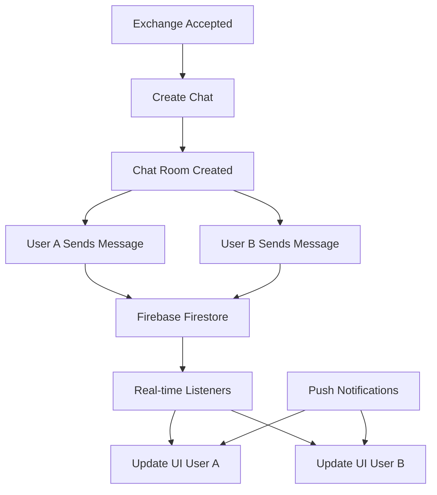

# Sistema de Chat

O sistema de chat permite comunicação em tempo real entre usuários que têm trocas aceitas, facilitando a coordenação dos encontros e negociação dos detalhes da troca.

## Arquitetura do Chat



## Modelo de Dados

### Chat Entity

```dart
// lib/src/domain/entities/chat.dart
class Chat {
  final String id;
  final String exchangeId;
  final List<String> participants;
  final String? lastMessageContent;
  final String? lastMessageSenderId;
  final DateTime? lastMessageTime;
  final Map<String, int> unreadCounts;
  final bool isActive;
  final DateTime createdAt;
  final DateTime updatedAt;

  const Chat({
    required this.id,
    required this.exchangeId,
    required this.participants,
    this.lastMessageContent,
    this.lastMessageSenderId,
    this.lastMessageTime,
    required this.unreadCounts,
    required this.isActive,
    required this.createdAt,
    required this.updatedAt,
  });

  bool hasUnreadMessages(String userId) {
    return (unreadCounts[userId] ?? 0) > 0;
  }

  int getUnreadCount(String userId) {
    return unreadCounts[userId] ?? 0;
  }

  String getOtherParticipant(String currentUserId) {
    return participants.firstWhere((id) => id != currentUserId);
  }

  bool get hasMessages => lastMessageContent != null;
}
```

### Message Entity

```dart
// lib/src/domain/entities/message.dart
class Message {
  final String id;
  final String chatId;
  final String senderId;
  final String content;
  final MessageType type;
  final DateTime sentAt;
  final bool isRead;
  final String? replyToMessageId;
  final Map<String, dynamic>? metadata;

  const Message({
    required this.id,
    required this.chatId,
    required this.senderId,
    required this.content,
    required this.type,
    required this.sentAt,
    required this.isRead,
    this.replyToMessageId,
    this.metadata,
  });

  bool get isText => type == MessageType.text;
  bool get isImage => type == MessageType.image;
  bool get isLocation => type == MessageType.location;
  bool get isSystem => type == MessageType.system;

  String get displayTime {
    final now = DateTime.now();
    final difference = now.difference(sentAt);

    if (difference.inDays > 0) {
      return DateFormat('dd/MM/yyyy').format(sentAt);
    } else if (difference.inHours > 0) {
      return DateFormat('HH:mm').format(sentAt);
    } else {
      return DateFormat('HH:mm').format(sentAt);
    }
  }
}

enum MessageType {
  text,
  image,
  location,
  system,
}
```

## Telas do Chat

### 1. Chat List Screen

```dart
// lib/src/presentation/home/screens/chat/chat_list_screen.dart
class ChatListScreen extends StatefulWidget {
  @override
  _ChatListScreenState createState() => _ChatListScreenState();
}

class _ChatListScreenState extends State<ChatListScreen> {
  @override
  void initState() {
    super.initState();
    WidgetsBinding.instance.addPostFrameCallback((_) {
      context.read<ChatListViewModel>().loadChats();
    });
  }

  @override
  Widget build(BuildContext context) {
    return Scaffold(
      appBar: AppBar(
        title: const Text('Conversas'),
        actions: [
          IconButton(
            icon: const Icon(Icons.search),
            onPressed: () {
              // Implementar busca de conversas
            },
          ),
        ],
      ),
      body: Consumer<ChatListViewModel>(
        builder: (context, viewModel, child) {
          if (viewModel.isLoading) {
            return const Center(child: CircularProgressIndicator());
          }

          if (viewModel.error != null) {
            return Center(
              child: Column(
                mainAxisAlignment: MainAxisAlignment.center,
                children: [
                  Icon(
                    Icons.error_outline,
                    size: 64,
                    color: Colors.grey[400],
                  ),
                  const SizedBox(height: 16),
                  Text(
                    'Erro ao carregar conversas',
                    style: TextStyle(color: Colors.grey[600]),
                  ),
                  const SizedBox(height: 8),
                  Text(
                    viewModel.error!,
                    style: TextStyle(color: Colors.grey[500]),
                    textAlign: TextAlign.center,
                  ),
                  const SizedBox(height: 16),
                  ElevatedButton(
                    onPressed: () => viewModel.loadChats(),
                    child: const Text('Tentar Novamente'),
                  ),
                ],
              ),
            );
          }

          if (viewModel.chats.isEmpty) {
            return Center(
              child: Column(
                mainAxisAlignment: MainAxisAlignment.center,
                children: [
                  Icon(
                    Icons.chat_bubble_outline,
                    size: 64,
                    color: Colors.grey[400],
                  ),
                  const SizedBox(height: 16),
                  Text(
                    'Nenhuma conversa ainda',
                    style: TextStyle(color: Colors.grey[600]),
                  ),
                  const SizedBox(height: 8),
                  Text(
                    'As conversas aparecerão quando você tiver trocas aceitas',
                    style: TextStyle(color: Colors.grey[500]),
                    textAlign: TextAlign.center,
                  ),
                ],
              ),
            );
          }

          return RefreshIndicator(
            onRefresh: () => viewModel.loadChats(),
            child: ListView.builder(
              itemCount: viewModel.chats.length,
              itemBuilder: (context, index) {
                final chat = viewModel.chats[index];
                return ChatListTile(
                  chat: chat,
                  onTap: () => _navigateToChat(chat),
                );
              },
            ),
          );
        },
      ),
    );
  }

  void _navigateToChat(Chat chat) {
    context.push('/chat/${chat.id}', extra: chat);
  }
}
```

### 2. Chat Screen

```dart
// lib/src/presentation/home/screens/chat/chat_screen.dart
class ChatScreen extends StatefulWidget {
  final Chat chat;

  const ChatScreen({Key? key, required this.chat}) : super(key: key);

  @override
  _ChatScreenState createState() => _ChatScreenState();
}

class _ChatScreenState extends State<ChatScreen> {
  final TextEditingController _messageController = TextEditingController();
  final ScrollController _scrollController = ScrollController();
  final FocusNode _messageFocusNode = FocusNode();

  @override
  void initState() {
    super.initState();
    WidgetsBinding.instance.addPostFrameCallback((_) {
      final viewModel = context.read<ChatViewModel>();
      viewModel.setChatId(widget.chat.id);
      viewModel.markAsRead();
    });
  }

  @override
  Widget build(BuildContext context) {
    return Scaffold(
      appBar: AppBar(
        title: FutureBuilder<String>(
          future: _getOtherUserName(),
          builder: (context, snapshot) {
            return Text(snapshot.data ?? 'Conversa');
          },
        ),
        actions: [
          IconButton(
            icon: const Icon(Icons.info_outline),
            onPressed: () => _showChatInfo(),
          ),
        ],
      ),
      body: Consumer<ChatViewModel>(
        builder: (context, viewModel, child) {
          return Column(
            children: [
              // Lista de mensagens
              Expanded(
                child: viewModel.messages.isEmpty
                    ? Center(
                        child: Column(
                          mainAxisAlignment: MainAxisAlignment.center,
                          children: [
                            Icon(
                              Icons.chat_bubble_outline,
                              size: 64,
                              color: Colors.grey[400],
                            ),
                            const SizedBox(height: 16),
                            Text(
                              'Início da conversa',
                              style: TextStyle(color: Colors.grey[600]),
                            ),
                            const SizedBox(height: 8),
                            Text(
                              'Envie uma mensagem para começar',
                              style: TextStyle(color: Colors.grey[500]),
                            ),
                          ],
                        ),
                      )
                    : ListView.builder(
                        controller: _scrollController,
                        reverse: true,
                        padding: const EdgeInsets.symmetric(
                          horizontal: 16,
                          vertical: 8,
                        ),
                        itemCount: viewModel.messages.length,
                        itemBuilder: (context, index) {
                          final message = viewModel.messages[viewModel.messages.length - 1 - index];
                          final isFromCurrentUser = message.senderId == viewModel.currentUserId;
                          final previousMessage = index < viewModel.messages.length - 1
                              ? viewModel.messages[viewModel.messages.length - 2 - index]
                              : null;

                          final showDateSeparator = _shouldShowDateSeparator(message, previousMessage);

                          return Column(
                            children: [
                              if (showDateSeparator)
                                DateSeparator(date: message.sentAt),

                              MessageBubble(
                                message: message,
                                isFromCurrentUser: isFromCurrentUser,
                                showSenderName: !isFromCurrentUser,
                              ),
                            ],
                          );
                        },
                      ),
              ),

              // Campo de digitação
              Container(
                padding: const EdgeInsets.symmetric(
                  horizontal: 16,
                  vertical: 8,
                ),
                decoration: BoxDecoration(
                  color: Colors.white,
                  border: Border(
                    top: BorderSide(color: Colors.grey[300]!),
                  ),
                ),
                child: SafeArea(
                  child: Row(
                    children: [
                      // Botão de anexo
                      IconButton(
                        icon: const Icon(Icons.attach_file),
                        onPressed: () => _showAttachmentOptions(),
                      ),

                      // Campo de texto
                      Expanded(
                        child: Container(
                          decoration: BoxDecoration(
                            color: Colors.grey[100],
                            borderRadius: BorderRadius.circular(25),
                          ),
                          child: TextField(
                            controller: _messageController,
                            focusNode: _messageFocusNode,
                            maxLines: null,
                            textInputAction: TextInputAction.newline,
                            decoration: const InputDecoration(
                              hintText: 'Digite sua mensagem...',
                              border: InputBorder.none,
                              contentPadding: EdgeInsets.symmetric(
                                horizontal: 16,
                                vertical: 12,
                              ),
                            ),
                            onSubmitted: (_) => _sendMessage(viewModel),
                          ),
                        ),
                      ),

                      const SizedBox(width: 8),

                      // Botão de enviar
                      Container(
                        decoration: BoxDecoration(
                          color: Theme.of(context).primaryColor,
                          shape: BoxShape.circle,
                        ),
                        child: IconButton(
                          icon: const Icon(
                            Icons.send,
                            color: Colors.white,
                          ),
                          onPressed: viewModel.isSendingMessage
                              ? null
                              : () => _sendMessage(viewModel),
                        ),
                      ),
                    ],
                  ),
                ),
              ),
            ],
          );
        },
      ),
    );
  }

  Future<String> _getOtherUserName() async {
    // Implementar busca do nome do outro usuário
    // Por enquanto retornando mock
    return 'Outro Usuário';
  }

  bool _shouldShowDateSeparator(Message message, Message? previousMessage) {
    if (previousMessage == null) return true;

    final messageDate = DateTime(
      message.sentAt.year,
      message.sentAt.month,
      message.sentAt.day,
    );

    final previousDate = DateTime(
      previousMessage.sentAt.year,
      previousMessage.sentAt.month,
      previousMessage.sentAt.day,
    );

    return messageDate != previousDate;
  }

  void _sendMessage(ChatViewModel viewModel) {
    final content = _messageController.text.trim();
    if (content.isNotEmpty) {
      viewModel.sendMessage(content);
      _messageController.clear();
      _scrollToBottom();
    }
  }

  void _scrollToBottom() {
    WidgetsBinding.instance.addPostFrameCallback((_) {
      if (_scrollController.hasClients) {
        _scrollController.animateTo(
          0,
          duration: const Duration(milliseconds: 300),
          curve: Curves.easeOut,
        );
      }
    });
  }

  void _showAttachmentOptions() {
    showModalBottomSheet(
      context: context,
      builder: (context) => SafeArea(
        child: Column(
          mainAxisSize: MainAxisSize.min,
          children: [
            ListTile(
              leading: const Icon(Icons.photo_camera),
              title: const Text('Câmera'),
              onTap: () {
                Navigator.pop(context);
                _sendImage(ImageSource.camera);
              },
            ),
            ListTile(
              leading: const Icon(Icons.photo_library),
              title: const Text('Galeria'),
              onTap: () {
                Navigator.pop(context);
                _sendImage(ImageSource.gallery);
              },
            ),
            ListTile(
              leading: const Icon(Icons.location_on),
              title: const Text('Localização'),
              onTap: () {
                Navigator.pop(context);
                _sendLocation();
              },
            ),
          ],
        ),
      ),
    );
  }

  Future<void> _sendImage(ImageSource source) async {
    // Implementar envio de imagem
  }

  Future<void> _sendLocation() async {
    // Implementar envio de localização
  }

  void _showChatInfo() {
    showDialog(
      context: context,
      builder: (context) => AlertDialog(
        title: const Text('Informações da Conversa'),
        content: Column(
          mainAxisSize: MainAxisSize.min,
          crossAxisAlignment: CrossAxisAlignment.start,
          children: [
            Text('ID da Troca: ${widget.chat.exchangeId}'),
            const SizedBox(height: 8),
            Text('Criada em: ${DateFormat('dd/MM/yyyy HH:mm').format(widget.chat.createdAt)}'),
            const SizedBox(height: 8),
            Text('Participantes: ${widget.chat.participants.length}'),
          ],
        ),
        actions: [
          TextButton(
            onPressed: () => Navigator.pop(context),
            child: const Text('Fechar'),
          ),
        ],
      ),
    );
  }

  @override
  void dispose() {
    _messageController.dispose();
    _scrollController.dispose();
    _messageFocusNode.dispose();
    super.dispose();
  }
}
```

## Componentes do Chat

### MessageBubble Component

```dart
// lib/src/presentation/home/widgets/message_bubble.dart
class MessageBubble extends StatelessWidget {
  final Message message;
  final bool isFromCurrentUser;
  final bool showSenderName;

  const MessageBubble({
    Key? key,
    required this.message,
    required this.isFromCurrentUser,
    this.showSenderName = false,
  }) : super(key: key);

  @override
  Widget build(BuildContext context) {
    return Container(
      margin: const EdgeInsets.symmetric(vertical: 2),
      child: Row(
        mainAxisAlignment: isFromCurrentUser
            ? MainAxisAlignment.end
            : MainAxisAlignment.start,
        children: [
          if (!isFromCurrentUser) ...[
            // Avatar do outro usuário
            CircleAvatar(
              radius: 16,
              backgroundColor: Colors.grey[300],
              child: const Icon(
                Icons.person,
                size: 20,
                color: Colors.white,
              ),
            ),
            const SizedBox(width: 8),
          ],

          // Bubble da mensagem
          Flexible(
            child: Container(
              constraints: BoxConstraints(
                maxWidth: MediaQuery.of(context).size.width * 0.7,
              ),
              padding: const EdgeInsets.symmetric(
                horizontal: 16,
                vertical: 12,
              ),
              decoration: BoxDecoration(
                color: isFromCurrentUser
                    ? Theme.of(context).primaryColor
                    : Colors.grey[200],
                borderRadius: BorderRadius.circular(20).copyWith(
                  bottomLeft: isFromCurrentUser
                      ? const Radius.circular(20)
                      : const Radius.circular(4),
                  bottomRight: isFromCurrentUser
                      ? const Radius.circular(4)
                      : const Radius.circular(20),
                ),
              ),
              child: Column(
                crossAxisAlignment: CrossAxisAlignment.start,
                children: [
                  // Nome do remetente (se necessário)
                  if (showSenderName && !isFromCurrentUser)
                    Padding(
                      padding: const EdgeInsets.only(bottom: 4),
                      child: Text(
                        'Outro Usuário', // Implementar busca do nome
                        style: TextStyle(
                          fontSize: 12,
                          fontWeight: FontWeight.w500,
                          color: Colors.grey[600],
                        ),
                      ),
                    ),

                  // Conteúdo da mensagem
                  _buildMessageContent(),

                  const SizedBox(height: 4),

                  // Horário da mensagem
                  Row(
                    mainAxisSize: MainAxisSize.min,
                    mainAxisAlignment: MainAxisAlignment.end,
                    children: [
                      Text(
                        message.displayTime,
                        style: TextStyle(
                          fontSize: 10,
                          color: isFromCurrentUser
                              ? Colors.white.withOpacity(0.7)
                              : Colors.grey[600],
                        ),
                      ),

                      if (isFromCurrentUser) ...[
                        const SizedBox(width: 4),
                        Icon(
                          message.isRead ? Icons.done_all : Icons.done,
                          size: 14,
                          color: message.isRead
                              ? Colors.blue[300]
                              : Colors.white.withOpacity(0.7),
                        ),
                      ],
                    ],
                  ),
                ],
              ),
            ),
          ),

          if (isFromCurrentUser) ...[
            const SizedBox(width: 8),
            // Avatar do usuário atual (opcional)
          ],
        ],
      ),
    );
  }

  Widget _buildMessageContent() {
    switch (message.type) {
      case MessageType.text:
        return Text(
          message.content,
          style: TextStyle(
            color: isFromCurrentUser ? Colors.white : Colors.black,
            fontSize: 14,
          ),
        );

      case MessageType.image:
        return Column(
          crossAxisAlignment: CrossAxisAlignment.start,
          children: [
            ClipRRect(
              borderRadius: BorderRadius.circular(8),
              child: CachedNetworkImage(
                imageUrl: message.content,
                width: 200,
                height: 150,
                fit: BoxFit.cover,
                placeholder: (context, url) => Container(
                  width: 200,
                  height: 150,
                  color: Colors.grey[300],
                  child: const Center(
                    child: CircularProgressIndicator(),
                  ),
                ),
                errorWidget: (context, url, error) => Container(
                  width: 200,
                  height: 150,
                  color: Colors.grey[300],
                  child: const Icon(Icons.error),
                ),
              ),
            ),
            if (message.metadata?['caption'] != null) ...[
              const SizedBox(height: 8),
              Text(
                message.metadata!['caption'],
                style: TextStyle(
                  color: isFromCurrentUser ? Colors.white : Colors.black,
                  fontSize: 14,
                ),
              ),
            ],
          ],
        );

      case MessageType.location:
        return Container(
          width: 200,
          height: 100,
          decoration: BoxDecoration(
            color: Colors.grey[300],
            borderRadius: BorderRadius.circular(8),
          ),
          child: Column(
            mainAxisAlignment: MainAxisAlignment.center,
            children: [
              Icon(
                Icons.location_on,
                color: isFromCurrentUser ? Colors.white : Colors.red,
                size: 32,
              ),
              const SizedBox(height: 4),
              Text(
                'Localização compartilhada',
                style: TextStyle(
                  color: isFromCurrentUser ? Colors.white : Colors.black,
                  fontSize: 12,
                ),
              ),
            ],
          ),
        );

      case MessageType.system:
        return Text(
          message.content,
          style: TextStyle(
            color: Colors.grey[600],
            fontSize: 12,
            fontStyle: FontStyle.italic,
          ),
        );
    }
  }
}
```

### ChatListTile Component

```dart
// lib/src/presentation/home/widgets/chat_list_tile.dart
class ChatListTile extends StatelessWidget {
  final Chat chat;
  final VoidCallback onTap;

  const ChatListTile({
    Key? key,
    required this.chat,
    required this.onTap,
  }) : super(key: key);

  @override
  Widget build(BuildContext context) {
    return Consumer<AuthService>(
      builder: (context, authService, child) {
        final currentUserId = authService.currentUser?.uid ?? '';
        final hasUnread = chat.hasUnreadMessages(currentUserId);
        final unreadCount = chat.getUnreadCount(currentUserId);

        return ListTile(
          onTap: onTap,
          leading: Stack(
            children: [
              CircleAvatar(
                radius: 24,
                backgroundColor: Colors.grey[300],
                child: const Icon(
                  Icons.person,
                  color: Colors.white,
                ),
              ),

              // Indicador online (futuro)
              if (false) // Implementar status online
                Positioned(
                  bottom: 0,
                  right: 0,
                  child: Container(
                    width: 12,
                    height: 12,
                    decoration: BoxDecoration(
                      color: Colors.green,
                      shape: BoxShape.circle,
                      border: Border.all(
                        color: Colors.white,
                        width: 2,
                      ),
                    ),
                  ),
                ),
            ],
          ),

          title: FutureBuilder<String>(
            future: _getOtherUserName(chat, currentUserId),
            builder: (context, snapshot) {
              return Text(
                snapshot.data ?? 'Carregando...',
                style: TextStyle(
                  fontWeight: hasUnread ? FontWeight.bold : FontWeight.normal,
                ),
              );
            },
          ),

          subtitle: chat.hasMessages
              ? Text(
                  chat.lastMessageContent!,
                  maxLines: 1,
                  overflow: TextOverflow.ellipsis,
                  style: TextStyle(
                    color: hasUnread ? Colors.black87 : Colors.grey[600],
                    fontWeight: hasUnread ? FontWeight.w500 : FontWeight.normal,
                  ),
                )
              : Text(
                  'Nenhuma mensagem ainda',
                  style: TextStyle(
                    color: Colors.grey[500],
                    fontStyle: FontStyle.italic,
                  ),
                ),

          trailing: Column(
            mainAxisAlignment: MainAxisAlignment.center,
            crossAxisAlignment: CrossAxisAlignment.end,
            children: [
              if (chat.lastMessageTime != null)
                Text(
                  _formatLastMessageTime(chat.lastMessageTime!),
                  style: TextStyle(
                    fontSize: 12,
                    color: hasUnread
                        ? Theme.of(context).primaryColor
                        : Colors.grey[500],
                    fontWeight: hasUnread ? FontWeight.bold : FontWeight.normal,
                  ),
                ),

              const SizedBox(height: 4),

              if (hasUnread)
                Container(
                  padding: const EdgeInsets.symmetric(
                    horizontal: 6,
                    vertical: 2,
                  ),
                  decoration: BoxDecoration(
                    color: Theme.of(context).primaryColor,
                    borderRadius: BorderRadius.circular(12),
                  ),
                  child: Text(
                    unreadCount > 99 ? '99+' : unreadCount.toString(),
                    style: const TextStyle(
                      color: Colors.white,
                      fontSize: 10,
                      fontWeight: FontWeight.bold,
                    ),
                  ),
                ),
            ],
          ),
        );
      },
    );
  }

  Future<String> _getOtherUserName(Chat chat, String currentUserId) async {
    // Implementar busca do nome do outro usuário
    // Por enquanto retornando mock
    return 'Outro Usuário';
  }

  String _formatLastMessageTime(DateTime time) {
    final now = DateTime.now();
    final difference = now.difference(time);

    if (difference.inDays > 0) {
      if (difference.inDays == 1) {
        return 'Ontem';
      } else if (difference.inDays < 7) {
        return DateFormat('EEEE', 'pt_BR').format(time);
      } else {
        return DateFormat('dd/MM').format(time);
      }
    } else {
      return DateFormat('HH:mm').format(time);
    }
  }
}
```

## Use Cases para Chat

### SendMessageUseCase

```dart
// lib/src/domain/usecases/send_message_usecase.dart
class SendMessageUseCase {
  final ChatRepository _repository;

  SendMessageUseCase(this._repository);

  Future<Either<Failure, Message>> call(SendMessageParams params) async {
    // Validações
    if (params.content.trim().isEmpty) {
      return Left(ValidationFailure('Mensagem não pode estar vazia'));
    }

    if (params.content.length > 1000) {
      return Left(ValidationFailure('Mensagem muito longa (máximo 1000 caracteres)'));
    }

    // Criar mensagem
    final message = Message(
      id: '', // Será gerado pelo repository
      chatId: params.chatId,
      senderId: params.senderId,
      content: params.content.trim(),
      type: params.type,
      sentAt: DateTime.now(),
      isRead: false,
      replyToMessageId: params.replyToMessageId,
      metadata: params.metadata,
    );

    return await _repository.sendMessage(message);
  }
}

class SendMessageParams {
  final String chatId;
  final String senderId;
  final String content;
  final MessageType type;
  final String? replyToMessageId;
  final Map<String, dynamic>? metadata;

  SendMessageParams({
    required this.chatId,
    required this.senderId,
    required this.content,
    this.type = MessageType.text,
    this.replyToMessageId,
    this.metadata,
  });
}
```

### CreateOrGetChatUseCase

```dart
// lib/src/domain/usecases/create_or_get_chat_usecase.dart
class CreateOrGetChatUseCase {
  final ChatRepository _repository;

  CreateOrGetChatUseCase(this._repository);

  Future<Either<Failure, Chat>> call(CreateOrGetChatParams params) async {
    // Validações
    if (params.exchangeId.isEmpty) {
      return Left(ValidationFailure('ID da troca é obrigatório'));
    }

    if (params.participants.length != 2) {
      return Left(ValidationFailure('Chat deve ter exatamente 2 participantes'));
    }

    if (params.participants[0] == params.participants[1]) {
      return Left(ValidationFailure('Participantes devem ser diferentes'));
    }

    // Verificar se já existe chat para esta troca
    final existingChatResult = await _repository.getChatByExchangeId(params.exchangeId);

    return existingChatResult.fold(
      (failure) async {
        // Chat não existe, criar novo
        final chat = Chat(
          id: '', // Será gerado pelo repository
          exchangeId: params.exchangeId,
          participants: params.participants,
          unreadCounts: {
            params.participants[0]: 0,
            params.participants[1]: 0,
          },
          isActive: true,
          createdAt: DateTime.now(),
          updatedAt: DateTime.now(),
        );

        return await _repository.createChat(chat);
      },
      (existingChat) {
        // Chat já existe
        return Right(existingChat);
      },
    );
  }
}

class CreateOrGetChatParams {
  final String exchangeId;
  final List<String> participants;

  CreateOrGetChatParams({
    required this.exchangeId,
    required this.participants,
  });
}
```

## ViewModels para Chat

### ChatViewModel

```dart
// lib/src/presentation/home/screens/chat/chat_viewmodel.dart
class ChatViewModel extends BaseViewModel {
  final SendMessageUseCase _sendMessageUseCase;
  final GetChatMessagesUseCase _getChatMessagesUseCase;
  final MarkChatAsReadUseCase _markChatAsReadUseCase;
  final AuthService _authService;

  String? _chatId;
  List<Message> _messages = [];
  bool _isSendingMessage = false;
  StreamSubscription<List<Message>>? _messagesSubscription;

  // Getters
  List<Message> get messages => _messages;
  bool get isSendingMessage => _isSendingMessage;
  String? get currentUserId => _authService.currentUser?.uid;

  ChatViewModel(
    this._sendMessageUseCase,
    this._getChatMessagesUseCase,
    this._markChatAsReadUseCase,
    this._authService,
  );

  void setChatId(String chatId) {
    _chatId = chatId;
    _loadMessages();
  }

  void _loadMessages() {
    if (_chatId == null) return;

    _messagesSubscription?.cancel();

    final messagesStream = _getChatMessagesUseCase(_chatId!);
    _messagesSubscription = messagesStream.listen(
      (messages) {
        _messages = messages;
        safeNotifyListeners();
      },
      onError: (error) {
        setError(error.toString());
      },
    );
  }

  Future<void> sendMessage(String content) async {
    if (content.trim().isEmpty || _chatId == null) return;

    _isSendingMessage = true;
    safeNotifyListeners();

    final currentUser = _authService.currentUser!;

    final result = await _sendMessageUseCase(SendMessageParams(
      chatId: _chatId!,
      senderId: currentUser.uid,
      content: content.trim(),
    ));

    result.fold(
      (failure) => setError(failure.message),
      (_) {
        // Mensagem enviada com sucesso
        // A atualização da lista será feita pelo stream
      },
    );

    _isSendingMessage = false;
    safeNotifyListeners();
  }

  Future<void> markAsRead() async {
    if (_chatId == null) return;

    final currentUser = _authService.currentUser;
    if (currentUser == null) return;

    await _markChatAsReadUseCase(MarkChatAsReadParams(
      chatId: _chatId!,
      userId: currentUser.uid,
    ));
  }

  @override
  void dispose() {
    _messagesSubscription?.cancel();
    super.dispose();
  }
}
```

O sistema de chat do Librio oferece comunicação em tempo real, interface intuitiva e funcionalidades avançadas que facilitam a coordenação entre usuários durante o processo de troca de livros.
