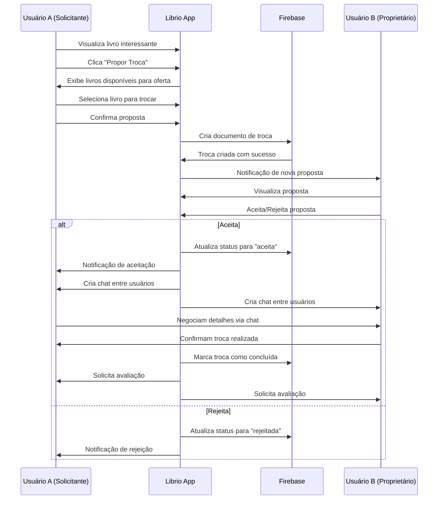
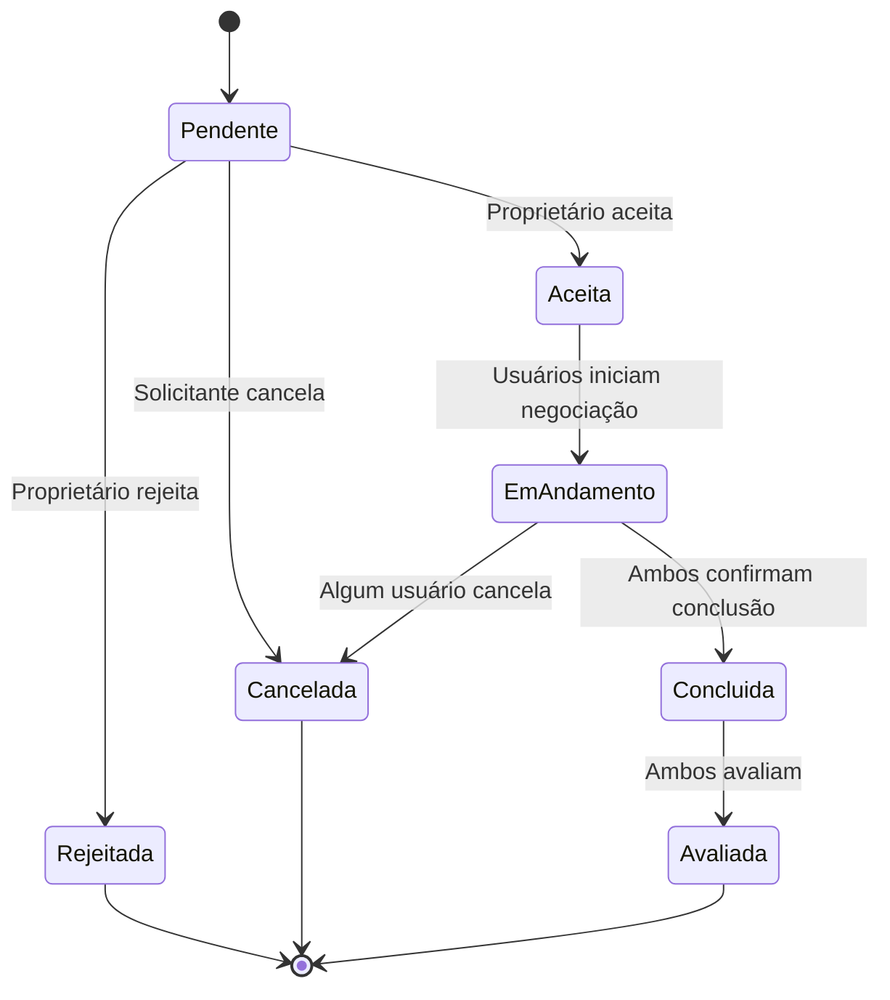

# Sistema de Trocas

O sistema de trocas é o coração do Librio, permitindo que usuários negociem livros de forma segura e organizada através de um fluxo bem estruturado com timeout de 48h, exclusão automática de livros, fotos dos usuários no histórico e contadores funcionais.

## Fluxo Completo de Troca



## Estados da Troca



## Modelo de Dados da Troca

### Exchange Entity

```dart
// lib/src/domain/entities/exchange.dart
class Exchange {
  final String id;
  final String requesterId;
  final String ownerId;
  final String requestedBookId;
  final String offeredBookId;
  final ExchangeStatus status;
  final DateTime createdAt;
  final DateTime updatedAt;
  final DateTime? acceptedAt;
  final DateTime? completedAt;
  final String? rejectionReason;
  final ExchangeLocation? meetingLocation;

  const Exchange({
    required this.id,
    required this.requesterId,
    required this.ownerId,
    required this.requestedBookId,
    required this.offeredBookId,
    required this.status,
    required this.createdAt,
    required this.updatedAt,
    this.acceptedAt,
    this.completedAt,
    this.rejectionReason,
    this.meetingLocation,
  });

  bool get isPending => status == ExchangeStatus.pending;
  bool get isAccepted => status == ExchangeStatus.accepted;
  bool get isInProgress => status == ExchangeStatus.inProgress;
  bool get isCompleted => status == ExchangeStatus.completed;
  bool get isRejected => status == ExchangeStatus.rejected;
  bool get isCanceled => status == ExchangeStatus.canceled;

  bool get canBeCanceled => isPending || isAccepted || isInProgress;
  bool get canBeAccepted => isPending;
  bool get canBeCompleted => isInProgress;

  String get displayStatus {
    switch (status) {
      case ExchangeStatus.pending:
        return 'Aguardando resposta';
      case ExchangeStatus.accepted:
        return 'Aceita';
      case ExchangeStatus.inProgress:
        return 'Em andamento';
      case ExchangeStatus.completed:
        return 'Concluída';
      case ExchangeStatus.rejected:
        return 'Rejeitada';
      case ExchangeStatus.canceled:
        return 'Cancelada';
    }
  }

  Color get statusColor {
    switch (status) {
      case ExchangeStatus.pending:
        return Colors.orange;
      case ExchangeStatus.accepted:
        return Colors.blue;
      case ExchangeStatus.inProgress:
        return Colors.purple;
      case ExchangeStatus.completed:
        return Colors.green;
      case ExchangeStatus.rejected:
        return Colors.red;
      case ExchangeStatus.canceled:
        return Colors.grey;
    }
  }
}

enum ExchangeStatus {
  pending,
  accepted,
  inProgress,
  completed,
  rejected,
  canceled,
}

class ExchangeLocation {
  final String description;
  final double? latitude;
  final double? longitude;
  final String? address;

  const ExchangeLocation({
    required this.description,
    this.latitude,
    this.longitude,
    this.address,
  });
}
```

## Telas do Sistema de Trocas

### 1. Propose Exchange Screen

```dart
// lib/src/presentation/home/screens/exchange/propose_exchange/propose_exchange_screen.dart
class ProposeExchangeScreen extends StatefulWidget {
  final Book requestedBook;

  const ProposeExchangeScreen({
    Key? key,
    required this.requestedBook,
  }) : super(key: key);

  @override
  _ProposeExchangeScreenState createState() => _ProposeExchangeScreenState();
}

class _ProposeExchangeScreenState extends State<ProposeExchangeScreen> {
  Book? _selectedBook;

  @override
  void initState() {
    super.initState();
    WidgetsBinding.instance.addPostFrameCallback((_) {
      context.read<ProposeExchangeViewModel>().loadUserBooks();
    });
  }

  @override
  Widget build(BuildContext context) {
    return Scaffold(
      appBar: AppBar(
        title: const Text('Propor Troca'),
        elevation: 0,
      ),
      body: Consumer<ProposeExchangeViewModel>(
        builder: (context, viewModel, child) {
          return Column(
            children: [
              // Livro solicitado
              Container(
                width: double.infinity,
                color: Theme.of(context).primaryColor.withOpacity(0.1),
                padding: const EdgeInsets.all(16),
                child: Column(
                  crossAxisAlignment: CrossAxisAlignment.start,
                  children: [
                    Text(
                      'Livro que você quer:',
                      style: Theme.of(context).textTheme.titleMedium?.copyWith(
                        fontWeight: FontWeight.bold,
                      ),
                    ),
                    const SizedBox(height: 12),
                    BookInfoCard(book: widget.requestedBook),
                  ],
                ),
              ),

              // Divider com ícone de troca
              Container(
                padding: const EdgeInsets.symmetric(vertical: 16),
                child: Row(
                  children: [
                    const Expanded(child: Divider()),
                    Container(
                      padding: const EdgeInsets.all(8),
                      decoration: BoxDecoration(
                        color: Theme.of(context).primaryColor,
                        shape: BoxShape.circle,
                      ),
                      child: const Icon(
                        Icons.swap_horiz,
                        color: Colors.white,
                        size: 24,
                      ),
                    ),
                    const Expanded(child: Divider()),
                  ],
                ),
              ),

              // Seleção do livro a oferecer
              Expanded(
                child: Padding(
                  padding: const EdgeInsets.symmetric(horizontal: 16),
                  child: Column(
                    crossAxisAlignment: CrossAxisAlignment.start,
                    children: [
                      Text(
                        'Escolha um livro para oferecer:',
                        style: Theme.of(context).textTheme.titleMedium?.copyWith(
                          fontWeight: FontWeight.bold,
                        ),
                      ),
                      const SizedBox(height: 16),

                      if (viewModel.isLoading)
                        const Expanded(
                          child: Center(child: CircularProgressIndicator()),
                        )
                      else if (viewModel.error != null)
                        Expanded(
                          child: Center(
                            child: Column(
                              mainAxisAlignment: MainAxisAlignment.center,
                              children: [
                                Icon(
                                  Icons.error_outline,
                                  size: 64,
                                  color: Colors.grey[400],
                                ),
                                const SizedBox(height: 16),
                                Text(
                                  'Erro ao carregar seus livros',
                                  style: TextStyle(color: Colors.grey[600]),
                                ),
                                const SizedBox(height: 8),
                                Text(
                                  viewModel.error!,
                                  style: TextStyle(color: Colors.grey[500]),
                                  textAlign: TextAlign.center,
                                ),
                                const SizedBox(height: 16),
                                ElevatedButton(
                                  onPressed: () => viewModel.loadUserBooks(),
                                  child: const Text('Tentar Novamente'),
                                ),
                              ],
                            ),
                          ),
                        )
                      else if (viewModel.userBooks.isEmpty)
                        Expanded(
                          child: Center(
                            child: Column(
                              mainAxisAlignment: MainAxisAlignment.center,
                              children: [
                                Icon(
                                  Icons.library_books_outlined,
                                  size: 64,
                                  color: Colors.grey[400],
                                ),
                                const SizedBox(height: 16),
                                Text(
                                  'Você não tem livros disponíveis',
                                  style: TextStyle(color: Colors.grey[600]),
                                ),
                                const SizedBox(height: 8),
                                Text(
                                  'Adicione livros para poder fazer trocas',
                                  style: TextStyle(color: Colors.grey[500]),
                                ),
                                const SizedBox(height: 16),
                                ElevatedButton(
                                  onPressed: () => context.push('/add-book'),
                                  child: const Text('Adicionar Livro'),
                                ),
                              ],
                            ),
                          ),
                        )
                      else
                        Expanded(
                          child: ListView.builder(
                            itemCount: viewModel.userBooks.length,
                            itemBuilder: (context, index) {
                              final book = viewModel.userBooks[index];
                              final isSelected = _selectedBook?.id == book.id;

                              return Container(
                                margin: const EdgeInsets.only(bottom: 12),
                                decoration: BoxDecoration(
                                  border: Border.all(
                                    color: isSelected
                                        ? Theme.of(context).primaryColor
                                        : Colors.grey[300]!,
                                    width: isSelected ? 2 : 1,
                                  ),
                                  borderRadius: BorderRadius.circular(12),
                                ),
                                child: BookSelectionCard(
                                  book: book,
                                  isSelected: isSelected,
                                  onTap: () {
                                    setState(() {
                                      _selectedBook = isSelected ? null : book;
                                    });
                                  },
                                ),
                              );
                            },
                          ),
                        ),
                    ],
                  ),
                ),
              ),

              // Botão de propor troca
              Container(
                width: double.infinity,
                padding: const EdgeInsets.all(16),
                child: ElevatedButton(
                  onPressed: (_selectedBook != null && !viewModel.isProposing)
                      ? () => _proposeExchange(viewModel)
                      : null,
                  style: ElevatedButton.styleFrom(
                    padding: const EdgeInsets.symmetric(vertical: 16),
                    shape: RoundedRectangleBorder(
                      borderRadius: BorderRadius.circular(12),
                    ),
                  ),
                  child: viewModel.isProposing
                      ? const SizedBox(
                          height: 20,
                          width: 20,
                          child: CircularProgressIndicator(
                            strokeWidth: 2,
                            valueColor: AlwaysStoppedAnimation<Color>(Colors.white),
                          ),
                        )
                      : Text(
                          _selectedBook == null
                              ? 'Selecione um livro para trocar'
                              : 'Propor Troca',
                          style: const TextStyle(
                            fontSize: 16,
                            fontWeight: FontWeight.bold,
                          ),
                        ),
                ),
              ),

              // Error message
              if (viewModel.proposalError != null)
                Container(
                  width: double.infinity,
                  margin: const EdgeInsets.only(left: 16, right: 16, bottom: 16),
                  padding: const EdgeInsets.all(12),
                  decoration: BoxDecoration(
                    color: Colors.red.shade50,
                    borderRadius: BorderRadius.circular(8),
                    border: Border.all(color: Colors.red.shade200),
                  ),
                  child: Row(
                    children: [
                      Icon(Icons.error_outline, color: Colors.red.shade700),
                      const SizedBox(width: 8),
                      Expanded(
                        child: Text(
                          viewModel.proposalError!,
                          style: TextStyle(color: Colors.red.shade700),
                        ),
                      ),
                    ],
                  ),
                ),
            ],
          );
        },
      ),
    );
  }

  Future<void> _proposeExchange(ProposeExchangeViewModel viewModel) async {
    if (_selectedBook == null) return;

    await viewModel.proposeExchange(
      requestedBook: widget.requestedBook,
      offeredBook: _selectedBook!,
    );

    if (viewModel.proposalError == null) {
      // Sucesso
      context.pop();

      ScaffoldMessenger.of(context).showSnackBar(
        const SnackBar(
          content: Text('Proposta de troca enviada com sucesso!'),
          backgroundColor: Colors.green,
        ),
      );
    }
  }
}
```

### 2. Exchange Requests Screen

```dart
// lib/src/presentation/home/screens/exchange/exchange_requests/exchange_requests_screen.dart
class ExchangeRequestsScreen extends StatefulWidget {
  @override
  _ExchangeRequestsScreenState createState() => _ExchangeRequestsScreenState();
}

class _ExchangeRequestsScreenState extends State<ExchangeRequestsScreen>
    with SingleTickerProviderStateMixin {
  late TabController _tabController;

  @override
  void initState() {
    super.initState();
    _tabController = TabController(length: 2, vsync: this);

    WidgetsBinding.instance.addPostFrameCallback((_) {
      context.read<ExchangeRequestsViewModel>().loadExchanges();
    });
  }

  @override
  Widget build(BuildContext context) {
    return Scaffold(
      appBar: AppBar(
        title: const Text('Minhas Trocas'),
        bottom: TabBar(
          controller: _tabController,
          tabs: const [
            Tab(text: 'Recebidas'),
            Tab(text: 'Enviadas'),
          ],
        ),
      ),
      body: Consumer<ExchangeRequestsViewModel>(
        builder: (context, viewModel, child) {
          if (viewModel.isLoading) {
            return const Center(child: CircularProgressIndicator());
          }

          if (viewModel.error != null) {
            return Center(
              child: Column(
                mainAxisAlignment: MainAxisAlignment.center,
                children: [
                  Icon(
                    Icons.error_outline,
                    size: 64,
                    color: Colors.grey[400],
                  ),
                  const SizedBox(height: 16),
                  Text(
                    'Erro ao carregar trocas',
                    style: TextStyle(color: Colors.grey[600]),
                  ),
                  const SizedBox(height: 8),
                  Text(
                    viewModel.error!,
                    style: TextStyle(color: Colors.grey[500]),
                    textAlign: TextAlign.center,
                  ),
                  const SizedBox(height: 16),
                  ElevatedButton(
                    onPressed: () => viewModel.loadExchanges(),
                    child: const Text('Tentar Novamente'),
                  ),
                ],
              ),
            );
          }

          return TabBarView(
            controller: _tabController,
            children: [
              // Trocas recebidas
              _buildExchangesList(
                viewModel.receivedExchanges,
                'Nenhuma proposta recebida',
                true,
              ),

              // Trocas enviadas
              _buildExchangesList(
                viewModel.sentExchanges,
                'Nenhuma proposta enviada',
                false,
              ),
            ],
          );
        },
      ),
    );
  }

  Widget _buildExchangesList(
    List<Exchange> exchanges,
    String emptyMessage,
    bool isReceived,
  ) {
    if (exchanges.isEmpty) {
      return Center(
        child: Column(
          mainAxisAlignment: MainAxisAlignment.center,
          children: [
            Icon(
              Icons.swap_horiz_outlined,
              size: 64,
              color: Colors.grey[400],
            ),
            const SizedBox(height: 16),
            Text(
              emptyMessage,
              style: TextStyle(color: Colors.grey[600]),
            ),
          ],
        ),
      );
    }

    return RefreshIndicator(
      onRefresh: () => context.read<ExchangeRequestsViewModel>().loadExchanges(),
      child: ListView.builder(
        padding: const EdgeInsets.all(16),
        itemCount: exchanges.length,
        itemBuilder: (context, index) {
          final exchange = exchanges[index];
          return Container(
            margin: const EdgeInsets.only(bottom: 12),
            child: ExchangeCard(
              exchange: exchange,
              isReceived: isReceived,
              onTap: () => _navigateToExchangeDetails(exchange),
              onAccept: isReceived && exchange.canBeAccepted
                  ? () => _acceptExchange(exchange)
                  : null,
              onReject: isReceived && exchange.canBeAccepted
                  ? () => _rejectExchange(exchange)
                  : null,
              onCancel: exchange.canBeCanceled
                  ? () => _cancelExchange(exchange)
                  : null,
            ),
          );
        },
      ),
    );
  }

  void _navigateToExchangeDetails(Exchange exchange) {
    context.push('/exchange-details', extra: exchange);
  }

  Future<void> _acceptExchange(Exchange exchange) async {
    final result = await showDialog<bool>(
      context: context,
      builder: (context) => AlertDialog(
        title: const Text('Aceitar Proposta'),
        content: const Text(
          'Tem certeza que deseja aceitar esta proposta de troca?'
        ),
        actions: [
          TextButton(
            onPressed: () => Navigator.pop(context, false),
            child: const Text('Cancelar'),
          ),
          ElevatedButton(
            onPressed: () => Navigator.pop(context, true),
            child: const Text('Aceitar'),
          ),
        ],
      ),
    );

    if (result == true) {
      await context.read<ExchangeRequestsViewModel>().acceptExchange(exchange.id);
    }
  }

  Future<void> _rejectExchange(Exchange exchange) async {
    final TextEditingController reasonController = TextEditingController();

    final result = await showDialog<bool>(
      context: context,
      builder: (context) => AlertDialog(
        title: const Text('Rejeitar Proposta'),
        content: Column(
          mainAxisSize: MainAxisSize.min,
          children: [
            const Text('Por que você está rejeitando esta proposta?'),
            const SizedBox(height: 12),
            TextField(
              controller: reasonController,
              maxLines: 3,
              decoration: const InputDecoration(
                hintText: 'Motivo (opcional)',
                border: OutlineInputBorder(),
              ),
            ),
          ],
        ),
        actions: [
          TextButton(
            onPressed: () => Navigator.pop(context, false),
            child: const Text('Cancelar'),
          ),
          ElevatedButton(
            onPressed: () => Navigator.pop(context, true),
            style: ElevatedButton.styleFrom(
              backgroundColor: Colors.red,
            ),
            child: const Text('Rejeitar'),
          ),
        ],
      ),
    );

    if (result == true) {
      await context.read<ExchangeRequestsViewModel>().rejectExchange(
        exchange.id,
        reasonController.text.trim(),
      );
    }
  }

  Future<void> _cancelExchange(Exchange exchange) async {
    final result = await showDialog<bool>(
      context: context,
      builder: (context) => AlertDialog(
        title: const Text('Cancelar Troca'),
        content: const Text(
          'Tem certeza que deseja cancelar esta troca?'
        ),
        actions: [
          TextButton(
            onPressed: () => Navigator.pop(context, false),
            child: const Text('Não'),
          ),
          ElevatedButton(
            onPressed: () => Navigator.pop(context, true),
            style: ElevatedButton.styleFrom(
              backgroundColor: Colors.red,
            ),
            child: const Text('Cancelar Troca'),
          ),
        ],
      ),
    );

    if (result == true) {
      await context.read<ExchangeRequestsViewModel>().cancelExchange(exchange.id);
    }
  }

  @override
  void dispose() {
    _tabController.dispose();
    super.dispose();
  }
}
```

## Componentes para Trocas

### ExchangeCard Component

```dart
// lib/src/presentation/home/widgets/exchange_card.dart
class ExchangeCard extends StatelessWidget {
  final Exchange exchange;
  final bool isReceived;
  final VoidCallback? onTap;
  final VoidCallback? onAccept;
  final VoidCallback? onReject;
  final VoidCallback? onCancel;

  const ExchangeCard({
    Key? key,
    required this.exchange,
    required this.isReceived,
    this.onTap,
    this.onAccept,
    this.onReject,
    this.onCancel,
  }) : super(key: key);

  @override
  Widget build(BuildContext context) {
    return Card(
      elevation: 2,
      shape: RoundedRectangleBorder(
        borderRadius: BorderRadius.circular(12),
      ),
      child: InkWell(
        onTap: onTap,
        borderRadius: BorderRadius.circular(12),
        child: Padding(
          padding: const EdgeInsets.all(16),
          child: Column(
            crossAxisAlignment: CrossAxisAlignment.start,
            children: [
              // Header com status
              Row(
                children: [
                  Container(
                    padding: const EdgeInsets.symmetric(
                      horizontal: 8,
                      vertical: 4,
                    ),
                    decoration: BoxDecoration(
                      color: exchange.statusColor.withOpacity(0.1),
                      borderRadius: BorderRadius.circular(12),
                      border: Border.all(
                        color: exchange.statusColor.withOpacity(0.3),
                      ),
                    ),
                    child: Text(
                      exchange.displayStatus,
                      style: TextStyle(
                        color: exchange.statusColor,
                        fontSize: 12,
                        fontWeight: FontWeight.w500,
                      ),
                    ),
                  ),
                  const Spacer(),
                  Text(
                    DateFormat('dd/MM/yyyy').format(exchange.createdAt),
                    style: TextStyle(
                      color: Colors.grey[600],
                      fontSize: 12,
                    ),
                  ),
                ],
              ),

              const SizedBox(height: 12),

              // Livros da troca
              FutureBuilder<Map<String, Book>>(
                future: _loadBooksData(exchange),
                builder: (context, snapshot) {
                  if (!snapshot.hasData) {
                    return const Center(child: CircularProgressIndicator());
                  }

                  final requestedBook = snapshot.data!['requested'];
                  final offeredBook = snapshot.data!['offered'];

                  return Row(
                    children: [
                      // Livro oferecido
                      Expanded(
                        child: Column(
                          crossAxisAlignment: CrossAxisAlignment.start,
                          children: [
                            Text(
                              isReceived ? 'Você recebe:' : 'Você oferece:',
                              style: TextStyle(
                                color: Colors.grey[600],
                                fontSize: 12,
                                fontWeight: FontWeight.w500,
                              ),
                            ),
                            const SizedBox(height: 4),
                            _buildBookMiniCard(
                              isReceived ? requestedBook! : offeredBook!,
                            ),
                          ],
                        ),
                      ),

                      // Ícone de troca
                      Container(
                        margin: const EdgeInsets.symmetric(horizontal: 12),
                        padding: const EdgeInsets.all(8),
                        decoration: BoxDecoration(
                          color: Theme.of(context).primaryColor.withOpacity(0.1),
                          shape: BoxShape.circle,
                        ),
                        child: Icon(
                          Icons.swap_horiz,
                          color: Theme.of(context).primaryColor,
                          size: 20,
                        ),
                      ),

                      // Livro solicitado
                      Expanded(
                        child: Column(
                          crossAxisAlignment: CrossAxisAlignment.start,
                          children: [
                            Text(
                              isReceived ? 'Você oferece:' : 'Você recebe:',
                              style: TextStyle(
                                color: Colors.grey[600],
                                fontSize: 12,
                                fontWeight: FontWeight.w500,
                              ),
                            ),
                            const SizedBox(height: 4),
                            _buildBookMiniCard(
                              isReceived ? offeredBook! : requestedBook!,
                            ),
                          ],
                        ),
                      ),
                    ],
                  );
                },
              ),

              const SizedBox(height: 16),

              // Botões de ação
              if (exchange.isPending && isReceived)
                Row(
                  children: [
                    Expanded(
                      child: OutlinedButton(
                        onPressed: onReject,
                        style: OutlinedButton.styleFrom(
                          foregroundColor: Colors.red,
                          side: const BorderSide(color: Colors.red),
                        ),
                        child: const Text('Rejeitar'),
                      ),
                    ),
                    const SizedBox(width: 12),
                    Expanded(
                      child: ElevatedButton(
                        onPressed: onAccept,
                        child: const Text('Aceitar'),
                      ),
                    ),
                  ],
                )
              else if (exchange.canBeCanceled)
                SizedBox(
                  width: double.infinity,
                  child: OutlinedButton(
                    onPressed: onCancel,
                    style: OutlinedButton.styleFrom(
                      foregroundColor: Colors.red,
                      side: const BorderSide(color: Colors.red),
                    ),
                    child: const Text('Cancelar Troca'),
                  ),
                ),
            ],
          ),
        ),
      ),
    );
  }

  Widget _buildBookMiniCard(Book book) {
    return Container(
      padding: const EdgeInsets.all(8),
      decoration: BoxDecoration(
        color: Colors.grey[50],
        borderRadius: BorderRadius.circular(8),
        border: Border.all(color: Colors.grey[300]!),
      ),
      child: Row(
        children: [
          // Miniatura
          Container(
            width: 40,
            height: 50,
            decoration: BoxDecoration(
              borderRadius: BorderRadius.circular(4),
              color: Colors.grey[200],
            ),
            child: book.hasImage
                ? ClipRRect(
                    borderRadius: BorderRadius.circular(4),
                    child: CachedNetworkImage(
                      imageUrl: book.imageUrl!,
                      fit: BoxFit.cover,
                    ),
                  )
                : Icon(
                    Icons.book,
                    color: Colors.grey[400],
                    size: 20,
                  ),
          ),

          const SizedBox(width: 8),

          // Info do livro
          Expanded(
            child: Column(
              crossAxisAlignment: CrossAxisAlignment.start,
              children: [
                Text(
                  book.title,
                  style: const TextStyle(
                    fontSize: 12,
                    fontWeight: FontWeight.w500,
                  ),
                  maxLines: 1,
                  overflow: TextOverflow.ellipsis,
                ),
                Text(
                  book.author,
                  style: TextStyle(
                    fontSize: 10,
                    color: Colors.grey[600],
                  ),
                  maxLines: 1,
                  overflow: TextOverflow.ellipsis,
                ),
              ],
            ),
          ),
        ],
      ),
    );
  }

  Future<Map<String, Book>> _loadBooksData(Exchange exchange) async {
    // Carregar dados dos livros
    // Esta implementação seria feita através de um repository
    // Por enquanto, retornando mock data
    return {
      'requested': Book(
        id: exchange.requestedBookId,
        title: 'Livro Solicitado',
        author: 'Autor',
        description: 'Descrição',
        category: 'Ficção',
        condition: 'usado_bom',
        isAvailable: true,
        userId: exchange.ownerId,
        createdAt: DateTime.now(),
        updatedAt: DateTime.now(),
      ),
      'offered': Book(
        id: exchange.offeredBookId,
        title: 'Livro Oferecido',
        author: 'Autor',
        description: 'Descrição',
        category: 'Romance',
        condition: 'novo',
        isAvailable: true,
        userId: exchange.requesterId,
        createdAt: DateTime.now(),
        updatedAt: DateTime.now(),
      ),
    };
  }
}
```

## Use Cases para Trocas

### CreateExchangeUseCase

```dart
// lib/src/domain/usecases/create_exchange_usecase.dart
class CreateExchangeUseCase {
  final ExchangeRepository _repository;
  final BookRepository _bookRepository;

  CreateExchangeUseCase(this._repository, this._bookRepository);

  Future<Either<Failure, Exchange>> call(CreateExchangeParams params) async {
    // Validações de domínio
    if (params.requesterId == params.ownerId) {
      return Left(ValidationFailure('Não é possível trocar com você mesmo'));
    }

    if (params.requestedBookId == params.offeredBookId) {
      return Left(ValidationFailure('Não é possível trocar o mesmo livro'));
    }

    // Verificar se os livros existem e estão disponíveis
    final requestedBookResult = await _bookRepository.getBookById(params.requestedBookId);
    final offeredBookResult = await _bookRepository.getBookById(params.offeredBookId);

    return requestedBookResult.fold(
      (failure) => Left(failure),
      (requestedBook) => offeredBookResult.fold(
        (failure) => Left(failure),
        (offeredBook) async {
          // Validar disponibilidade
          if (!requestedBook.isAvailable) {
            return Left(ValidationFailure('Livro solicitado não está disponível'));
          }

          if (!offeredBook.isAvailable) {
            return Left(ValidationFailure('Livro oferecido não está disponível'));
          }

          // Verificar ownership
          if (requestedBook.userId != params.ownerId) {
            return Left(ValidationFailure('Livro solicitado não pertence ao usuário informado'));
          }

          if (offeredBook.userId != params.requesterId) {
            return Left(ValidationFailure('Livro oferecido não pertence ao solicitante'));
          }

          // Criar troca
          final exchange = Exchange(
            id: '', // Será gerado pelo repository
            requesterId: params.requesterId,
            ownerId: params.ownerId,
            requestedBookId: params.requestedBookId,
            offeredBookId: params.offeredBookId,
            status: ExchangeStatus.pending,
            createdAt: DateTime.now(),
            updatedAt: DateTime.now(),
          );

          return await _repository.createExchange(exchange);
        },
      ),
    );
  }
}

class CreateExchangeParams {
  final String requesterId;
  final String ownerId;
  final String requestedBookId;
  final String offeredBookId;

  CreateExchangeParams({
    required this.requesterId,
    required this.ownerId,
    required this.requestedBookId,
    required this.offeredBookId,
  });
}
```

O sistema de trocas do Librio oferece uma experiência completa e segura para negociação de livros, com fluxos bem definidos, validações robustas e interface intuitiva que facilita a comunicação entre os usuários.
