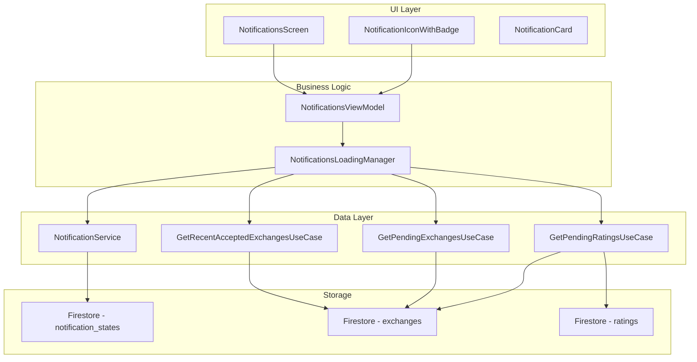
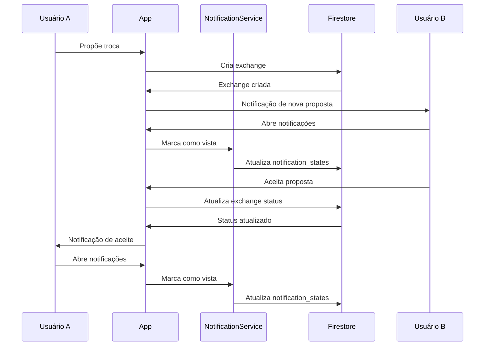

# Sistema de Notificações

O sistema de notificações do Librio mantém os usuários informados sobre todas as atividades importantes relacionadas às suas trocas de livros, avaliações pendentes e interações.

## 📋 Visão Geral

O sistema de notificações é composto por quatro tipos principais de notificações:

1. **Avaliações Pendentes** - Lembretes para avaliar trocas concluídas
2. **Propostas Pendentes** - Novas propostas de troca recebidas
3. **Propostas Aceitas** - Notificações quando suas propostas são aceitas
4. **Atividade Recente** - Histórico das últimas interações

## 🏗️ Arquitetura do Sistema



## 💾 Estrutura de Dados

### NotificationStateModel
```dart
class NotificationStateModel {
  final String userId;
  final List<String> viewedExchangeIds;
  final DateTime lastViewed;

  const NotificationStateModel({
    required this.userId,
    required this.viewedExchangeIds,
    required this.lastViewed,
  });
}
```

### Coleção `notification_states`
```json
{
  "userId": "user_uuid",
  "viewedExchangeIds": [
    "exchange1_uuid",
    "exchange2_uuid"
  ],
  "lastViewed": "2024-01-25T10:00:00Z"
}
```

## 🔧 Componentes Principais

### 1. NotificationService

Gerencia o estado de visualização das notificações no Firestore.

```dart
class NotificationService {
  final FirebaseFirestore _firestore;
  final FirebaseAuth _auth;

  /// Marcar exchanges específicas como vistas
  Future<void> markExchangesAsViewed(List<String> exchangeIds) async {
    final user = _auth.currentUser;
    if (user == null) return;

    try {
      final docRef = _firestore.collection('notification_states').doc(user.uid);
      final doc = await docRef.get();

      List<String> currentViewed = [];
      if (doc.exists) {
        final data = doc.data()!;
        currentViewed = List<String>.from(data['viewedExchangeIds'] ?? []);
      }

      final updatedViewed = {...currentViewed, ...exchangeIds}.toList();

      await docRef.set({
        'userId': user.uid,
        'viewedExchangeIds': updatedViewed,
        'lastViewed': FieldValue.serverTimestamp(),
      }, SetOptions(merge: true));
    } catch (e) {
      debugPrint('Erro ao marcar notificações como vistas: $e');
    }
  }

  /// Obter exchanges que já foram vistas
  Future<List<String>> getViewedExchangeIds() async {
    final user = _auth.currentUser;
    if (user == null) return [];

    try {
      final doc = await _firestore
          .collection('notification_states')
          .doc(user.uid)
          .get();

      if (!doc.exists) return [];

      final data = doc.data()!;
      return List<String>.from(data['viewedExchangeIds'] ?? []);
    } catch (e) {
      return [];
    }
  }
}
```

### 2. NotificationsLoadingManager

Coordena o carregamento de todas as notificações do usuário.

```dart
class NotificationsLoadingManager {
  Future<NotificationsData> loadNotifications() async {
    final user = FirebaseAuth.instance.currentUser;
    if (user == null) return NotificationsData.empty();

    try {
      // Buscar exchanges já vistas
      final viewedExchangeIds = await _notificationService.getViewedExchangeIds();
      final lastViewedTime = await _notificationService.getLastViewedTime();

      // Carregar diferentes tipos de notificações
      final pending = await _getPendingRatingsUseCase.execute(user.uid);
      final pendingProposals = await _getPendingExchangesUseCase.execute(user.uid);
      final acceptedProposals = await _getRecentAcceptedExchangesUseCase.execute(user.uid);

      // Filtrar notificações já vistas
      final unviewedPendingExchanges = pendingProposals
          .where((exchange) => !viewedExchangeIds.contains(exchange.id))
          .toList();

      final unviewedAcceptedExchanges = acceptedProposals
          .where((exchange) =>
              !viewedExchangeIds.contains(exchange.id) &&
              (lastViewedTime == null ||
                  (exchange.updatedAt?.isAfter(lastViewedTime) ?? false)))
          .toList();

      // Marcar como vistas após carregamento
      final notificationIds = [
        ...unviewedPendingExchanges.map((e) => e.id),
        ...unviewedAcceptedExchanges.map((e) => e.id),
      ];

      if (notificationIds.isNotEmpty) {
        await _notificationService.markExchangesAsViewed(notificationIds);
      }

      return NotificationsData(
        pendingRatings: pending,
        pendingExchanges: unviewedPendingExchanges,
        recentAcceptedExchanges: unviewedAcceptedExchanges,
        recentExchanges: recent,
      );
    } catch (e) {
      return NotificationsData.empty();
    }
  }
}
```

### 3. NotificationIconWithBadge

Ícone de notificação com contador na barra superior.

```dart
class NotificationIconWithBadge extends StatefulWidget {
  final VoidCallback onPressed;

  @override
  State<NotificationIconWithBadge> createState() => _NotificationIconWithBadgeState();
}

class _NotificationIconWithBadgeState extends State<NotificationIconWithBadge> {
  int totalNotificationCount = 0;
  bool isLoading = true;

  @override
  Widget build(BuildContext context) {
    return Stack(
      children: [
        IconButton(
          onPressed: widget.onPressed,
          icon: SvgPicture.asset(
            'assets/icons/notification_icon.svg',
            width: 24,
            height: 24,
          ),
        ),
        if (totalNotificationCount > 0 && !isLoading)
          Positioned(
            right: 8,
            top: 8,
            child: Container(
              padding: const EdgeInsets.all(2),
              decoration: BoxDecoration(
                color: Colors.red,
                borderRadius: BorderRadius.circular(10),
              ),
              constraints: const BoxConstraints(
                minWidth: 16,
                minHeight: 16,
              ),
              child: Text(
                totalNotificationCount > 99 ? '99+' : '$totalNotificationCount',
                style: const TextStyle(
                  color: Colors.white,
                  fontSize: 10,
                  fontWeight: FontWeight.bold,
                ),
                textAlign: TextAlign.center,
              ),
            ),
          ),
      ],
    );
  }
}
```

## 📱 Interface do Usuário

### NotificationsScreen

Tela principal das notificações com diferentes seções.

```dart
class NotificationsScreen extends StatefulWidget {
  @override
  Widget build(BuildContext context) {
    return Scaffold(
      appBar: AppBar(
        title: const Text('Notificações'),
        backgroundColor: Colors.white,
        elevation: 0,
      ),
      body: _buildNotificationsList(),
    );
  }

  Widget _buildNotificationsList() {
    final data = viewModel.notificationsData;

    if (data == null || !data.hasNotifications) {
      return _buildEmptyState();
    }

    return SingleChildScrollView(
      padding: const EdgeInsets.all(16),
      child: Column(
        crossAxisAlignment: CrossAxisAlignment.start,
        children: [
          // Avaliações pendentes (alta prioridade)
          if (data.pendingRatings.isNotEmpty) ...[
            _buildSectionHeader('Avaliações pendentes'),
            ...data.pendingRatings.map((exchange) =>
              PendingRatingCard(
                exchange: exchange,
                onTap: () => viewModel.navigateToRating(context, exchange),
              )
            ),
          ],

          // Propostas de troca pendentes
          if (data.pendingExchanges.isNotEmpty) ...[
            _buildSectionHeader('Novas propostas'),
            ...data.pendingExchanges.map((exchange) =>
              PendingExchangeNotification(
                exchange: exchange,
                onTap: () => viewModel.navigateToExchangeDetails(context, exchange),
              )
            ),
          ],

          // Propostas aceitas recentemente
          if (data.recentAcceptedExchanges.isNotEmpty) ...[
            _buildSectionHeader('Propostas aceitas'),
            ...data.recentAcceptedExchanges.map((exchange) =>
              AcceptedExchangeNotification(
                exchange: exchange,
                onTap: () => viewModel.startChatAfterAccepted(context, exchange),
              )
            ),
          ],

          // Atividade recente
          if (data.recentExchanges.isNotEmpty) ...[
            _buildSectionHeader('Atividade recente'),
            ...data.recentExchanges.map((exchange) =>
              RecentExchangeNotification(
                exchange: exchange,
                onTap: () => viewModel.navigateToExchangeDetails(context, exchange),
              )
            ),
          ],
        ],
      ),
    );
  }

  Widget _buildEmptyState() {
    return Center(
      child: Column(
        mainAxisAlignment: MainAxisAlignment.center,
        children: [
          Icon(
            Icons.notifications_none,
            size: 80,
            color: Colors.grey[400],
          ),
          const SizedBox(height: 16),
          Text(
            'Nenhuma notificação',
            style: TextStyle(
              fontSize: 18,
              fontWeight: FontWeight.bold,
              color: Colors.grey[600],
            ),
          ),
          const SizedBox(height: 8),
          Text(
            'Você está em dia! 📚',
            style: TextStyle(
              fontSize: 14,
              color: Colors.grey[500],
            ),
          ),
        ],
      ),
    );
  }
}
```

## 🎨 Tipos de Notificação

### 1. Avaliação Pendente

```dart
class PendingRatingCard extends StatelessWidget {
  final Exchange exchange;
  final VoidCallback onTap;

  @override
  Widget build(BuildContext context) {
    return NotificationCard(
      title: 'Avalie sua troca',
      subtitle: 'Troca concluída com ${_getOtherUserName()}',
      time: 'Concluída em ${DateFormat('dd/MM/yyyy').format(exchange.updatedAt ?? exchange.createdAt)}',
      backgroundColor: Colors.amber.shade50,
      borderColor: Colors.amber.shade200,
      icon: Container(
        padding: const EdgeInsets.all(8),
        decoration: BoxDecoration(
          color: Colors.amber.shade100,
          shape: BoxShape.circle,
        ),
        child: Icon(
          Icons.star_outline,
          size: 20,
          color: Colors.amber.shade700,
        ),
      ),
      onTap: onTap,
    );
  }
}
```

### 2. Proposta Pendente

```dart
class PendingExchangeNotification extends StatelessWidget {
  final Exchange exchange;
  final VoidCallback onTap;

  @override
  Widget build(BuildContext context) {
    return Container(
      margin: const EdgeInsets.only(bottom: 12),
      padding: const EdgeInsets.all(16),
      decoration: BoxDecoration(
        color: Colors.white,
        borderRadius: BorderRadius.circular(12),
        border: Border.all(color: Colors.orange.shade200),
        boxShadow: [
          BoxShadow(
            color: Colors.orange.shade100,
            blurRadius: 4,
            offset: const Offset(0, 2),
          ),
        ],
      ),
      child: InkWell(
        onTap: onTap,
        child: Row(
          children: [
            Container(
              padding: const EdgeInsets.all(8),
              decoration: BoxDecoration(
                color: Colors.orange.shade100,
                shape: BoxShape.circle,
              ),
              child: Icon(
                Icons.swap_horiz,
                color: Colors.orange.shade700,
                size: 20,
              ),
            ),
            const SizedBox(width: 12),
            Expanded(
              child: Column(
                crossAxisAlignment: CrossAxisAlignment.start,
                children: [
                  Text(
                    'Nova proposta de troca',
                    style: const TextStyle(
                      fontWeight: FontWeight.w600,
                      fontSize: 14,
                    ),
                  ),
                  const SizedBox(height: 4),
                  Text(
                    '${exchange.proposerName} quer trocar "${exchange.proposerBookTitle}" por "${exchange.receiverBookTitle}"',
                    style: const TextStyle(
                      fontSize: 12,
                      color: Colors.grey,
                    ),
                  ),
                ],
              ),
            ),
            const Icon(Icons.chevron_right, color: Colors.grey),
          ],
        ),
      ),
    );
  }
}
```

### 3. Proposta Aceita

```dart
class AcceptedExchangeNotification extends StatelessWidget {
  final Exchange exchange;
  final VoidCallback onTap;

  @override
  Widget build(BuildContext context) {
    return Container(
      margin: const EdgeInsets.only(bottom: 12),
      padding: const EdgeInsets.all(16),
      decoration: BoxDecoration(
        color: Colors.white,
        borderRadius: BorderRadius.circular(12),
        border: Border.all(color: Colors.green.shade200),
        boxShadow: [
          BoxShadow(
            color: Colors.green.shade100,
            blurRadius: 4,
            offset: const Offset(0, 2),
          ),
        ],
      ),
      child: InkWell(
        onTap: onTap,
        child: Row(
          children: [
            Container(
              padding: const EdgeInsets.all(8),
              decoration: BoxDecoration(
                color: Colors.green.shade100,
                shape: BoxShape.circle,
              ),
              child: Icon(
                Icons.check_circle_outline,
                color: Colors.green.shade700,
                size: 20,
              ),
            ),
            const SizedBox(width: 12),
            Expanded(
              child: Column(
                crossAxisAlignment: CrossAxisAlignment.start,
                children: [
                  Text(
                    'Proposta aceita! 🎉',
                    style: const TextStyle(
                      fontWeight: FontWeight.w600,
                      fontSize: 14,
                    ),
                  ),
                  const SizedBox(height: 4),
                  Text(
                    '${exchange.receiverName} aceitou sua proposta. Toque para iniciar conversa.',
                    style: const TextStyle(
                      fontSize: 12,
                      color: Colors.grey,
                    ),
                  ),
                ],
              ),
            ),
            Container(
              padding: const EdgeInsets.symmetric(horizontal: 8, vertical: 4),
              decoration: BoxDecoration(
                color: Colors.green,
                borderRadius: BorderRadius.circular(12),
              ),
              child: const Text(
                'Conversar',
                style: TextStyle(
                  color: Colors.white,
                  fontSize: 10,
                  fontWeight: FontWeight.w600,
                ),
              ),
            ),
          ],
        ),
      ),
    );
  }
}
```

## 🔄 Fluxo de Notificações



## ⚙️ Configuração

### Regras do Firestore

```javascript
// firestore.rules
rules_version = '2';
service cloud.firestore {
  match /databases/{database}/documents {

    // Regras para estados de notificação
    match /notification_states/{userId} {
      allow read, write: if request.auth != null &&
                          request.auth.uid == userId;
    }
  }
}
```

### Índices Necessários

```json
{
  "indexes": [
    {
      "collectionGroup": "exchanges",
      "queryScope": "COLLECTION",
      "fields": [
        {"fieldPath": "receiverId", "order": "ASCENDING"},
        {"fieldPath": "status", "order": "ASCENDING"},
        {"fieldPath": "createdAt", "order": "DESCENDING"}
      ]
    },
    {
      "collectionGroup": "exchanges",
      "queryScope": "COLLECTION",
      "fields": [
        {"fieldPath": "proposerId", "order": "ASCENDING"},
        {"fieldPath": "status", "order": "ASCENDING"},
        {"fieldPath": "updatedAt", "order": "DESCENDING"}
      ]
    }
  ]
}
```

## 🧪 Testes

### Teste do NotificationService

```dart
group('NotificationService', () {
  late NotificationService notificationService;
  late MockFirebaseFirestore mockFirestore;
  late MockFirebaseAuth mockAuth;

  setUp(() {
    mockFirestore = MockFirebaseFirestore();
    mockAuth = MockFirebaseAuth();
    notificationService = NotificationService(
      firestore: mockFirestore,
      auth: mockAuth,
    );
  });

  test('should mark exchanges as viewed', () async {
    // Arrange
    when(mockAuth.currentUser).thenReturn(mockUser);
    when(mockFirestore.collection('notification_states'))
        .thenReturn(mockCollection);

    // Act
    await notificationService.markExchangesAsViewed(['exchange1', 'exchange2']);

    // Assert
    verify(mockCollection.doc(testUserId).set(any, any)).called(1);
  });

  test('should return viewed exchange IDs', () async {
    // Arrange
    when(mockAuth.currentUser).thenReturn(mockUser);
    when(mockFirestore.collection('notification_states'))
        .thenReturn(mockCollection);
    when(mockCollection.doc(testUserId).get())
        .thenAnswer((_) async => mockDocumentSnapshot);
    when(mockDocumentSnapshot.exists).thenReturn(true);
    when(mockDocumentSnapshot.data()).thenReturn({
      'viewedExchangeIds': ['exchange1', 'exchange2'],
    });

    // Act
    final result = await notificationService.getViewedExchangeIds();

    // Assert
    expect(result, ['exchange1', 'exchange2']);
  });
});
```

## 🚀 Funcionalidades Principais

### ✅ Sistema Implementado
- **Contador em tempo real** no ícone de notificação
- **Filtragem automática** de notificações já vistas
- **Persistência** do estado no Firestore
- **Múltiplos tipos** de notificação com prioridades
- **Interface responsiva** com estados de loading e erro
- **Navegação contextual** para ações relevantes

### ✅ Experiência do Usuário
- **Feedback visual** claro para cada tipo de notificação
- **Cores diferenciadas** por categoria de notificação
- **Ações rápidas** diretamente das notificações
- **Estado vazio** amigável quando não há notificações
- **Atualização automática** ao voltar para a tela

---

:::tip Otimização
O sistema carrega notificações de forma otimizada, buscando apenas o necessário e mantendo estado local para evitar requisições desnecessárias.
:::

:::info Performance
As notificações são filtradas no cliente após busca no Firestore, garantindo que apenas notificações relevantes sejam exibidas ao usuário.
:::
