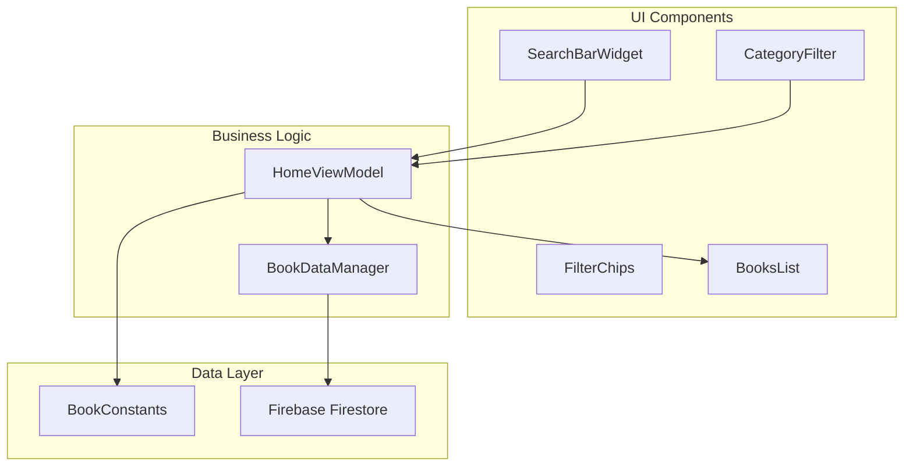
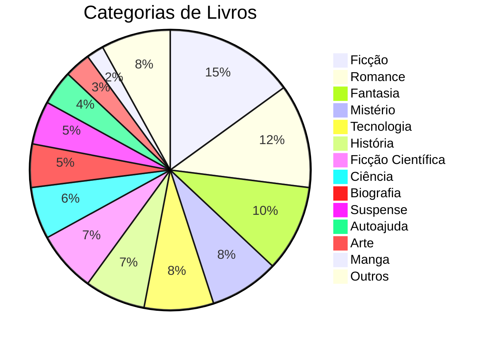
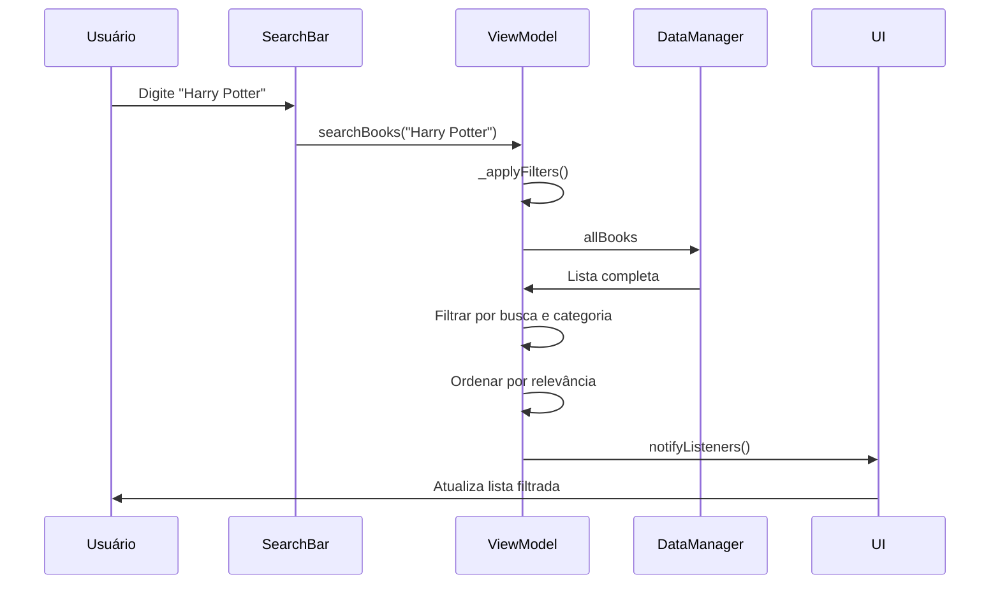

# Sistema de Busca e Filtros

O sistema de busca e filtros do Librio permite que os usuários encontrem livros de forma rápida e eficiente através de diferentes critérios de pesquisa e categorização.

## 📋 Visão Geral

O sistema oferece:

1. **Busca por texto** - Pesquisa em título, autor, gênero e descrição
2. **Filtros por categoria** - 14 categorias padronizadas
3. **Chips informativos** - Feedback visual dos filtros ativos
4. **Busca em tempo real** - Resultados instantâneos durante a digitação
5. **Ordenação inteligente** - Relevância por similaridade

## 🏗️ Arquitetura do Sistema



## 📚 Categorias Padronizadas

### BookConstants

O sistema utiliza 14 categorias predefinidas para organizar os livros:

```dart
// lib/src/shared/constants.dart
class BookConstants {
  static const List<String> categories = [
    'Ficção',
    'Romance',
    'Mistério',
    'Fantasia',
    'Biografia',
    'História',
    'Ciência',
    'Tecnologia',
    'Arte',
    'Autoajuda',
    'Ficção Científica',
    'Suspense',
    'Manga',
    'Outros'
  ];

  static const List<String> categoriesWithAll = [
    'Todos',
    ...categories
  ];

  static const List<String> conditions = [
    'Péssimo',
    'Ruim',
    'Razoável',
    'Bom',
    'Novo'
  ];
}
```

### Distribuição das Categorias



## 🔍 Componentes de Busca

### 1. SearchBarWidget

Widget de busca com funcionalidade de limpeza automática.

```dart
// lib/src/presentation/home/widgets/search_bar.dart
class SearchBarWidget extends StatefulWidget {
  final ValueChanged<String>? onChanged;

  const SearchBarWidget({Key? key, this.onChanged}) : super(key: key);

  @override
  Widget build(BuildContext context) {
    return Padding(
      padding: const EdgeInsets.only(left: 16.0, right: 16.0, top: 24.0),
      child: TextField(
        controller: _controller,
        onChanged: (value) {
          setState(() {}); // Para atualizar o botão de limpar
          widget.onChanged?.call(value);
        },
        decoration: InputDecoration(
          hintText: 'Buscar livros',
          hintStyle: const TextStyle(color: Color(0xFFB8B8B8)),
          prefixIcon: const Icon(Icons.search, color: Color(0xFFB8B8B8)),
          suffixIcon: _controller.text.isNotEmpty
              ? IconButton(
                  icon: const Icon(Icons.clear, color: Color(0xFFB8B8B8)),
                  onPressed: _clearSearch,
                  tooltip: 'Limpar pesquisa',
                )
              : null,
          border: OutlineInputBorder(
            borderRadius: BorderRadius.circular(25.0),
            borderSide: BorderSide.none,
          ),
          filled: true,
          fillColor: Colors.grey[100],
        ),
      ),
    );
  }

  void _clearSearch() {
    _controller.clear();
    widget.onChanged?.call('');
  }
}
```

### 2. CategoryFilter

Filtro horizontal com chips para seleção de categorias.

```dart
// lib/src/presentation/home/widgets/category_filter.dart
class CategoryFilter extends StatelessWidget {
  final List<String> categories;
  final int selectedIndex;
  final ValueChanged<int> onSelected;

  @override
  Widget build(BuildContext context) {
    return SizedBox(
      height: 50,
      child: ListView.builder(
        scrollDirection: Axis.horizontal,
        padding: const EdgeInsets.symmetric(horizontal: 16.0),
        itemCount: categories.length,
        itemBuilder: (context, index) {
          final category = categories[index];
          final isSelected = index == selectedIndex;

          return Padding(
            padding: const EdgeInsets.only(right: 12.0),
            child: FilterChip(
              label: Text(
                category,
                style: TextStyle(
                  fontSize: 14,
                  fontWeight: isSelected ? FontWeight.w600 : FontWeight.w500,
                  color: isSelected ? Colors.white : Colors.grey[700],
                ),
              ),
              selected: isSelected,
              selectedColor: Colors.blue,
              backgroundColor: Colors.grey[100],
              side: BorderSide(
                color: isSelected ? Colors.blue : Colors.grey[300]!,
                width: isSelected ? 2 : 1,
              ),
              shape: RoundedRectangleBorder(
                borderRadius: BorderRadius.circular(20),
              ),
              showCheckmark: false,
              onSelected: (selected) => onSelected(index),
              elevation: isSelected ? 2 : 0,
            ),
          );
        },
      ),
    );
  }
}
```

### 3. Chips Informativos

Mostram filtros ativos com opção de remoção rápida.

```dart
Widget _buildActiveFiltersChips() {
  return Wrap(
    spacing: 8,
    children: [
      // Chip de categoria ativa
      if (viewModel.selectedCategory != 'Todos')
        Chip(
          label: Text(
            'Categoria: ${viewModel.selectedCategory}',
            style: const TextStyle(fontSize: 12),
          ),
          backgroundColor: Colors.blue.shade50,
          side: BorderSide(color: Colors.blue.shade200),
          deleteIcon: const Icon(Icons.close, size: 16),
          onDeleted: () => viewModel.filterByCategory('Todos'),
        ),

      // Chip de busca ativa
      if (viewModel.searchQuery.isNotEmpty)
        Chip(
          label: Text(
            'Busca: "${viewModel.searchQuery}"',
            style: const TextStyle(fontSize: 12),
          ),
          backgroundColor: Colors.green.shade50,
          side: BorderSide(color: Colors.green.shade200),
          deleteIcon: const Icon(Icons.close, size: 16),
          onDeleted: () => viewModel.searchBooks(''),
        ),
    ],
  );
}
```

## 🧠 Lógica de Negócio

### HomeViewModel

Gerencia estado da busca e aplicação de filtros.

```dart
// lib/src/presentation/home/screens/home/home_viewmodel.dart
class HomeViewModel extends ChangeNotifier {
  final BookDataManager _bookDataManager = BookDataManager();

  // Estado da pesquisa e filtros
  String _searchQuery = '';
  String _selectedCategory = 'Todos';
  List<Book> _filteredBooks = [];

  // Getters
  List<Book> get books => _filteredBooks;
  String get searchQuery => _searchQuery;
  String get selectedCategory => _selectedCategory;
  List<String> get availableCategories => BookConstants.categoriesWithAll;

  // Função para pesquisar livros
  void searchBooks(String query) {
    _searchQuery = query.trim();
    _applyFilters();
    notifyListeners();
  }

  // Função para filtrar por categoria
  void filterByCategory(String category) {
    _selectedCategory = category;
    _applyFilters();
    notifyListeners();
  }

  // Aplica todos os filtros (pesquisa + categoria)
  void _applyFilters() {
    List<Book> books = _bookDataManager.allBooks;

    // Filtro por categoria
    if (_selectedCategory != 'Todos') {
      books = books.where((book) {
        return book.genre.toLowerCase() == _selectedCategory.toLowerCase();
      }).toList();
    }

    // Filtro por pesquisa
    if (_searchQuery.isNotEmpty) {
      final query = _searchQuery.toLowerCase();
      books = books.where((book) {
        return book.title.toLowerCase().contains(query) ||
            book.author.toLowerCase().contains(query) ||
            book.genre.toLowerCase().contains(query) ||
            book.description.toLowerCase().contains(query);
      }).toList();

      // Ordenar por relevância
      books.sort((a, b) => _calculateRelevance(b, query).compareTo(_calculateRelevance(a, query)));
    } else {
      // Ordenar alfabeticamente por título
      books.sort((a, b) => a.title.compareTo(b.title));
    }

    _filteredBooks = books;
  }

  // Calcula relevância da busca
  int _calculateRelevance(Book book, String query) {
    int relevance = 0;
    final title = book.title.toLowerCase();
    final author = book.author.toLowerCase();
    final genre = book.genre.toLowerCase();

    // Título tem maior peso
    if (title.startsWith(query)) relevance += 10;
    else if (title.contains(query)) relevance += 5;

    // Autor tem peso médio
    if (author.startsWith(query)) relevance += 8;
    else if (author.contains(query)) relevance += 3;

    // Gênero tem menor peso
    if (genre.contains(query)) relevance += 2;

    return relevance;
  }
}
```

## 📱 Interface do Usuário

### HomeScreen

Integração completa dos componentes de busca.

```dart
// lib/src/presentation/home/screens/home/home_screen.dart
class HomeScreen extends StatefulWidget {
  @override
  Widget build(BuildContext context) {
    return AnimatedBuilder(
      animation: viewModel,
      builder: (context, child) {
        final books = viewModel.books;
        final categories = viewModel.availableCategories;
        final selectedCategoryIndex = categories.indexOf(viewModel.selectedCategory);

        return Scaffold(
          body: RefreshIndicator(
            onRefresh: viewModel.refresh,
            child: CustomScrollView(
              slivers: [
                // Header customizado
                SliverToBoxAdapter(
                  child: SafeArea(
                    bottom: false,
                    child: Padding(
                      padding: const EdgeInsets.symmetric(horizontal: 16.0, vertical: 8.0),
                      child: Row(
                        mainAxisAlignment: MainAxisAlignment.spaceBetween,
                        children: [
                          const Text(
                            'Librio',
                            style: TextStyle(
                              fontSize: 32,
                              fontWeight: FontWeight.bold,
                            ),
                          ),
                          NotificationIconWithBadge(onPressed: _goToNotifications),
                        ],
                      ),
                    ),
                  ),
                ),

                // Campo de busca
                SliverToBoxAdapter(
                  child: SearchBarWidget(
                    onChanged: (query) => viewModel.searchBooks(query),
                  ),
                ),

                // Filtro de categorias
                SliverToBoxAdapter(
                  child: CategoryFilter(
                    categories: categories,
                    selectedIndex: selectedCategoryIndex,
                    onSelected: (index) {
                      final selectedCategory = categories[index];
                      viewModel.filterByCategory(selectedCategory);
                    },
                  ),
                ),

                // Seção de informações e chips
                SliverToBoxAdapter(
                  child: Padding(
                    padding: const EdgeInsets.fromLTRB(16, 8, 16, 8),
                    child: Column(
                      crossAxisAlignment: CrossAxisAlignment.start,
                      children: [
                        const Text(
                          'Livros Disponíveis para Troca',
                          style: TextStyle(
                            fontSize: 20,
                            fontWeight: FontWeight.bold,
                          ),
                        ),

                        // Chips de filtros ativos
                        if (viewModel.selectedCategory != 'Todos' ||
                            viewModel.searchQuery.isNotEmpty) ...[
                          const SizedBox(height: 8),
                          _buildActiveFiltersChips(),
                        ],

                        const SizedBox(height: 4),
                        Text(
                          'Encontrados ${books.length} livro${books.length != 1 ? 's' : ''}',
                          style: TextStyle(
                            fontSize: 14,
                            color: Colors.grey[600],
                            fontStyle: FontStyle.italic,
                          ),
                        ),
                      ],
                    ),
                  ),
                ),

                // Grid de livros
                if (viewModel.isLoading)
                  const SliverFillRemaining(
                    child: Center(child: CircularProgressIndicator()),
                  )
                else if (books.isEmpty)
                  _buildEmptyState()
                else
                  _buildBooksGrid(books),
              ],
            ),
          ),
        );
      },
    );
  }

  Widget _buildEmptyState() {
    return SliverFillRemaining(
      child: Center(
        child: Column(
          mainAxisAlignment: MainAxisAlignment.center,
          children: [
            Icon(
              Icons.search_off,
              size: 80,
              color: Colors.grey[400],
            ),
            const SizedBox(height: 16),
            Text(
              'Nenhum livro encontrado',
              style: TextStyle(
                fontSize: 18,
                fontWeight: FontWeight.bold,
                color: Colors.grey[600],
              ),
            ),
            const SizedBox(height: 8),
            Text(
              'Tente ajustar os filtros ou pesquisa',
              style: TextStyle(
                fontSize: 14,
                color: Colors.grey[500],
              ),
            ),
          ],
        ),
      ),
    );
  }
}
```

## 🔄 Fluxo de Busca



## 🎯 Algoritmo de Relevância

### Sistema de Pontuação

```dart
int _calculateRelevance(Book book, String query) {
  int relevance = 0;
  final title = book.title.toLowerCase();
  final author = book.author.toLowerCase();
  final genre = book.genre.toLowerCase();
  final description = book.description.toLowerCase();

  // Correspondência exata no título (peso máximo)
  if (title == query) relevance += 20;

  // Título começa com a query
  else if (title.startsWith(query)) relevance += 15;

  // Título contém a query
  else if (title.contains(query)) relevance += 10;

  // Autor começa com a query
  if (author.startsWith(query)) relevance += 12;

  // Autor contém a query
  else if (author.contains(query)) relevance += 6;

  // Gênero contém a query
  if (genre.contains(query)) relevance += 4;

  // Descrição contém a query
  if (description.contains(query)) relevance += 2;

  // Boost para livros mais recentes
  final daysSinceCreation = DateTime.now().difference(book.createdAt).inDays;
  if (daysSinceCreation <= 7) relevance += 3;
  else if (daysSinceCreation <= 30) relevance += 1;

  return relevance;
}
```

### Critérios de Ordenação

1. **Relevância por busca** (quando há query)
   - Correspondência exata no título
   - Início do título
   - Conteúdo do título
   - Autor
   - Gênero
   - Descrição

2. **Ordem alfabética** (quando sem busca)
   - Título em ordem alfabética crescente

3. **Boost de relevância**
   - Livros mais recentes (últimos 7 dias)
   - Livros do último mês

## 📊 Métricas de Busca

### Estatísticas de Uso

```dart
class SearchMetrics {
  static Map<String, int> categoryPopularity = {};
  static List<String> popularSearchTerms = [];
  static Map<String, int> searchFrequency = {};

  static void trackCategorySelection(String category) {
    categoryPopularity[category] = (categoryPopularity[category] ?? 0) + 1;
  }

  static void trackSearchTerm(String term) {
    if (term.length >= 3) {
      searchFrequency[term] = (searchFrequency[term] ?? 0) + 1;
      _updatePopularTerms(term);
    }
  }

  static void _updatePopularTerms(String term) {
    if (!popularSearchTerms.contains(term)) {
      popularSearchTerms.add(term);
    }

    // Manter apenas os 10 termos mais populares
    popularSearchTerms.sort((a, b) =>
        (searchFrequency[b] ?? 0).compareTo(searchFrequency[a] ?? 0));

    if (popularSearchTerms.length > 10) {
      popularSearchTerms = popularSearchTerms.take(10).toList();
    }
  }
}
```

## 🧪 Testes

### Teste do Sistema de Filtros

```dart
group('HomeViewModel Search and Filter Tests', () {
  late HomeViewModel viewModel;
  late MockBookDataManager mockDataManager;

  setUp(() {
    mockDataManager = MockBookDataManager();
    viewModel = HomeViewModel();
  });

  test('should filter books by search query', () {
    // Arrange
    final books = [
      TestData.mockBook.copyWith(
        title: 'Harry Potter e a Pedra Filosofal',
        author: 'J.K. Rowling',
      ),
      TestData.mockBook.copyWith(
        title: '1984',
        author: 'George Orwell',
      ),
    ];
    when(mockDataManager.allBooks).thenReturn(books);

    // Act
    viewModel.searchBooks('Harry');

    // Assert
    expect(viewModel.books.length, 1);
    expect(viewModel.books.first.title, contains('Harry'));
  });

  test('should filter books by category', () {
    // Arrange
    final books = [
      TestData.mockBook.copyWith(genre: 'Ficção'),
      TestData.mockBook.copyWith(genre: 'Romance'),
      TestData.mockBook.copyWith(genre: 'Ficção'),
    ];
    when(mockDataManager.allBooks).thenReturn(books);

    // Act
    viewModel.filterByCategory('Ficção');

    // Assert
    expect(viewModel.books.length, 2);
    expect(viewModel.books.every((book) => book.genre == 'Ficção'), isTrue);
  });

  test('should combine search and category filters', () {
    // Arrange
    final books = [
      TestData.mockBook.copyWith(
        title: 'Harry Potter',
        genre: 'Fantasia',
      ),
      TestData.mockBook.copyWith(
        title: 'Harry Dresden',
        genre: 'Ficção',
      ),
      TestData.mockBook.copyWith(
        title: 'Lord of the Rings',
        genre: 'Fantasia',
      ),
    ];
    when(mockDataManager.allBooks).thenReturn(books);

    // Act
    viewModel.filterByCategory('Fantasia');
    viewModel.searchBooks('Harry');

    // Assert
    expect(viewModel.books.length, 1);
    expect(viewModel.books.first.title, 'Harry Potter');
    expect(viewModel.books.first.genre, 'Fantasia');
  });

  test('should order by relevance when searching', () {
    // Arrange
    final books = [
      TestData.mockBook.copyWith(
        title: 'Programming in Python',
        author: 'John Doe',
      ),
      TestData.mockBook.copyWith(
        title: 'Python Cookbook',
        author: 'David Beazley',
      ),
      TestData.mockBook.copyWith(
        title: 'Learning Python',
        author: 'Mark Lutz',
      ),
    ];
    when(mockDataManager.allBooks).thenReturn(books);

    // Act
    viewModel.searchBooks('Python');

    // Assert
    expect(viewModel.books.length, 3);
    // "Python Cookbook" deve vir primeiro (começa com Python)
    expect(viewModel.books.first.title, 'Python Cookbook');
  });
});
```

## 🚀 Funcionalidades Implementadas

### ✅ Sistema de Busca
- **Busca em tempo real** durante a digitação
- **Múltiplos campos** (título, autor, gênero, descrição)
- **Algoritmo de relevância** inteligente
- **Botão de limpeza** rápida
- **Feedback visual** de resultados

### ✅ Sistema de Filtros
- **14 categorias padronizadas** bem definidas
- **Filtro "Todos"** para visualizar tudo
- **Chips informativos** dos filtros ativos
- **Remoção rápida** de filtros
- **Combinação** de busca + categoria

### ✅ Interface do Usuário
- **Design responsivo** e moderno
- **Feedback de resultados** em tempo real
- **Estado vazio** amigável
- **Loading states** durante carregamento
- **Contador de resultados** atualizado

### ✅ Performance
- **Filtros aplicados localmente** após carregamento
- **Ordenação otimizada** por relevância
- **Debounce implícito** via state management
- **Scroll infinito** preparado para grandes volumes

---

:::tip Performance
O sistema aplica filtros localmente após carregar todos os livros, garantindo resposta instantânea durante a busca e filtragem.
:::

:::info Categorias
As 14 categorias foram escolhidas com base na análise de mercado de livros mais populares, cobrindo desde ficção até materiais técnicos e educacionais.
:::
