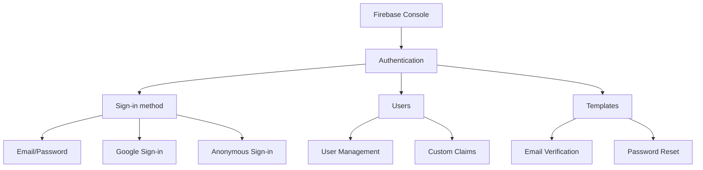
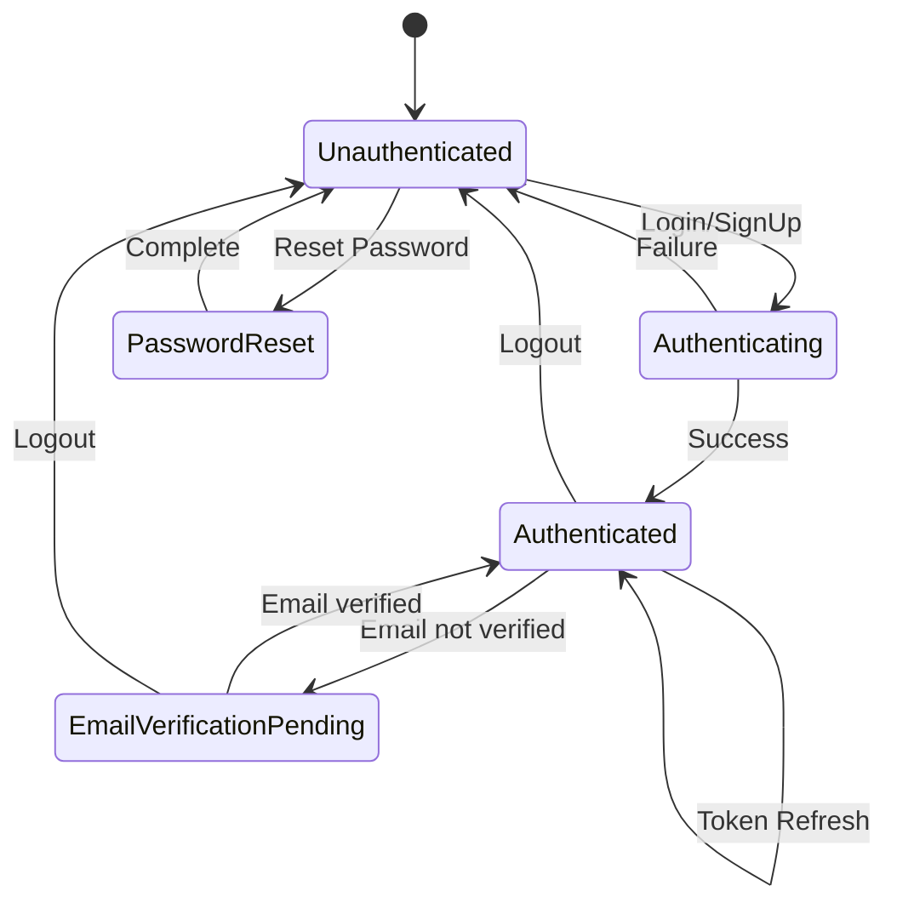
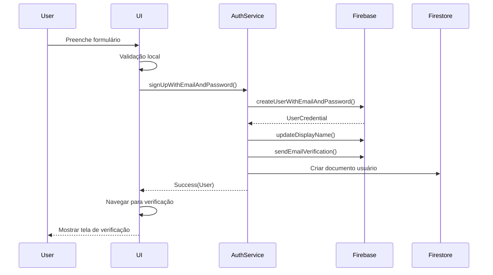

# Firebase Authentication

O sistema de autenticação do Librio utiliza o **Firebase Authentication** para gerenciar o ciclo de vida completo dos usuários, desde o cadastro até o logout, garantindo segurança e facilidade de uso.

## Configuração do Firebase Auth

### Configuração no Firebase Console



### Configuração no Projeto Flutter

```dart
// lib/firebase_options.dart (gerado pelo FlutterFire CLI)
class DefaultFirebaseOptions {
  static FirebaseOptions get currentPlatform {
    if (kIsWeb) {
      return web;
    }
    switch (defaultTargetPlatform) {
      case TargetPlatform.android:
        return android;
      case TargetPlatform.iOS:
        return ios;
      default:
        throw UnsupportedError(
          'DefaultFirebaseOptions have not been configured for this platform.',
        );
    }
  }

  static const FirebaseOptions android = FirebaseOptions(
    apiKey: 'AIzaSyD...',
    appId: '1:123456789:android:abc123',
    messagingSenderId: '123456789',
    projectId: 'librio-app',
    storageBucket: 'librio-app.appspot.com',
  );

  static const FirebaseOptions ios = FirebaseOptions(
    apiKey: 'AIzaSyD...',
    appId: '1:123456789:ios:def456',
    messagingSenderId: '123456789',
    projectId: 'librio-app',
    storageBucket: 'librio-app.appspot.com',
    iosBundleId: 'com.lorenzocardoso.librio',
  );
}
```

## AuthService - Camada de Dados

### Implementação Completa do AuthService

```dart
// lib/src/data/datasources/auth_service.dart
class AuthService {
  final FirebaseAuth _firebaseAuth = FirebaseAuth.instance;
  final GoogleSignIn _googleSignIn = GoogleSignIn();

  // Stream para escutar mudanças de autenticação
  Stream<User?> get authStateChanges => _firebaseAuth.authStateChanges();

  // Usuário atual
  User? get currentUser => _firebaseAuth.currentUser;

  // Estado de autenticação
  bool get isAuthenticated => currentUser != null;

  /// Cadastro com email e senha
  Future<Either<AuthFailure, User>> signUpWithEmailAndPassword({
    required String email,
    required String password,
    required String name,
  }) async {
    try {
      // Validações básicas
      if (!_isValidEmail(email)) {
        return Left(AuthFailure('Email inválido'));
      }

      if (!_isValidPassword(password)) {
        return Left(AuthFailure('Senha deve ter pelo menos 6 caracteres'));
      }

      if (name.trim().isEmpty) {
        return Left(AuthFailure('Nome é obrigatório'));
      }

      // Criar usuário no Firebase Auth
      final UserCredential userCredential = await _firebaseAuth
          .createUserWithEmailAndPassword(
        email: email.trim(),
        password: password,
      );

      final User? firebaseUser = userCredential.user;
      if (firebaseUser == null) {
        return Left(AuthFailure('Erro ao criar usuário'));
      }

      // Atualizar profile do usuário
      await firebaseUser.updateDisplayName(name.trim());

      // Enviar email de verificação
      await firebaseUser.sendEmailVerification();

      // Criar documento do usuário no Firestore
      await _createUserDocument(firebaseUser, name.trim());

      return Right(firebaseUser);
    } on FirebaseAuthException catch (e) {
      return Left(_handleFirebaseAuthException(e));
    } catch (e) {
      return Left(AuthFailure('Erro inesperado: ${e.toString()}'));
    }
  }

  /// Login com email e senha
  Future<Either<AuthFailure, User>> signInWithEmailAndPassword({
    required String email,
    required String password,
  }) async {
    try {
      if (!_isValidEmail(email)) {
        return Left(AuthFailure('Email inválido'));
      }

      if (password.isEmpty) {
        return Left(AuthFailure('Senha é obrigatória'));
      }

      final UserCredential userCredential = await _firebaseAuth
          .signInWithEmailAndPassword(
        email: email.trim(),
        password: password,
      );

      final User? user = userCredential.user;
      if (user == null) {
        return Left(AuthFailure('Erro ao fazer login'));
      }

      return Right(user);
    } on FirebaseAuthException catch (e) {
      return Left(_handleFirebaseAuthException(e));
    } catch (e) {
      return Left(AuthFailure('Erro inesperado: ${e.toString()}'));
    }
  }

  /// Login com Google
  Future<Either<AuthFailure, User>> signInWithGoogle() async {
    try {
      // Trigger do fluxo de autenticação
      final GoogleSignInAccount? googleUser = await _googleSignIn.signIn();
      if (googleUser == null) {
        return Left(AuthFailure('Login cancelado pelo usuário'));
      }

      // Obter detalhes de autenticação
      final GoogleSignInAuthentication googleAuth =
          await googleUser.authentication;

      // Criar credential
      final credential = GoogleAuthProvider.credential(
        accessToken: googleAuth.accessToken,
        idToken: googleAuth.idToken,
      );

      // Login no Firebase
      final UserCredential userCredential =
          await _firebaseAuth.signInWithCredential(credential);

      final User? user = userCredential.user;
      if (user == null) {
        return Left(AuthFailure('Erro ao fazer login com Google'));
      }

      // Verificar se é novo usuário e criar documento
      if (userCredential.additionalUserInfo?.isNewUser == true) {
        await _createUserDocument(user, user.displayName ?? 'Usuário');
      }

      return Right(user);
    } catch (e) {
      return Left(AuthFailure('Erro no login com Google: ${e.toString()}'));
    }
  }

  /// Logout
  Future<Either<AuthFailure, void>> signOut() async {
    try {
      await Future.wait([
        _firebaseAuth.signOut(),
        _googleSignIn.signOut(),
      ]);
      return const Right(null);
    } catch (e) {
      return Left(AuthFailure('Erro ao fazer logout: ${e.toString()}'));
    }
  }

  /// Reset de senha
  Future<Either<AuthFailure, void>> resetPassword(String email) async {
    try {
      if (!_isValidEmail(email)) {
        return Left(AuthFailure('Email inválido'));
      }

      await _firebaseAuth.sendPasswordResetEmail(email: email.trim());
      return const Right(null);
    } on FirebaseAuthException catch (e) {
      return Left(_handleFirebaseAuthException(e));
    } catch (e) {
      return Left(AuthFailure('Erro ao enviar email: ${e.toString()}'));
    }
  }

  /// Reenviar email de verificação
  Future<Either<AuthFailure, void>> sendEmailVerification() async {
    try {
      final user = currentUser;
      if (user == null) {
        return Left(AuthFailure('Usuário não autenticado'));
      }

      if (user.emailVerified) {
        return Left(AuthFailure('Email já está verificado'));
      }

      await user.sendEmailVerification();
      return const Right(null);
    } catch (e) {
      return Left(AuthFailure('Erro ao enviar verificação: ${e.toString()}'));
    }
  }

  /// Atualizar senha
  Future<Either<AuthFailure, void>> updatePassword({
    required String currentPassword,
    required String newPassword,
  }) async {
    try {
      final user = currentUser;
      if (user == null) {
        return Left(AuthFailure('Usuário não autenticado'));
      }

      if (!_isValidPassword(newPassword)) {
        return Left(AuthFailure('Nova senha deve ter pelo menos 6 caracteres'));
      }

      // Reautenticar usuário
      final credential = EmailAuthProvider.credential(
        email: user.email!,
        password: currentPassword,
      );

      await user.reauthenticateWithCredential(credential);

      // Atualizar senha
      await user.updatePassword(newPassword);

      return const Right(null);
    } on FirebaseAuthException catch (e) {
      return Left(_handleFirebaseAuthException(e));
    } catch (e) {
      return Left(AuthFailure('Erro ao atualizar senha: ${e.toString()}'));
    }
  }

  /// Deletar conta
  Future<Either<AuthFailure, void>> deleteAccount(String password) async {
    try {
      final user = currentUser;
      if (user == null) {
        return Left(AuthFailure('Usuário não autenticado'));
      }

      // Reautenticar usuário
      final credential = EmailAuthProvider.credential(
        email: user.email!,
        password: password,
      );

      await user.reauthenticateWithCredential(credential);

      // Deletar documento do Firestore primeiro
      await FirebaseFirestore.instance
          .collection('users')
          .doc(user.uid)
          .delete();

      // Deletar conta do Firebase Auth
      await user.delete();

      return const Right(null);
    } on FirebaseAuthException catch (e) {
      return Left(_handleFirebaseAuthException(e));
    } catch (e) {
      return Left(AuthFailure('Erro ao deletar conta: ${e.toString()}'));
    }
  }

  // === MÉTODOS PRIVADOS ===

  bool _isValidEmail(String email) {
    return RegExp(r'^[\w-\.]+@([\w-]+\.)+[\w-]{2,4}$').hasMatch(email);
  }

  bool _isValidPassword(String password) {
    return password.length >= 6;
  }

  Future<void> _createUserDocument(User user, String name) async {
    await FirebaseFirestore.instance
        .collection('users')
        .doc(user.uid)
        .set({
      'id': user.uid,
      'email': user.email,
      'name': name,
      'photoUrl': user.photoURL,
      'emailVerified': user.emailVerified,
      'createdAt': FieldValue.serverTimestamp(),
      'updatedAt': FieldValue.serverTimestamp(),
    });
  }

  AuthFailure _handleFirebaseAuthException(FirebaseAuthException e) {
    switch (e.code) {
      case 'weak-password':
        return AuthFailure('Senha muito fraca');
      case 'email-already-in-use':
        return AuthFailure('Este email já está em uso');
      case 'user-not-found':
        return AuthFailure('Usuário não encontrado');
      case 'wrong-password':
        return AuthFailure('Senha incorreta');
      case 'invalid-email':
        return AuthFailure('Email inválido');
      case 'user-disabled':
        return AuthFailure('Conta desabilitada');
      case 'too-many-requests':
        return AuthFailure('Muitas tentativas. Tente novamente mais tarde');
      case 'operation-not-allowed':
        return AuthFailure('Operação não permitida');
      default:
        return AuthFailure('Erro de autenticação: ${e.message}');
    }
  }

  void dispose() {
    // Limpar recursos se necessário
  }
}

// Classe de erro customizada
class AuthFailure {
  final String message;

  const AuthFailure(this.message);

  @override
  String toString() => message;
}
```

## Fluxo de Autenticação

### Diagrama de Estados de Autenticação



### Fluxo de Cadastro Completo



## Use Cases de Autenticação

### LoginUseCase

```dart
// lib/src/domain/usecases/login_usecase.dart
class LoginUseCase {
  final AuthService _authService;

  LoginUseCase(this._authService);

  Future<Either<AuthFailure, User>> call(LoginParams params) async {
    // Validações de domínio
    if (params.email.trim().isEmpty) {
      return Left(AuthFailure('Email é obrigatório'));
    }

    if (params.password.isEmpty) {
      return Left(AuthFailure('Senha é obrigatória'));
    }

    return await _authService.signInWithEmailAndPassword(
      email: params.email,
      password: params.password,
    );
  }
}

class LoginParams {
  final String email;
  final String password;

  LoginParams({
    required this.email,
    required this.password,
  });
}
```

### SignUpUseCase

```dart
// lib/src/domain/usecases/sign_up_usecase.dart
class SignUpUseCase {
  final AuthService _authService;

  SignUpUseCase(this._authService);

  Future<Either<AuthFailure, User>> call(SignUpParams params) async {
    // Validações de domínio específicas
    if (params.name.trim().length < 2) {
      return Left(AuthFailure('Nome deve ter pelo menos 2 caracteres'));
    }

    if (params.password != params.confirmPassword) {
      return Left(AuthFailure('Senhas não coincidem'));
    }

    if (params.password.length < 8) {
      return Left(AuthFailure('Senha deve ter pelo menos 8 caracteres'));
    }

    // Verificar força da senha
    if (!_isStrongPassword(params.password)) {
      return Left(AuthFailure(
        'Senha deve conter pelo menos uma letra maiúscula, minúscula e um número'
      ));
    }

    return await _authService.signUpWithEmailAndPassword(
      email: params.email,
      password: params.password,
      name: params.name,
    );
  }

  bool _isStrongPassword(String password) {
    // Pelo menos uma maiúscula, uma minúscula e um número
    return RegExp(r'^(?=.*[a-z])(?=.*[A-Z])(?=.*\d).{8,}$').hasMatch(password);
  }
}

class SignUpParams {
  final String email;
  final String password;
  final String confirmPassword;
  final String name;

  SignUpParams({
    required this.email,
    required this.password,
    required this.confirmPassword,
    required this.name,
  });
}
```

## Gerenciamento de Estado de Autenticação

### AuthWrapper - Controle de Navegação

```dart
// lib/src/presentation/auth_wrapper.dart
class AuthWrapper extends StatelessWidget {
  @override
  Widget build(BuildContext context) {
    return StreamBuilder<User?>(
      stream: Provider.of<AuthService>(context, listen: false).authStateChanges,
      builder: (context, snapshot) {
        // Loading state
        if (snapshot.connectionState == ConnectionState.waiting) {
          return const Scaffold(
            body: Center(
              child: CircularProgressIndicator(),
            ),
          );
        }

        // Error state
        if (snapshot.hasError) {
          return Scaffold(
            body: Center(
              child: Column(
                mainAxisAlignment: MainAxisAlignment.center,
                children: [
                  const Icon(Icons.error, size: 64, color: Colors.red),
                  const SizedBox(height: 16),
                  Text('Erro: ${snapshot.error}'),
                  const SizedBox(height: 16),
                  ElevatedButton(
                    onPressed: () {
                      // Restart app ou retry
                    },
                    child: const Text('Tentar Novamente'),
                  ),
                ],
              ),
            ),
          );
        }

        final user = snapshot.data;

        // Usuário não autenticado
        if (user == null) {
          return const LoginScreen();
        }

        // Usuário autenticado mas email não verificado
        if (!user.emailVerified) {
          return const EmailVerificationScreen();
        }

        // Usuário autenticado e verificado
        return const HomeScreen();
      },
    );
  }
}
```

## Segurança e Boas Práticas

### 1. Validação de Email

```dart
class EmailValidator {
  static bool isValid(String email) {
    // RFC 5322 compliant regex (simplified)
    return RegExp(
      r'^[a-zA-Z0-9.!#$%&'*+/=?^_`{|}~-]+@[a-zA-Z0-9](?:[a-zA-Z0-9-]{0,61}[a-zA-Z0-9])?(?:\.[a-zA-Z0-9](?:[a-zA-Z0-9-]{0,61}[a-zA-Z0-9])?)*$'
    ).hasMatch(email);
  }

  static String? validateEmail(String? email) {
    if (email == null || email.isEmpty) {
      return 'Email é obrigatório';
    }

    if (!isValid(email)) {
      return 'Email inválido';
    }

    return null;
  }
}
```

### 2. Validação de Senha

```dart
class PasswordValidator {
  static const int minLength = 8;

  static bool hasMinLength(String password) => password.length >= minLength;
  static bool hasUppercase(String password) => password.contains(RegExp(r'[A-Z]'));
  static bool hasLowercase(String password) => password.contains(RegExp(r'[a-z]'));
  static bool hasDigits(String password) => password.contains(RegExp(r'[0-9]'));
  static bool hasSpecialCharacters(String password) =>
      password.contains(RegExp(r'[!@#$%^&*(),.?":{}|<>]'));

  static PasswordStrength getStrength(String password) {
    int score = 0;

    if (hasMinLength(password)) score++;
    if (hasUppercase(password)) score++;
    if (hasLowercase(password)) score++;
    if (hasDigits(password)) score++;
    if (hasSpecialCharacters(password)) score++;

    switch (score) {
      case 0:
      case 1:
        return PasswordStrength.veryWeak;
      case 2:
        return PasswordStrength.weak;
      case 3:
        return PasswordStrength.medium;
      case 4:
        return PasswordStrength.strong;
      case 5:
        return PasswordStrength.veryStrong;
      default:
        return PasswordStrength.veryWeak;
    }
  }

  static String? validatePassword(String? password) {
    if (password == null || password.isEmpty) {
      return 'Senha é obrigatória';
    }

    if (!hasMinLength(password)) {
      return 'Senha deve ter pelo menos $minLength caracteres';
    }

    if (!hasUppercase(password)) {
      return 'Senha deve conter pelo menos uma letra maiúscula';
    }

    if (!hasLowercase(password)) {
      return 'Senha deve conter pelo menos uma letra minúscula';
    }

    if (!hasDigits(password)) {
      return 'Senha deve conter pelo menos um número';
    }

    return null;
  }
}

enum PasswordStrength { veryWeak, weak, medium, strong, veryStrong }
```

### 3. Rate Limiting e Proteção

```dart
class AuthRateLimiter {
  static final Map<String, List<DateTime>> _attempts = {};
  static const int maxAttempts = 5;
  static const Duration windowDuration = Duration(minutes: 15);

  static bool canAttempt(String identifier) {
    final now = DateTime.now();
    final attempts = _attempts[identifier] ?? [];

    // Remove tentativas antigas
    attempts.removeWhere((attempt) =>
        now.difference(attempt) > windowDuration);

    _attempts[identifier] = attempts;

    return attempts.length < maxAttempts;
  }

  static void recordAttempt(String identifier) {
    final attempts = _attempts[identifier] ?? [];
    attempts.add(DateTime.now());
    _attempts[identifier] = attempts;
  }

  static Duration? getBlockDuration(String identifier) {
    if (canAttempt(identifier)) return null;

    final attempts = _attempts[identifier]!;
    final oldestAttempt = attempts.first;
    final timeSinceOldest = DateTime.now().difference(oldestAttempt);

    return windowDuration - timeSinceOldest;
  }
}
```

## Tratamento de Erros

### Mapeamento de Erros do Firebase

```dart
class AuthErrorHandler {
  static String getLocalizedMessage(String errorCode) {
    switch (errorCode) {
      case 'email-already-in-use':
        return 'Este email já está cadastrado';
      case 'invalid-email':
        return 'Email inválido';
      case 'operation-not-allowed':
        return 'Operação não permitida';
      case 'weak-password':
        return 'Senha muito fraca';
      case 'user-disabled':
        return 'Conta desabilitada';
      case 'user-not-found':
        return 'Usuário não encontrado';
      case 'wrong-password':
        return 'Senha incorreta';
      case 'too-many-requests':
        return 'Muitas tentativas. Tente novamente mais tarde';
      case 'network-request-failed':
        return 'Erro de conexão. Verifique sua internet';
      default:
        return 'Erro desconhecido. Tente novamente';
    }
  }
}
```

O sistema de autenticação do Librio garante segurança robusta, experiência de usuário fluida e manutenibilidade do código através de uma arquitetura bem estruturada e práticas de segurança modernas.
