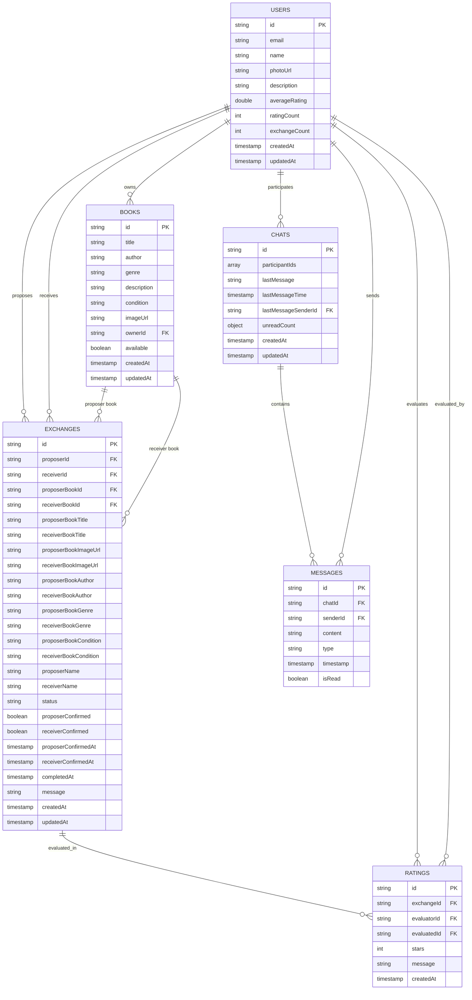
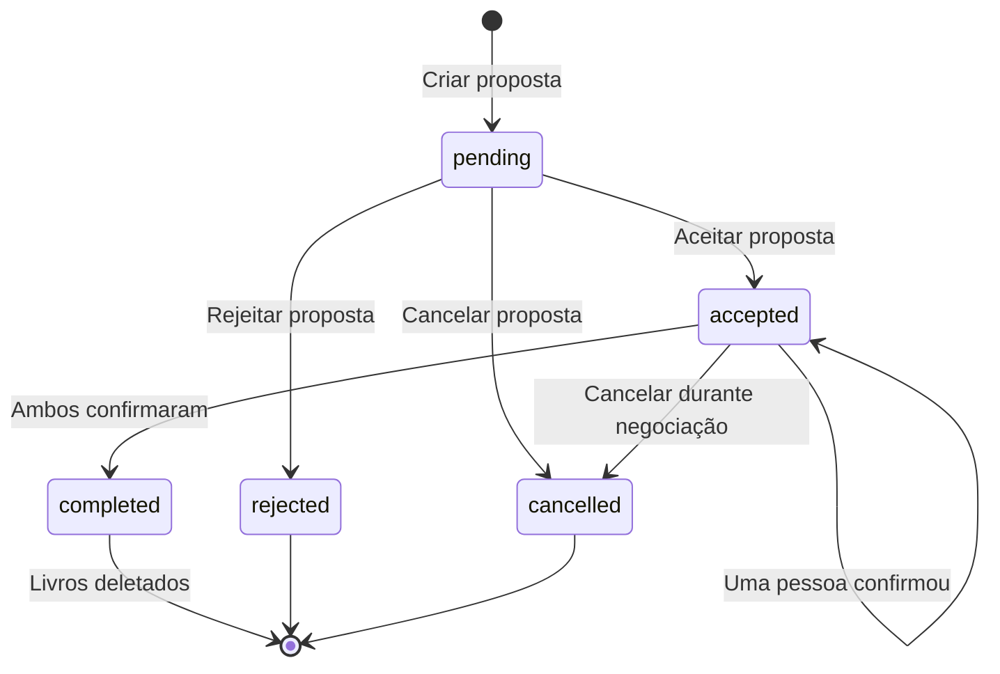

# Firestore Database

O Firestore é o banco de dados NoSQL em tempo real utilizado pelo Librio. Esta seção detalha a estrutura das coleções, regras de segurança e todas as funcionalidades implementadas.

## 🗃️ Estrutura das Coleções

O banco de dados está organizado nas seguintes coleções principais:



## 🔐 Regras de Segurança

### firestore.rules
```javascript
rules_version = '2';
service cloud.firestore {
  match /databases/{database}/documents {

    // Regras para usuários
    match /users/{userId} {
      allow read: if true; // Perfis são públicos para visualização
      allow create: if request.auth != null && request.auth.uid == userId;
      allow update: if request.auth != null &&
        (request.auth.uid == userId ||
         'averageRating' in request.resource.data ||
         'ratingCount' in request.resource.data ||
         'exchangeCount' in request.resource.data);
      allow delete: if request.auth != null && request.auth.uid == userId;
    }

    // Regras para livros
    match /books/{bookId} {
      allow read: if true; // Livros são públicos
      allow create: if request.auth != null &&
        request.auth.uid == request.resource.data.ownerId &&
        'imageUrl' in request.resource.data &&
        request.resource.data.imageUrl != '';
      allow update: if request.auth != null &&
        request.auth.uid == resource.data.ownerId;
      allow delete: if request.auth != null; // Permite deleção em trocas
    }

    // Regras para trocas
    match /exchanges/{exchangeId} {
      allow read: if request.auth != null &&
        (request.auth.uid == resource.data.proposerId ||
         request.auth.uid == resource.data.receiverId);
      allow create: if request.auth != null &&
        request.auth.uid == request.resource.data.proposerId;
      allow update: if request.auth != null &&
        (request.auth.uid == resource.data.proposerId ||
         request.auth.uid == resource.data.receiverId);
      allow delete: if false; // Trocas não podem ser deletadas
    }

    // Regras para chats
    match /chats/{chatId} {
      allow read, write: if request.auth != null &&
        request.auth.uid in resource.data.participantIds;
      allow create: if request.auth != null &&
        request.auth.uid in request.resource.data.participantIds;
    }

    // Regras para mensagens
    match /chats/{chatId}/messages/{messageId} {
      allow read: if request.auth != null &&
        request.auth.uid in get(/databases/$(database)/documents/chats/$(chatId)).data.participantIds;
      allow create: if request.auth != null &&
        request.auth.uid == request.resource.data.senderId &&
        request.auth.uid in get(/databases/$(database)/documents/chats/$(chatId)).data.participantIds;
      allow update: if request.auth != null &&
        request.auth.uid in get(/databases/$(database)/documents/chats/$(chatId)).data.participantIds;
    }

    // Regras para avaliações
    match /ratings/{ratingId} {
      allow read: if true; // Avaliações são públicas
      allow create: if request.auth != null &&
        request.auth.uid == request.resource.data.evaluatorId;
      allow update, delete: if false; // Avaliações são imutáveis
    }
  }
}
```

## 📚 Coleção `users`

Armazena informações completas dos usuários registrados.

### Estrutura do Documento
```json
{
  "id": "user_uuid",
  "name": "João Silva",
  "email": "joao@exemplo.com",
  "photoUrl": "https://firebasestorage.googleapis.com/v0/b/librio-12fd4.appspot.com/o/users%2Fuser_uuid%2Fprofile%2Favatar.jpg",
  "description": "Apaixonado por ficção científica e literatura clássica",
  "averageRating": 4.7,
  "ratingCount": 15,
  "exchangeCount": 8,
  "createdAt": "2024-01-15T10:30:00Z",
  "updatedAt": "2024-01-20T14:15:00Z"
}
```

### Campos Detalhados

| Campo | Tipo | Descrição | Obrigatório |
|-------|------|-----------|-------------|
| `id` | string | ID único do usuário (mesmo do Auth) | ✅ |
| `name` | string | Nome completo do usuário | ✅ |
| `email` | string | Email de registro | ✅ |
| `photoUrl` | string | URL da foto de perfil no Storage | ❌ |
| `description` | string | Biografia/descrição do usuário | ❌ |
| `averageRating` | double | Média das avaliações recebidas | ✅ |
| `ratingCount` | int | Número total de avaliações | ✅ |
| `exchangeCount` | int | Número de trocas concluídas | ✅ |
| `createdAt` | timestamp | Data de criação | ✅ |
| `updatedAt` | timestamp | Última atualização | ✅ |

## 📖 Coleção `books`

Contém todos os livros cadastrados com imagens obrigatórias.

### Estrutura do Documento
```json
{
  "id": "book_uuid",
  "title": "1984",
  "author": "George Orwell",
  "genre": "Ficção Científica",
  "description": "Uma distopia clássica sobre vigilância e controle totalitário",
  "condition": "Muito bom",
  "imageUrl": "https://firebasestorage.googleapis.com/v0/b/librio-12fd4.appspot.com/o/books%2Fbook_uuid%2Fcover.jpg",
  "ownerId": "user_uuid",
  "available": true,
  "createdAt": "2024-01-20T14:15:00Z",
  "updatedAt": "2024-01-20T14:15:00Z"
}
```

### Categorias Suportadas
```dart
const List<String> categories = [
  'Ficção',
  'Romance',
  'Mistério',
  'Fantasia',
  'Biografia',
  'História',
  'Ciência',
  'Tecnologia',
  'Arte',
  'Autoajuda',
  'Ficção Científica',
  'Suspense',
  'Manga',
  'Outros'
];
```

### Condições Suportadas
```dart
const List<String> conditions = [
  'Péssimo',
  'Ruim',
  'Razoável',
  'Bom',
  'Novo'
];
```

## 🔄 Coleção `exchanges` - Sistema Avançado

Sistema completo de trocas com timeout automático de 48h.

### Estrutura do Documento
```json
{
  "id": "exchange_uuid",
  "proposerId": "user1_uuid",
  "receiverId": "user2_uuid",
  "proposerBookId": "book1_uuid",
  "receiverBookId": "book2_uuid",
  "proposerBookTitle": "1984",
  "receiverBookTitle": "O Senhor dos Anéis",
  "proposerBookImageUrl": "https://storage.../book1.jpg",
  "receiverBookImageUrl": "https://storage.../book2.jpg",
  "proposerBookAuthor": "George Orwell",
  "receiverBookAuthor": "J.R.R. Tolkien",
  "proposerBookGenre": "Ficção Científica",
  "receiverBookGenre": "Fantasia",
  "proposerBookCondition": "Bom",
  "receiverBookCondition": "Muito bom",
  "proposerName": "João Silva",
  "receiverName": "Maria Santos",
  "status": "completed",
  "proposerConfirmed": true,
  "receiverConfirmed": true,
  "proposerConfirmedAt": "2024-01-25T10:00:00Z",
  "receiverConfirmedAt": "2024-01-25T11:30:00Z",
  "completedAt": "2024-01-25T11:30:00Z",
  "message": "Interessado na troca!",
  "createdAt": "2024-01-24T15:20:00Z",
  "updatedAt": "2024-01-25T11:30:00Z"
}
```

### Estados da Troca
```dart
enum ExchangeStatus {
  pending,    // Aguardando resposta
  accepted,   // Aceita, aguardando confirmações
  completed,  // Concluída (ambos confirmaram)
  rejected,   // Rejeitada
  cancelled   // Cancelada
}
```

### Sistema de Timeout de 48h

O sistema automaticamente processa trocas que ficam pendentes:

```dart
class ExchangeTimeoutHelper {
  static Duration timeoutDuration = Duration(hours: 48);

  static bool isNearTimeout(DateTime confirmedAt) {
    final elapsed = DateTime.now().difference(confirmedAt);
    final remaining = timeoutDuration - elapsed;
    return remaining.inHours <= 12; // Últimas 12 horas
  }

  static bool isOverdue(DateTime confirmedAt) {
    final elapsed = DateTime.now().difference(confirmedAt);
    return elapsed >= timeoutDuration;
  }
}
```

### Ciclo de Vida da Troca



## 💬 Coleção `chats`

Sistema de chat em tempo real entre usuários.

### Estrutura do Documento
```json
{
  "id": "chat_uuid",
  "participantIds": ["user1_uuid", "user2_uuid"],
  "lastMessage": "Quando podemos fazer a troca?",
  "lastMessageTime": "2024-01-25T14:30:00Z",
  "lastMessageSenderId": "user1_uuid",
  "unreadCount": {
    "user1_uuid": 0,
    "user2_uuid": 2
  },
  "createdAt": "2024-01-20T10:00:00Z",
  "updatedAt": "2024-01-25T14:30:00Z"
}
```

## 💌 Subcoleção `messages`

Mensagens dentro de cada chat.

### Estrutura do Documento
```json
{
  "id": "message_uuid",
  "chatId": "chat_uuid",
  "senderId": "user1_uuid",
  "content": "Olá! Gostaria de trocar meu livro pelo seu.",
  "type": "text",
  "timestamp": "2024-01-25T14:30:00Z",
  "isRead": false
}
```

## ⭐ Coleção `ratings`

Sistema de avaliações após trocas concluídas.

### Estrutura do Documento
```json
{
  "id": "rating_uuid",
  "exchangeId": "exchange_uuid",
  "evaluatorId": "user1_uuid",
  "evaluatedId": "user2_uuid",
  "stars": 5,
  "message": "Excelente experiência! Livro em perfeito estado.",
  "createdAt": "2024-01-26T09:15:00Z"
}
```

### Validações
- ⭐ 1-5 estrelas obrigatório
- 📝 Comentário opcional (máx. 500 caracteres)
- 🔒 Uma avaliação por troca
- ⏰ Apenas após troca concluída

## 🔍 Consultas Principais

### Buscar Livros Disponíveis
```dart
Query<Map<String, dynamic>> getAvailableBooks() {
  return FirebaseFirestore.instance
      .collection('books')
      .where('available', isEqualTo: true)
      .orderBy('createdAt', descending: true);
}
```

### Buscar por Categoria
```dart
Query<Map<String, dynamic>> getBooksByCategory(String genre) {
  return FirebaseFirestore.instance
      .collection('books')
      .where('available', isEqualTo: true)
      .where('genre', isEqualTo: genre)
      .orderBy('createdAt', descending: true);
}
```

### Trocas do Usuário
```dart
Stream<List<Exchange>> getUserExchanges(String userId) {
  return FirebaseFirestore.instance
      .collection('exchanges')
      .where('proposerId', isEqualTo: userId)
      .snapshots()
      .asyncMap((proposerQuery) async {

    final receiverQuery = await FirebaseFirestore.instance
        .collection('exchanges')
        .where('receiverId', isEqualTo: userId)
        .get();

    final allDocs = [...proposerQuery.docs, ...receiverQuery.docs];
    return allDocs.map((doc) => Exchange.fromFirestore(doc)).toList();
  });
}
```

### Avaliações do Usuário
```dart
Stream<List<Rating>> getUserRatings(String userId) {
  return FirebaseFirestore.instance
      .collection('ratings')
      .where('evaluatedId', isEqualTo: userId)
      .orderBy('createdAt', descending: true)
      .snapshots()
      .map((snapshot) =>
          snapshot.docs.map((doc) => Rating.fromFirestore(doc)).toList());
}
```

## 🚨 Monitoramento e Analytics

### Índices Compostos Necessários

```javascript
// Índices criados automaticamente via firestore.indexes.json
[
  {
    "collectionGroup": "books",
    "queryScope": "COLLECTION",
    "fields": [
      {"fieldPath": "available", "order": "ASCENDING"},
      {"fieldPath": "genre", "order": "ASCENDING"},
      {"fieldPath": "createdAt", "order": "DESCENDING"}
    ]
  },
  {
    "collectionGroup": "exchanges",
    "queryScope": "COLLECTION",
    "fields": [
      {"fieldPath": "status", "order": "ASCENDING"},
      {"fieldPath": "createdAt", "order": "DESCENDING"}
    ]
  }
]
```

### Triggers Cloud Functions

```javascript
// Função para atualizar estatísticas do usuário
exports.updateUserStats = functions.firestore
    .document('ratings/{ratingId}')
    .onCreate(async (snap, context) => {
      const rating = snap.data();
      const userRef = admin.firestore()
          .collection('users')
          .doc(rating.evaluatedId);

      return admin.firestore().runTransaction(async (transaction) => {
        const userDoc = await transaction.get(userRef);
        const userData = userDoc.data();

        const newRatingCount = (userData.ratingCount || 0) + 1;
        const currentTotal = (userData.averageRating || 0) * (userData.ratingCount || 0);
        const newAverage = (currentTotal + rating.stars) / newRatingCount;

        transaction.update(userRef, {
          averageRating: newAverage,
          ratingCount: newRatingCount,
          updatedAt: admin.firestore.FieldValue.serverTimestamp()
        });
      });
    });
```

## 🛡️ Backup e Segurança

### Estratégia de Backup
- ✅ Backup automático diário via Firebase
- ✅ Retenção de 30 dias
- ✅ Export semanal para Cloud Storage
- ✅ Teste de restore mensal

### Auditoria
- 📊 Log de todas as operações sensíveis
- 🔍 Monitoramento de atividades suspeitas
- 📈 Analytics de uso e performance
- ⚠️ Alertas de falha automáticos

---

:::tip Dica de Performance
Use `.limit()` em consultas grandes e implemente paginação para melhor experiência do usuário.
:::

:::warning Atenção
Sempre valide dados no frontend E backend. As regras do Firestore são a última linha de defesa.
:::

:::info Configuração Atual
O projeto está configurado para usar o projeto Firebase `librio-12fd4` em produção.
:::
