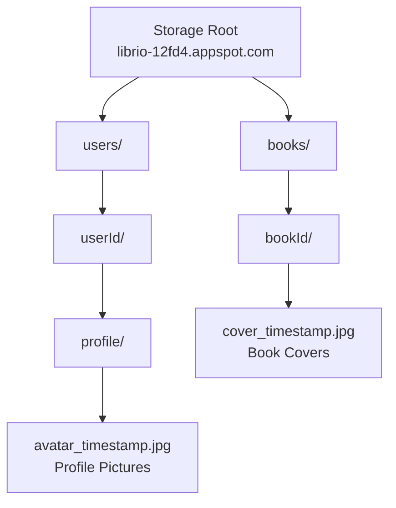

# Firebase Cloud Storage

O **Firebase Cloud Storage** é utilizado no Librio para armazenar e gerenciar imagens de perfil de usuários e capas de livros. O sistema foi implementado com upload obrigatório de imagens para livros e sistema completo de fotos de perfil.

## 📁 Estrutura de Pastas Implementada



## 🔐 Regras de Segurança

### storage.rules
```javascript
rules_version = '2';

service firebase.storage {
  match /b/{bucket}/o {

    // Regras para fotos de perfil dos usuários
    match /users/{userId}/profile/{fileName} {
      allow read: if true; // Fotos de perfil são públicas
      allow write: if request.auth != null
                   && request.auth.uid == userId
                   && isImageFile(fileName)
                   && isValidImageSize();
      allow delete: if request.auth != null
                    && request.auth.uid == userId;
    }

    // Regras para capas de livros
    match /books/{bookId}/{fileName} {
      allow read: if true; // Capas de livros são públicas
      allow write: if request.auth != null
                   && isValidImageSize()
                         && isImageFile(fileName);
      allow delete: if request.auth != null;
    }

    // Funções auxiliares de validação
    function isImageFile(fileName) {
      return fileName.matches('.*\\.(jpg|jpeg|png|webp)$');
    }

    function isValidImageSize() {
      return request.resource.size < 5 * 1024 * 1024; // Máximo 5MB
    }
  }
}
```

## 🛠️ StorageService - Implementação Completa

### Classe Principal
```dart
// lib/src/data/datasources/storage_service.dart
import 'dart:io';
import 'package:firebase_storage/firebase_storage.dart';
import 'package:path/path.dart';

class StorageService {
  final FirebaseStorage _storage = FirebaseStorage.instance;

  // Configurações globais
  static const int maxFileSize = 5 * 1024 * 1024; // 5MB
  static const List<String> allowedExtensions = ['jpg', 'jpeg', 'png', 'webp'];

  /// Upload de foto de perfil do usuário
  Future<String?> uploadProfileImage(File imageFile) async {
    try {
      final user = FirebaseAuth.instance.currentUser;
      if (user == null) throw Exception('Usuário não autenticado');

      // Validar arquivo
      if (!_isValidImageFile(imageFile)) {
        throw Exception('Formato de arquivo inválido');
      }

      if (!_isValidFileSize(imageFile)) {
        throw Exception('Arquivo muito grande (máx. 5MB)');
      }

      // Gerar nome único
      final fileName = 'avatar_${DateTime.now().millisecondsSinceEpoch}.jpg';
      final path = 'users/${user.uid}/profile/$fileName';

      // Fazer upload
      final ref = _storage.ref().child(path);
      final uploadTask = ref.putFile(
        imageFile,
        SettableMetadata(
          contentType: 'image/jpeg',
          customMetadata: {
            'uploadedBy': user.uid,
            'uploadedAt': DateTime.now().toIso8601String(),
            'type': 'profile',
          },
        ),
      );

      // Aguardar conclusão
      final snapshot = await uploadTask;

      // Obter URL pública
      final downloadUrl = await snapshot.ref.getDownloadURL();

      return downloadUrl;
    } catch (e) {
      print('Erro no upload da foto de perfil: $e');
      return null;
    }
  }

  /// Upload de capa de livro (obrigatório)
  Future<String?> uploadBookCover(File imageFile) async {
    try {
      final user = FirebaseAuth.instance.currentUser;
      if (user == null) throw Exception('Usuário não autenticado');

      // Validações obrigatórias
      if (!_isValidImageFile(imageFile)) {
        throw Exception('Formato de imagem inválido. Use: JPG, PNG, WEBP');
      }

      if (!_isValidFileSize(imageFile)) {
        throw Exception('Imagem muito grande. Máximo permitido: 5MB');
      }

      // Gerar ID único para o livro
      final bookId = FirebaseFirestore.instance.collection('books').doc().id;
      final fileName = 'cover_${DateTime.now().millisecondsSinceEpoch}.jpg';
      final path = 'books/$bookId/$fileName';

      // Upload com metadados
      final ref = _storage.ref().child(path);
      final uploadTask = ref.putFile(
        imageFile,
        SettableMetadata(
          contentType: 'image/jpeg',
          customMetadata: {
            'bookId': bookId,
            'uploadedBy': user.uid,
            'uploadedAt': DateTime.now().toIso8601String(),
            'type': 'cover',
          },
        ),
      );

      final snapshot = await uploadTask;
      final downloadUrl = await snapshot.ref.getDownloadURL();

      return downloadUrl;
    } catch (e) {
      print('Erro no upload da capa do livro: $e');
      return null;
    }
  }

  /// Deletar imagem do storage
  Future<bool> deleteImage(String imageUrl) async {
    try {
      final ref = _storage.refFromURL(imageUrl);
      await ref.delete();
      return true;
    } catch (e) {
      print('Erro ao deletar imagem: $e');
      return false;
    }
  }

  /// Validar se é um arquivo de imagem válido
  bool _isValidImageFile(File file) {
    final extension = basename(file.path).split('.').last.toLowerCase();
    return allowedExtensions.contains(extension);
  }

  /// Validar tamanho do arquivo
  bool _isValidFileSize(File file) {
    final fileSize = file.lengthSync();
    return fileSize <= maxFileSize;
  }

  /// Obter informações de um arquivo no storage
  Future<FullMetadata?> getFileMetadata(String imageUrl) async {
    try {
      final ref = _storage.refFromURL(imageUrl);
      return await ref.getMetadata();
    } catch (e) {
      print('Erro ao obter metadados: $e');
      return null;
    }
  }

  /// Listar todas as imagens de um usuário
  Future<List<String>> getUserImages(String userId) async {
    try {
      final ref = _storage.ref().child('users/$userId/profile');
      final result = await ref.listAll();

      final urls = <String>[];
      for (final item in result.items) {
        final url = await item.getDownloadURL();
        urls.add(url);
      }

      return urls;
    } catch (e) {
      print('Erro ao listar imagens do usuário: $e');
      return [];
    }
  }
}
```

## 📱 ImagePickerService - Seleção de Imagens

### Implementação do Seletor
```dart
// lib/src/data/datasources/image_picker_service.dart
import 'dart:io';
import 'package:flutter/material.dart';
import 'package:image_picker/image_picker.dart';

class ImagePickerService {
  final ImagePicker _picker = ImagePicker();

  /// Mostrar opções de seleção de imagem
  Future<File?> pickImage(BuildContext context) async {
    return showDialog<File?>(
      context: context,
      builder: (BuildContext context) {
        return AlertDialog(
          title: const Text('Selecionar Imagem'),
          content: Column(
          mainAxisSize: MainAxisSize.min,
          children: [
            ListTile(
                leading: const Icon(Icons.camera_alt),
              title: const Text('Câmera'),
                onTap: () async {
                  Navigator.of(context).pop();
                  final image = await _pickFromCamera();
                  if (context.mounted) {
                    Navigator.of(context).pop(image);
                  }
              },
            ),
            ListTile(
              leading: const Icon(Icons.photo_library),
              title: const Text('Galeria'),
                onTap: () async {
                  Navigator.of(context).pop();
                  final image = await _pickFromGallery();
                  if (context.mounted) {
                    Navigator.of(context).pop(image);
                  }
                },
              ),
          ],
        ),
          actions: [
            TextButton(
              onPressed: () => Navigator.of(context).pop(),
              child: const Text('Cancelar'),
      ),
          ],
        );
      },
    );
  }

  /// Selecionar da câmera
  Future<File?> _pickFromCamera() async {
    try {
      final XFile? image = await _picker.pickImage(
        source: ImageSource.camera,
        maxWidth: 1024,
        maxHeight: 1024,
        imageQuality: 80,
      );

      if (image != null) {
        return File(image.path);
      }
      return null;
    } catch (e) {
      print('Erro ao selecionar da câmera: $e');
      return null;
    }
  }

  /// Selecionar da galeria
  Future<File?> _pickFromGallery() async {
    try {
      final XFile? image = await _picker.pickImage(
        source: ImageSource.gallery,
        maxWidth: 1024,
        maxHeight: 1024,
        imageQuality: 80,
      );

      if (image != null) {
        return File(image.path);
      }
      return null;
    } catch (e) {
      print('Erro ao selecionar da galeria: $e');
      return null;
    }
  }
}
```

## 🖼️ Implementação nas Telas

### Foto de Perfil - ProfileScreen
```dart
// lib/src/presentation/home/screens/profile/profile_screen.dart
class ProfileScreen extends StatefulWidget {
  // ... implementação

  Widget _buildProfileHeader() {
    return Column(
      children: [
        Stack(
          children: [
            // Avatar do usuário
            CircleAvatar(
              radius: 50,
              backgroundColor: Colors.grey[300],
              backgroundImage: viewModel.userProfile?.photoUrl != null
                  ? NetworkImage(viewModel.userProfile!.photoUrl!)
                  : null,
              child: viewModel.userProfile?.photoUrl == null
                  ? const Icon(Icons.person, size: 50, color: Colors.grey)
                  : null,
            ),

            // Botão para editar foto
            Positioned(
              bottom: 0,
              right: 0,
              child: GestureDetector(
                onTap: () => viewModel.updateProfilePhoto(context),
                child: Container(
                  padding: const EdgeInsets.all(8),
                  decoration: const BoxDecoration(
                    color: Colors.blue,
                    shape: BoxShape.circle,
                  ),
                  child: const Icon(
                    Icons.camera_alt,
                    color: Colors.white,
                    size: 16,
                  ),
                ),
              ),
            ),

            // Loading indicator durante upload
            if (viewModel.isUploadingPhoto)
              Positioned.fill(
                child: Container(
                  decoration: BoxDecoration(
                    color: Colors.black.withOpacity(0.5),
                    shape: BoxShape.circle,
                  ),
                  child: const Center(
                    child: CircularProgressIndicator(
                      valueColor: AlwaysStoppedAnimation<Color>(Colors.white),
                    ),
                  ),
                ),
          ),
        ],
      ),

        const SizedBox(height: 16),

        // Nome e informações do usuário
        Text(
          viewModel.userProfile?.name ?? 'Carregando...',
          style: const TextStyle(
            fontSize: 24,
            fontWeight: FontWeight.bold,
          ),
        ),
      ],
    );
  }
}
```

### Imagem de Livro - AddBookScreen
```dart
// lib/src/presentation/home/screens/add_book/add_book_screen.dart
class AddBookScreen extends StatefulWidget {
  // ... implementação

  Widget _buildImageSection() {
    return Column(
      children: [
        const Row(
          mainAxisAlignment: MainAxisAlignment.center,
          children: [
            Text(
              'Foto do livro',
              style: TextStyle(
                fontSize: 14,
                fontWeight: FontWeight.w500,
              ),
            ),
            SizedBox(width: 4),
            Text(
              '*',
              style: TextStyle(
                color: Colors.red,
                fontSize: 16,
                fontWeight: FontWeight.bold,
              ),
            ),
          ],
        ),
        const SizedBox(height: 8),

        Center(
          child: Stack(
            children: [
              GestureDetector(
                onTap: () => viewModel.pickImage(context),
                child: Container(
                  width: 120,
                  height: 150,
                  decoration: BoxDecoration(
                    color: Colors.grey[200],
                    borderRadius: BorderRadius.circular(12),
                    border: Border.all(
                      color: viewModel.selectedImageFile == null
                          ? Colors.red[300]!
                          : Colors.grey[300]!,
                      width: 2,
                    ),
                  ),
                  child: viewModel.selectedImageFile != null
                      ? ClipRRect(
                          borderRadius: BorderRadius.circular(10),
                          child: Image.file(
                            viewModel.selectedImageFile!,
                            fit: BoxFit.cover,
                          ),
                        )
                      : Column(
                          mainAxisAlignment: MainAxisAlignment.center,
                          children: [
                            Icon(
                              Icons.add_photo_alternate_outlined,
                              size: 32,
                              color: viewModel.selectedImageFile == null
                                  ? Colors.red[400]
                                  : Colors.grey[600],
                            ),
                            const SizedBox(height: 8),
                            Text(
                              'Toque para\nadicionar foto',
                              textAlign: TextAlign.center,
                              style: TextStyle(
                                fontSize: 12,
                                color: viewModel.selectedImageFile == null
                                    ? Colors.red[600]
                                    : Colors.grey[600],
                                fontWeight: FontWeight.w500,
                              ),
                            ),
                          ],
                        ),
                ),
              ),

              // Botão remover imagem
              if (viewModel.selectedImageFile != null)
                Positioned(
                  top: 4,
                  right: 4,
                  child: GestureDetector(
                    onTap: () => viewModel.removeImage(),
                    child: Container(
                      padding: const EdgeInsets.all(4),
                      decoration: const BoxDecoration(
                        color: Colors.red,
                        shape: BoxShape.circle,
                      ),
                      child: const Icon(
                        Icons.close,
                        color: Colors.white,
                        size: 16,
                      ),
                    ),
                  ),
                ),

              // Loading durante upload
              if (viewModel.isUploadingImage)
                Positioned.fill(
                  child: Container(
                    decoration: BoxDecoration(
                      color: Colors.black.withOpacity(0.5),
                      borderRadius: BorderRadius.circular(12),
                    ),
                    child: const Center(
                      child: CircularProgressIndicator(
                        valueColor: AlwaysStoppedAnimation<Color>(Colors.white),
                      ),
                    ),
                  ),
                ),
            ],
          ),
        ),
      ],
    );
  }
}
```

## 🔧 ViewModels - Lógica de Negócio

### ProfileViewModel - Gerenciamento de Foto
```dart
// lib/src/presentation/home/screens/profile/profile_viewmodel.dart
mixin ProfileViewModel on ChangeNotifier {
  bool isUploadingPhoto = false;

  final StorageService _storageService = StorageService();
  final ImagePickerService _imagePickerService = ImagePickerService();

  Future<void> updateProfilePhoto(BuildContext context) async {
    final user = FirebaseAuth.instance.currentUser;
    if (user == null) return;

    try {
      // Mostrar picker de imagem
      final File? imageFile = await _imagePickerService.pickImage(context);
      if (imageFile == null) return;

      isUploadingPhoto = true;
      notifyListeners();

      // Fazer upload da imagem para o Storage
      final String? imageUrl = await _storageService.uploadProfileImage(imageFile);

      if (imageUrl == null) {
        if (context.mounted) {
          ScaffoldMessenger.of(context).showSnackBar(
            const SnackBar(content: Text('Erro ao fazer upload da imagem')),
          );
        }
        return;
      }

      // Atualizar perfil com a nova foto
      await FirebaseFirestore.instance
          .collection('users')
          .doc(user.uid)
          .update({'photoUrl': imageUrl});

      // Recarregar perfil para mostrar a nova foto
      await fetchUserProfile();

      if (context.mounted) {
        ScaffoldMessenger.of(context).showSnackBar(
          const SnackBar(content: Text('Foto atualizada com sucesso!')),
        );
      }
    } catch (e) {
      if (context.mounted) {
        ScaffoldMessenger.of(context).showSnackBar(
          SnackBar(content: Text('Erro: $e')),
        );
      }
    } finally {
      isUploadingPhoto = false;
      notifyListeners();
    }
  }
}
```

### AddBookViewModel - Upload Obrigatório
```dart
// lib/src/presentation/home/screens/add_book/add_book_viewmodel.dart
class AddBookViewModel extends ChangeNotifier {
  File? selectedImageFile;
  bool isUploadingImage = false;

  final StorageService _storageService = StorageService();
  final ImagePickerService _imagePickerService = ImagePickerService();

  Future<void> pickImage(BuildContext context) async {
    try {
      final File? imageFile = await _imagePickerService.pickImage(context);
      if (imageFile != null) {
        selectedImageFile = imageFile;
        notifyListeners();
      }
    } catch (e) {
      ScaffoldMessenger.of(context).showSnackBar(
        SnackBar(content: Text('Erro ao selecionar imagem: $e')),
      );
    }
  }

  void removeImage() {
    selectedImageFile = null;
    notifyListeners();
  }

  Future<void> addBook({
    required String title,
    required String author,
    required String genre,
    required String description,
    required String condition,
  }) async {
    if (selectedImageFile == null) {
      throw Exception('Imagem do livro é obrigatória');
    }

    try {
      isUploadingImage = true;
      notifyListeners();

      // Upload da imagem primeiro
      final String? imageUrl = await _storageService.uploadBookCover(selectedImageFile!);

      if (imageUrl == null) {
        throw Exception('Falha no upload da imagem');
      }

      // Criar documento do livro com imagem
      final user = FirebaseAuth.instance.currentUser;
      await FirebaseFirestore.instance.collection('books').add({
        'title': title,
        'author': author,
        'genre': genre,
        'description': description,
        'condition': condition,
        'imageUrl': imageUrl, // URL obrigatória
        'ownerId': user!.uid,
        'available': true,
        'createdAt': FieldValue.serverTimestamp(),
      });

    } finally {
      isUploadingImage = false;
      notifyListeners();
    }
  }
}
```

## 📊 Monitoramento e Analytics

### Métricas de Storage
```dart
// Exemplo de coleta de métricas
class StorageMetrics {
  static Future<Map<String, dynamic>> getStorageStats() async {
    final storage = FirebaseStorage.instance;

    try {
      // Listar arquivos por tipo
      final userPhotos = await storage.ref('users').listAll();
      final bookCovers = await storage.ref('books').listAll();

      return {
        'totalUserPhotos': userPhotos.items.length,
        'totalBookCovers': bookCovers.items.length,
        'lastUpdated': DateTime.now().toIso8601String(),
      };
    } catch (e) {
      return {'error': e.toString()};
    }
  }
}
```

## 🚨 Tratamento de Erros

### Tipos de Erro Comuns
```dart
enum StorageError {
  fileNotFound,
  permissionDenied,
  quotaExceeded,
  networkError,
  invalidFile,
  fileTooLarge,
}

class StorageException implements Exception {
  final StorageError type;
  final String message;

  StorageException(this.type, this.message);

  @override
  String toString() => 'StorageException: $message';
}
```

## 🔧 Configuração de Dependências

### pubspec.yaml
```yaml
dependencies:
  firebase_storage: ^11.6.9
  image_picker: ^1.0.7
  path: ^1.8.3

dev_dependencies:
  mockito: ^5.4.4 # Para testes
```

### Permissões Android
```xml
<!-- android/app/src/main/AndroidManifest.xml -->
<uses-permission android:name="android.permission.CAMERA" />
<uses-permission android:name="android.permission.READ_EXTERNAL_STORAGE" />
<uses-permission android:name="android.permission.WRITE_EXTERNAL_STORAGE" />
```

### Permissões iOS
```xml
<!-- ios/Runner/Info.plist -->
<key>NSCameraUsageDescription</key>
<string>Este app precisa acessar a câmera para capturar fotos de livros e perfil</string>
<key>NSPhotoLibraryUsageDescription</key>
<string>Este app precisa acessar a galeria para selecionar fotos</string>
```

## 🧪 Testes

### Teste de Upload
```dart
// test/storage_service_test.dart
void main() {
  group('StorageService', () {
    test('deve fazer upload de imagem válida', () async {
      final service = StorageService();
      final testFile = File('test/assets/test_image.jpg');

      final result = await service.uploadBookCover(testFile);

      expect(result, isNotNull);
      expect(result, startsWith('https://'));
    });

    test('deve rejeitar arquivo muito grande', () async {
      final service = StorageService();
      final largeFile = File('test/assets/large_image.jpg');

      expect(
        () => service.uploadBookCover(largeFile),
        throwsA(isA<Exception>()),
      );
    });
  });
}
```

## 📈 Performance e Otimização

### Boas Práticas Implementadas
- ✅ **Compressão automática** - Imagens redimensionadas para 1024x1024
- ✅ **Validação de formato** - Apenas JPG, PNG, WEBP
- ✅ **Limite de tamanho** - Máximo 5MB por arquivo
- ✅ **Nomes únicos** - Timestamp para evitar conflitos
- ✅ **Metadados** - Informações de upload para auditoria
- ✅ **Cleanup automático** - Remoção de arquivos temporários

### Cache de Imagens
```dart
// Implementação de cache local
class ImageCacheService {
  static final Map<String, Uint8List> _cache = {};

  static Future<Uint8List?> getCachedImage(String url) async {
    if (_cache.containsKey(url)) {
      return _cache[url];
    }

    // Baixar e cachear
    try {
      final response = await http.get(Uri.parse(url));
      if (response.statusCode == 200) {
        _cache[url] = response.bodyBytes;
        return response.bodyBytes;
      }
    } catch (e) {
      print('Erro ao cachear imagem: $e');
    }

    return null;
  }
}
```

---

:::tip Dica de Configuração
Configure as regras do Storage antes de fazer deploy para produção. Teste sempre em ambiente de desenvolvimento primeiro.
:::

:::warning Atenção aos Custos
O Firebase Storage cobra por transferência de dados. Otimize imagens e use cache para reduzir custos.
:::

:::info Configuração Atual
O projeto usa o Storage do projeto `librio-12fd4` com estrutura organizada por usuários e livros.
:::
