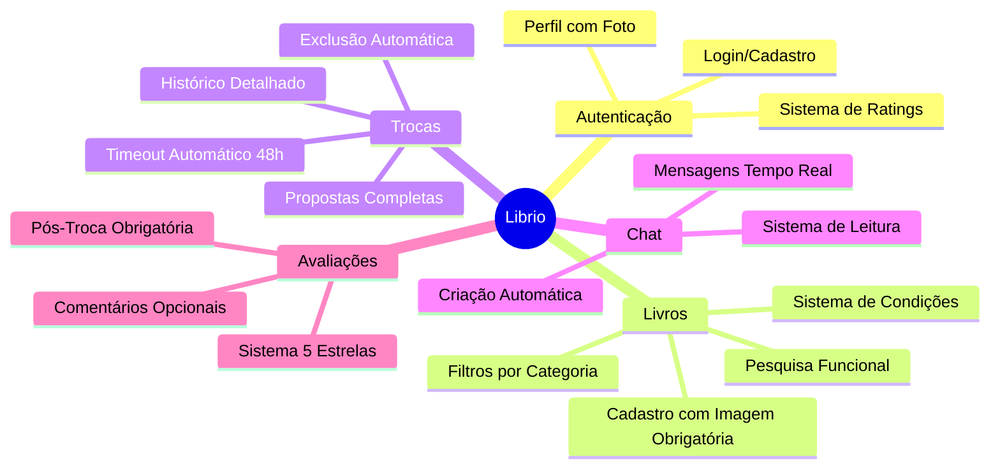
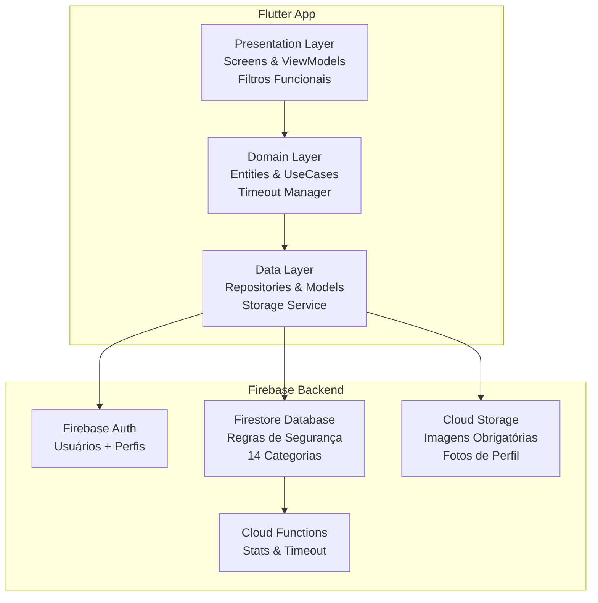

# Librio - Documentação Técnica

Bem-vindo à documentação técnica completa do **Librio**, um aplicativo móvel desenvolvido em Flutter para facilitar a troca de livros entre usuários.

## 📱 Sobre o Projeto

O **Librio** é um aplicativo que conecta leitores, permitindo que compartilhem e troquem livros de forma simples e segura. O projeto promove sustentabilidade através da reutilização de livros e democratiza o acesso à leitura.

### 🎯 Objetivo Principal

Criar uma plataforma onde os usuários possam:
- **Cadastrar** seus livros disponíveis para troca
- **Descobrir** novos títulos de outros usuários
- **Propor** e **negociar** trocas de forma segura
- **Comunicar-se** através de chat integrado
- **Avaliar** experiências de troca

## 🚀 Stack Tecnológico

### Frontend
- **Flutter** - Framework de desenvolvimento multiplataforma
- **Dart** - Linguagem de programação
- **Material Design 3** - Sistema de design

### Backend
- **Firebase Authentication** - Autenticação completa de usuários
- **Firestore Database** - Banco NoSQL com regras de segurança robustas
- **Firebase Cloud Storage** - Armazenamento de imagens (perfil e livros)
- **Cloud Functions** - Funções automáticas para timeout e estatísticas

### Arquitetura
- **Clean Architecture** - Separação em camadas
- **Provider** - Gerenciamento de estado
- **GoRouter** - Navegação declarativa

## 📋 Funcionalidades Principais

## 🏗️ Arquitetura Geral

## 📚 Navegação da Documentação

Esta documentação está organizada nas seguintes seções:

### 🔧 **Configuração**
- Ambiente de desenvolvimento
- Instalação e dependências
- Configuração do Firebase

### 🏛️ **Arquitetura**
- Visão geral da arquitetura
- Clean Architecture
- Gerenciamento de estado

### 🔥 **Firebase Backend**
- Estrutura do Firestore
- Autenticação
- Armazenamento

### ⚡ **Funcionalidades**
- Sistema de autenticação
- Gerenciamento de livros
- Sistema de trocas
- Chat em tempo real
- Sistema de avaliações

### 🧪 **Testes**
- Testes de unidade
- Testes de widget
- Testes de integração

### 🚀 **Deploy**
- Compilação
- Publicação
- CI/CD

## 🎓 Contexto Acadêmico

Esta documentação faz parte de um Trabalho de Conclusão de Curso (TCC) e serve como:

- **Documentação técnica** completa do projeto
- **Guia de desenvolvimento** para futuros contribuidores
- **Referência arquitetural** para projetos similares
- **Manual de implementação** Flutter + Firebase

## 🚀 Primeiros Passos

Para começar a explorar o projeto:

1. **[Configuração do Ambiente](setup/environment)** - Configure seu ambiente de desenvolvimento
2. **[Arquitetura](architecture/overview)** - Entenda a estrutura do projeto
3. **[Firebase](firebase/firestore)** - Conheça a integração com Firebase

## 🔍 Como Usar a Pesquisa

Esta documentação possui um sistema de pesquisa integrado para facilitar a navegação:

- **Barra de pesquisa**: Localizada no canto superior direito
- **Pesquisa em tempo real**: Digite qualquer termo e veja os resultados instantaneamente
- **Suporte completo ao português**: Encontre conteúdo em sua língua nativa
- **Navegação por teclado**: Use as setas ↑↓ para navegar e Enter para abrir

**Dicas de pesquisa:**
- Pesquise por tecnologias: "Flutter", "Firebase", "Dart"
- Busque funcionalidades: "troca", "chat", "autenticação"
- Procure conceitos: "arquitetura", "testes", "deploy"

---

:::tip Dica
Use o menu lateral para navegar entre as seções da documentação. Cada seção contém informações detalhadas com exemplos de código e diagramas explicativos.
:::

## 🌟 Principais Funcionalidades

### ✅ Sistema de Storage Completo
- **Imagens obrigatórias** para todos os livros
- **Fotos de perfil** com upload via Firebase Storage
- **Validação rigorosa** de formato e tamanho

### ✅ Filtros e Busca Funcionais
- **14 categorias padronizadas** (incluindo Manga, Autoajuda)
- **Sistema de filtros 100% funcional**
- **Busca em tempo real** por título e autor
- **Interface com chips informativos**

### ✅ Sistema de Trocas Avançado
- **Timeout automático de 48h** para confirmações
- **Exclusão automática** de livros após troca
- **Contadores de troca** funcionais
- **Histórico com fotos** dos usuários

### ✅ Melhorias na Interface
- **Loading states** em todas as operações
- **Feedback visual** para ações do usuário
- **Cards modernos** com imagens de qualidade
- **Sistema de notificações** aprimorado

---

:::info Configuração Atual
Projeto configurado com Firebase Authentication, Firestore Database, Cloud Storage para imagens e sistema completo de trocas com timeout automático.
:::
