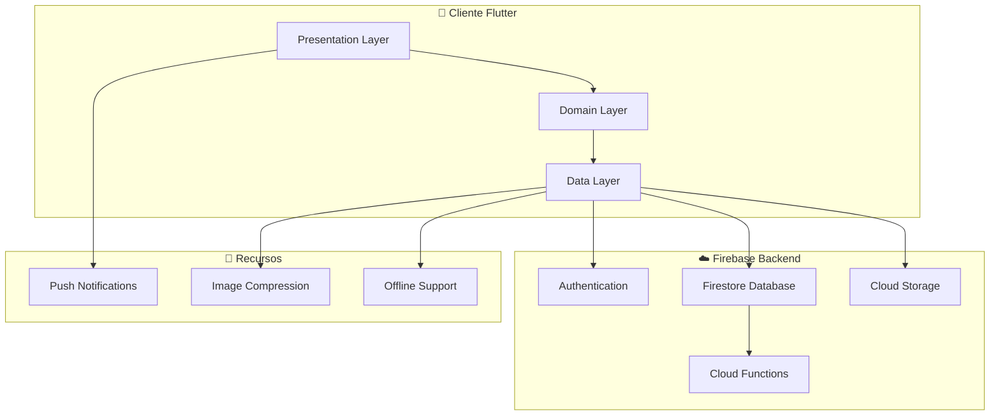
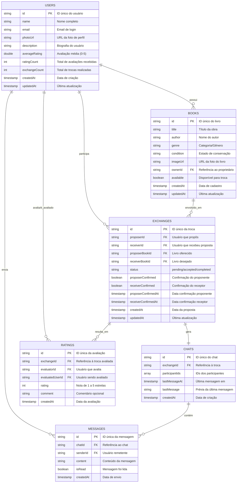
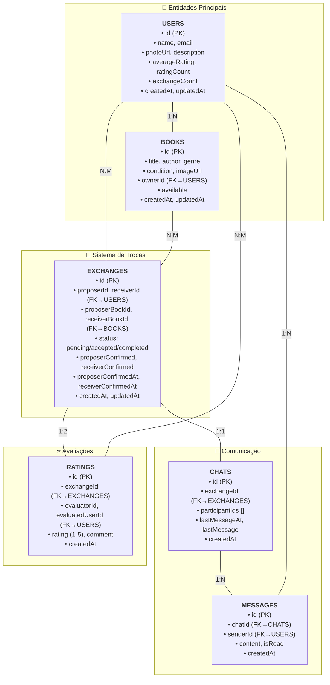
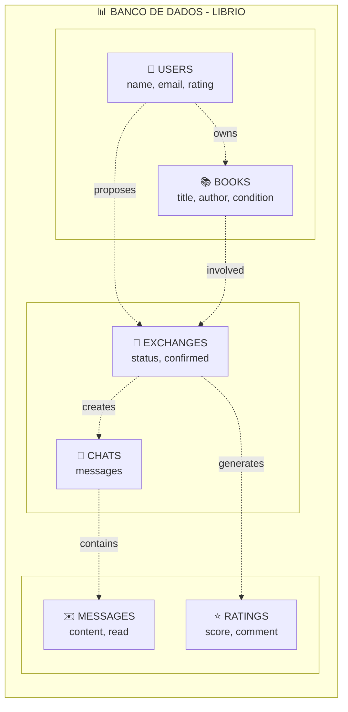
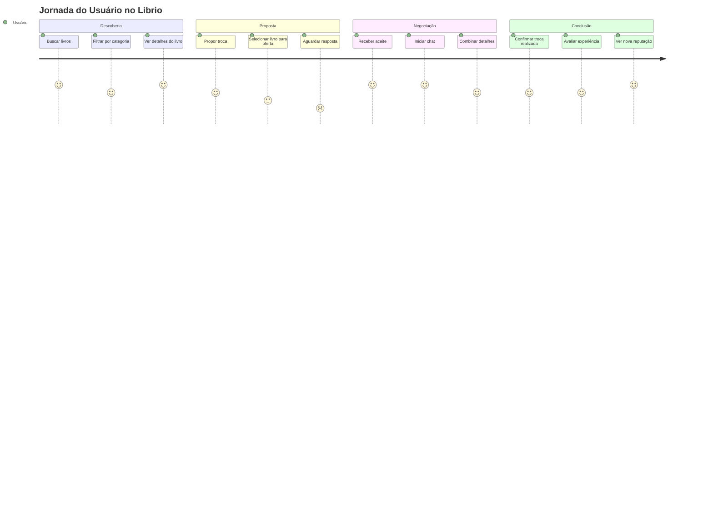

# Visão Geral Completa do Librio

O **Librio** é um aplicativo móvel que conecta leitores através de um sistema de troca de livros seguro e eficiente, promovendo o compartilhamento de conhecimento e sustentabilidade.

## 🎯 Missão do Projeto

Democratizar o acesso à leitura através de uma plataforma que permite aos usuários trocarem livros de forma prática, segura e sustentável, criando uma comunidade de leitores engajados.

## 🏗️ Arquitetura Geral do Sistema



## 📋 Funcionalidades Principais

### 1. 🔐 Sistema de Autenticação
- **Login/Cadastro** com email e senha
- **Perfis de usuário** com foto e biografia
- **Sistema de reputação** baseado em avaliações
- **Gerenciamento de sessão** seguro

**Tecnologias**: Firebase Authentication, validação de formulários

### 2. 📚 Gerenciamento de Livros
- **Cadastro de livros** com imagem obrigatória
- **14 categorias padronizadas** (Ficção, Romance, Fantasia, etc.)
- **5 condições de conservação** (Novo, Bom, Razoável, etc.)
- **Upload para Cloud Storage** com compressão automática

**Tecnologias**: Firebase Storage, Image Picker, validação de formato

### 3. 🔍 Busca e Filtros Avançados
- **Busca em tempo real** por título, autor, gênero
- **Filtros por categoria** com interface intuitiva
- **Algoritmo de relevância** inteligente
- **Chips informativos** dos filtros ativos

**Tecnologias**: Algoritmos de busca local, UI responsiva

### 4. 🔄 Sistema de Trocas Completo
- **Propostas de troca** entre usuários
- **Timeout automático** de 48 horas
- **Exclusão automática** de livros após troca
- **Histórico detalhado** com fotos dos participantes

**Tecnologias**: Firestore Transactions, Cloud Functions para timeout

### 5. 💬 Chat em Tempo Real
- **Mensagens instantâneas** entre usuários
- **Criação automática** quando troca é aceita
- **Interface moderna** com bolhas de mensagem
- **Indicadores de leitura** e typing

**Tecnologias**: Firestore Real-time Listeners, Stream de dados

### 6. 🔔 Sistema de Notificações
- **Notificações contextuais** para cada tipo de evento
- **Contador inteligente** no ícone de notificação
- **Filtragem automática** de notificações já vistas
- **Ações rápidas** diretamente das notificações

**Tecnologias**: Estado local + Firestore, gestão de badges

### 7. ⭐ Sistema de Avaliações
- **Avaliações pós-troca** obrigatórias
- **Sistema de 5 estrelas** com comentários
- **Cálculo automático** de média de reputação
- **Prevenção de auto-avaliação** e duplicatas

**Tecnologias**: Validações de negócio, cálculos estatísticos

## 🗄️ Estrutura do Banco de Dados

### Modelo Entidade-Relacionamento Simplificado



### Relacionamentos Detalhados

**1. USERS ↔ BOOKS** (1:N)
- Um usuário pode cadastrar múltiplos livros
- Cada livro pertence a exatamente um usuário

**2. USERS ↔ EXCHANGES** (N:M)
- Usuários participam de trocas como proponente ou receptor
- Cada troca envolve exatamente dois usuários

**3. BOOKS ↔ EXCHANGES** (N:M)
- Livros são objetos das propostas de troca
- Cada troca envolve exatamente dois livros

**4. EXCHANGES → CHATS** (1:1)
- Cada troca aceita gera automaticamente um chat
- Chat é criado apenas quando troca é aceita

**5. CHATS ↔ MESSAGES** (1:N)
- Cada chat contém múltiplas mensagens
- Mensagens pertencem a exatamente um chat

**6. EXCHANGES ↔ RATINGS** (1:N)
- Trocas concluídas geram avaliações mútuas
- Máximo de 2 ratings por troca (uma para cada participante)

---

### Versão Compacta para TCC/Impressão



### Versão Minimalista (Ideal para TCC)



**Legendas:**
- **1:N** = Um para muitos (ex: 1 usuário possui N livros)
- **N:M** = Muitos para muitos (ex: N usuários fazem M trocas)
- **1:1** = Um para um (ex: 1 troca gera 1 chat)

## 🎨 Design System

### Paleta de Cores
- **Primária**: Azul (#2196F3) - Confiança e segurança
- **Secundária**: Verde (#4CAF50) - Sucesso e confirmação
- **Acento**: Âmbar (#FFC107) - Destaque e avaliações
- **Erro**: Vermelho (#F44336) - Alertas e erros
- **Neutro**: Cinza (#9E9E9E) - Textos secundários

### Tipografia
- **Título Principal**: 32px, Bold
- **Títulos Seção**: 20px, Bold
- **Corpo**: 14px, Regular
- **Legenda**: 12px, Regular

### Componentes Reutilizáveis
- **BookCard**: Card de livro com imagem e detalhes
- **NotificationCard**: Card de notificação contextual
- **ExchangeCard**: Card de troca com ações
- **UserAvatar**: Avatar circular com foto de perfil
- **CategoryFilter**: Filtro horizontal com chips
- **SearchBar**: Campo de busca com limpeza

## 🔐 Segurança Implementada

### Firestore Security Rules
```javascript
// Proteção de dados por usuário
match /users/{userId} {
  allow read: if true; // Perfis públicos
  allow write: if request.auth.uid == userId;
}

// Proteção de livros
match /books/{bookId} {
  allow read: if true; // Livros públicos
  allow write: if request.auth.uid == resource.data.ownerId;
}

// Proteção de trocas
match /exchanges/{exchangeId} {
  allow read, write: if request.auth.uid in
    [resource.data.proposerId, resource.data.receiverId];
}
```

### Storage Rules
```javascript
// Proteção de imagens por usuário
match /users/{userId}/profile/{fileName} {
  allow read: if true;
  allow write: if request.auth.uid == userId
               && isValidImageFile();
}
```

## 📊 Métricas e Analytics

### Métricas de Engajamento
- **Livros cadastrados** por usuário
- **Taxa de conversão** proposta → troca
- **Tempo médio** de resposta às propostas
- **Categorias mais populares**
- **Termos de busca** mais utilizados

### Métricas de Qualidade
- **Média geral** de avaliações na plataforma
- **Taxa de completion** das trocas
- **Tempo médio** para conclusão de troca
- **Usuários mais ativos** (top rated)

## 🚀 Fluxo de Uso Típico



## ⚡ Performance e Otimizações

### Estratégias Implementadas
- **Paginação** implícita com carregamento sob demanda
- **Cache local** de livros e perfis
- **Compressão de imagens** automática
- **Debounce** em campos de busca
- **Lazy loading** de imagens
- **Filtros locais** para resposta instantânea

### Métricas de Performance
- **Tempo de carregamento** inicial < 3s
- **Resposta de busca** < 100ms
- **Upload de imagem** < 5s (com compressão)
- **Sincronização** de mensagens < 500ms

## 🧪 Estratégia de Testes

### Cobertura de Testes
- **Unit Tests**: Lógica de negócio e use cases
- **Widget Tests**: Componentes de UI isolados
- **Integration Tests**: Fluxos completos de usuário
- **E2E Tests**: Jornadas críticas do app

### Ferramentas Utilizadas
- **Flutter Test**: Framework nativo do Flutter
- **Mockito**: Mocks para dependencies
- **Golden Tests**: Testes visuais de regressão
- **Firebase Emulator**: Testes locais do backend

## 🌟 Diferenciais Competitivos

### 1. **Sistema de Timeout Inteligente**
Trocas que não são confirmadas em 48h são automaticamente processadas, evitando livros "presos" indefinidamente.

### 2. **Busca com Relevância**
Algoritmo proprietário que considera múltiplos fatores para ordenar resultados por relevância real.

### 3. **Chat Contextual**
Chat criado automaticamente quando troca é aceita, mantendo conversas organizadas por contexto.

### 4. **Notificações Inteligentes**
Sistema que aprende quais notificações o usuário já viu, evitando spam e melhorando UX.

### 5. **Reputação Transparente**
Sistema de avaliações pós-troca que gera reputação confiável baseada em experiências reais.

## 🎓 Impacto Educacional

### Para Desenvolvedores
- **Referência de Clean Architecture** em Flutter
- **Integração completa** com Firebase
- **Padrões de UI/UX** modernos
- **Gestão de estado** com Provider
- **Boas práticas** de segurança

### Para Usuários
- **Acesso democratizado** à literatura
- **Comunidade de leitores** engajada
- **Sustentabilidade** através de reutilização
- **Descoberta** de novos livros e autores

---

:::tip Próximos Passos
Este projeto serve como base sólida para futuras expansões como marketplace de livros, grupos de leitura, recomendações por IA, e integração com bibliotecas públicas.
:::

:::info Tecnologia
O Librio demonstra como tecnologias modernas podem criar soluções que geram valor social real, conectando pessoas através do conhecimento compartilhado.
:::
