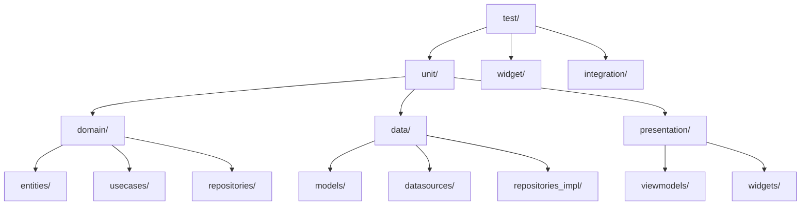

# Testes Unitários

Os testes unitários no Librio garantem que cada componente individual funciona corretamente de forma isolada, seguindo as melhores práticas de TDD (Test-Driven Development).

## Estrutura de Testes



## Configuração de Testes

### pubspec.yaml - Dependências de Teste

```yaml
dev_dependencies:
  flutter_test:
    sdk: flutter
  test: ^1.24.3
  mockito: ^5.4.2
  build_runner: ^2.4.7
  mocktail: ^0.3.0
  bloc_test: ^9.1.4
  fake_cloud_firestore: ^2.4.1+1
  firebase_auth_mocks: ^0.13.0
  network_image_mock: ^2.1.1
```

### Test Helper Setup

```dart
// test/helpers/test_helpers.dart
import 'package:mockito/annotations.dart';
import 'package:mockito/mockito.dart';
import 'package:librio/src/data/datasources/auth_service.dart';
import 'package:librio/src/data/datasources/firestore_service.dart';
import 'package:librio/src/domain/repositories/book_repository.dart';
import 'package:librio/src/domain/repositories/user_repository.dart';
import 'package:librio/src/domain/repositories/exchange_repository.dart';

// Gerar mocks com build_runner
@GenerateMocks([
  AuthService,
  FirestoreService,
  BookRepository,
  UserRepository,
  ExchangeRepository,
])
void main() {}

// test/helpers/test_data.dart
class TestData {
  static User mockUser = const User(
    id: 'user123',
    email: 'test@example.com',
    name: 'Test User',
    photoUrl: 'https://example.com/photo.jpg',
    createdAt: '2023-01-01T00:00:00.000Z',
    updatedAt: '2023-01-01T00:00:00.000Z',
  );

  static Book mockBook = const Book(
    id: 'book123',
    title: 'Test Book',
    author: 'Test Author',
    description: 'A test book description',
    category: 'Fiction',
    condition: 'good',
    isAvailable: true,
    userId: 'user123',
    imageUrl: 'https://example.com/book.jpg',
    createdAt: '2023-01-01T00:00:00.000Z',
    updatedAt: '2023-01-01T00:00:00.000Z',
  );

  static Exchange mockExchange = const Exchange(
    id: 'exchange123',
    requesterId: 'user123',
    ownerId: 'user456',
    requestedBookId: 'book123',
    offeredBookId: 'book456',
    status: ExchangeStatus.pending,
    createdAt: '2023-01-01T00:00:00.000Z',
    updatedAt: '2023-01-01T00:00:00.000Z',
  );
}
```

## Testes de Domínio

### Testes de Entidades

```dart
// test/unit/domain/entities/book_test.dart
import 'package:flutter_test.dart';
import 'package:librio/src/domain/entities/book.dart';

void main() {
  group('Book Entity', () {
    late Book book;

    setUp(() {
      book = const Book(
        id: '1',
        title: 'Clean Code',
        author: 'Robert C. Martin',
        description: 'A handbook of agile software craftsmanship',
        category: 'Technology',
        condition: 'good',
        isAvailable: true,
        userId: 'user1',
        createdAt: '2023-01-01T00:00:00.000Z',
        updatedAt: '2023-01-01T00:00:00.000Z',
      );
    });

    test('should create book with valid data', () {
      expect(book.id, '1');
      expect(book.title, 'Clean Code');
      expect(book.author, 'Robert C. Martin');
      expect(book.isAvailable, true);
    });

    test('should return true for canBeExchanged when book is available', () {
      expect(book.canBeExchanged, true);
    });

    test('should return false for canBeExchanged when book is not available', () {
      final unavailableBook = book.copyWith(isAvailable: false);
      expect(unavailableBook.canBeExchanged, false);
    });

    test('should return correct display condition', () {
      const newBook = Book(
        id: '1',
        title: 'Test',
        author: 'Test',
        description: 'Test',
        category: 'Test',
        condition: 'new',
        isAvailable: true,
        userId: 'user1',
        createdAt: '2023-01-01T00:00:00.000Z',
        updatedAt: '2023-01-01T00:00:00.000Z',
      );

      expect(newBook.displayCondition, 'Novo');
    });

    test('should return false for hasImage when imageUrl is null', () {
      expect(book.hasImage, false);
    });

    test('should return true for hasImage when imageUrl is provided', () {
      final bookWithImage = book.copyWith(imageUrl: 'https://example.com/image.jpg');
      expect(bookWithImage.hasImage, true);
    });

    group('Validation', () {
      test('should validate required fields', () {
        expect(() => Book(
          id: '',
          title: '',
          author: '',
          description: '',
          category: '',
          condition: '',
          isAvailable: true,
          userId: '',
          createdAt: '2023-01-01T00:00:00.000Z',
          updatedAt: '2023-01-01T00:00:00.000Z',
        ), throwsA(isA<AssertionError>()));
      });
    });
  });
}
```

### Testes de Use Cases

```dart
// test/unit/domain/usecases/add_book_usecase_test.dart
import 'package:flutter_test.dart';
import 'package:mockito/mockito.dart';
import 'package:dartz/dartz.dart';
import 'package:librio/src/domain/usecases/add_book_usecase.dart';
import 'package:librio/src/domain/entities/book.dart';
import 'package:librio/src/core/error/failures.dart';

import '../../helpers/test_helpers.mocks.dart';
import '../../helpers/test_data.dart';

void main() {
  group('AddBookUseCase', () {
    late AddBookUseCase useCase;
    late MockBookRepository mockRepository;

    setUp(() {
      mockRepository = MockBookRepository();
      useCase = AddBookUseCase(mockRepository);
    });

    test('should add book successfully when data is valid', () async {
      // Arrange
      final params = AddBookParams(
        title: 'Clean Code',
        author: 'Robert C. Martin',
        description: 'A handbook of agile software craftsmanship',
        category: 'Technology',
        condition: 'good',
        userId: 'user123',
      );

      when(mockRepository.addBook(any))
          .thenAnswer((_) async => Right(TestData.mockBook));

      // Act
      final result = await useCase(params);

      // Assert
      expect(result, isA<Right<Failure, Book>>());
      verify(mockRepository.addBook(any)).called(1);
    });

    test('should return ValidationFailure when title is empty', () async {
      // Arrange
      final params = AddBookParams(
        title: '',
        author: 'Robert C. Martin',
        description: 'A handbook of agile software craftsmanship',
        category: 'Technology',
        condition: 'good',
        userId: 'user123',
      );

      // Act
      final result = await useCase(params);

      // Assert
      expect(result, isA<Left<Failure, Book>>());
      result.fold(
        (failure) => expect(failure, isA<ValidationFailure>()),
        (book) => fail('Should have returned failure'),
      );
      verifyNever(mockRepository.addBook(any));
    });

    test('should return ValidationFailure when author is empty', () async {
      // Arrange
      final params = AddBookParams(
        title: 'Clean Code',
        author: '',
        description: 'A handbook of agile software craftsmanship',
        category: 'Technology',
        condition: 'good',
        userId: 'user123',
      );

      // Act
      final result = await useCase(params);

      // Assert
      expect(result, isA<Left<Failure, Book>>());
      result.fold(
        (failure) => expect(failure.message, 'Autor é obrigatório'),
        (book) => fail('Should have returned failure'),
      );
    });

    test('should return ValidationFailure when description is too short', () async {
      // Arrange
      final params = AddBookParams(
        title: 'Clean Code',
        author: 'Robert C. Martin',
        description: 'Short', // Less than 10 characters
        category: 'Technology',
        condition: 'good',
        userId: 'user123',
      );

      // Act
      final result = await useCase(params);

      // Assert
      expect(result, isA<Left<Failure, Book>>());
      result.fold(
        (failure) => expect(failure.message, contains('pelo menos 10 caracteres')),
        (book) => fail('Should have returned failure'),
      );
    });

    test('should return ServerFailure when repository throws exception', () async {
      // Arrange
      final params = AddBookParams(
        title: 'Clean Code',
        author: 'Robert C. Martin',
        description: 'A handbook of agile software craftsmanship',
        category: 'Technology',
        condition: 'good',
        userId: 'user123',
      );

      when(mockRepository.addBook(any))
          .thenAnswer((_) async => Left(ServerFailure('Server error')));

      // Act
      final result = await useCase(params);

      // Assert
      expect(result, isA<Left<Failure, Book>>());
      result.fold(
        (failure) => expect(failure, isA<ServerFailure>()),
        (book) => fail('Should have returned failure'),
      );
    });
  });
}
```

### Testes de Exchange Use Case

```dart
// test/unit/domain/usecases/create_exchange_usecase_test.dart
import 'package:flutter_test.dart';
import 'package:mockito/mockito.dart';
import 'package:dartz/dartz.dart';
import 'package:librio/src/domain/usecases/create_exchange_usecase.dart';
import 'package:librio/src/domain/entities/exchange.dart';
import 'package:librio/src/core/error/failures.dart';

import '../../helpers/test_helpers.mocks.dart';
import '../../helpers/test_data.dart';

void main() {
  group('CreateExchangeUseCase', () {
    late CreateExchangeUseCase useCase;
    late MockExchangeRepository mockExchangeRepository;
    late MockBookRepository mockBookRepository;

    setUp(() {
      mockExchangeRepository = MockExchangeRepository();
      mockBookRepository = MockBookRepository();
      useCase = CreateExchangeUseCase(mockExchangeRepository, mockBookRepository);
    });

    test('should create exchange successfully when data is valid', () async {
      // Arrange
      final params = CreateExchangeParams(
        requesterId: 'user123',
        ownerId: 'user456',
        requestedBookId: 'book123',
        offeredBookId: 'book456',
      );

      final requestedBook = TestData.mockBook.copyWith(
        id: 'book123',
        userId: 'user456',
        isAvailable: true,
      );

      final offeredBook = TestData.mockBook.copyWith(
        id: 'book456',
        userId: 'user123',
        isAvailable: true,
      );

      when(mockBookRepository.getBookById('book123'))
          .thenAnswer((_) async => Right(requestedBook));
      when(mockBookRepository.getBookById('book456'))
          .thenAnswer((_) async => Right(offeredBook));
      when(mockExchangeRepository.createExchange(any))
          .thenAnswer((_) async => Right(TestData.mockExchange));

      // Act
      final result = await useCase(params);

      // Assert
      expect(result, isA<Right<Failure, Exchange>>());
      verify(mockBookRepository.getBookById('book123')).called(1);
      verify(mockBookRepository.getBookById('book456')).called(1);
      verify(mockExchangeRepository.createExchange(any)).called(1);
    });

    test('should return ValidationFailure when trying to exchange with same user', () async {
      // Arrange
      final params = CreateExchangeParams(
        requesterId: 'user123',
        ownerId: 'user123', // Same user
        requestedBookId: 'book123',
        offeredBookId: 'book456',
      );

      // Act
      final result = await useCase(params);

      // Assert
      expect(result, isA<Left<Failure, Exchange>>());
      result.fold(
        (failure) => expect(failure.message, contains('trocar com você mesmo')),
        (exchange) => fail('Should have returned failure'),
      );
      verifyNever(mockBookRepository.getBookById(any));
    });

    test('should return ValidationFailure when trying to exchange same book', () async {
      // Arrange
      final params = CreateExchangeParams(
        requesterId: 'user123',
        ownerId: 'user456',
        requestedBookId: 'book123',
        offeredBookId: 'book123', // Same book
      );

      // Act
      final result = await useCase(params);

      // Assert
      expect(result, isA<Left<Failure, Exchange>>());
      result.fold(
        (failure) => expect(failure.message, contains('mesmo livro')),
        (exchange) => fail('Should have returned failure'),
      );
    });

    test('should return ValidationFailure when requested book is not available', () async {
      // Arrange
      final params = CreateExchangeParams(
        requesterId: 'user123',
        ownerId: 'user456',
        requestedBookId: 'book123',
        offeredBookId: 'book456',
      );

      final requestedBook = TestData.mockBook.copyWith(
        id: 'book123',
        userId: 'user456',
        isAvailable: false, // Not available
      );

      final offeredBook = TestData.mockBook.copyWith(
        id: 'book456',
        userId: 'user123',
        isAvailable: true,
      );

      when(mockBookRepository.getBookById('book123'))
          .thenAnswer((_) async => Right(requestedBook));
      when(mockBookRepository.getBookById('book456'))
          .thenAnswer((_) async => Right(offeredBook));

      // Act
      final result = await useCase(params);

      // Assert
      expect(result, isA<Left<Failure, Exchange>>());
      result.fold(
        (failure) => expect(failure.message, contains('não está disponível')),
        (exchange) => fail('Should have returned failure'),
      );
    });
  });
}
```

## Testes de Data Layer

### Testes de Models

```dart
// test/unit/data/models/book_model_test.dart
import 'package:flutter_test.dart';
import 'package:librio/src/data/models/book_model.dart';
import 'package:librio/src/domain/entities/book.dart';

void main() {
  group('BookModel', () {
    const testBookModel = BookModel(
      id: '1',
      title: 'Clean Code',
      author: 'Robert C. Martin',
      description: 'A handbook of agile software craftsmanship',
      category: 'Technology',
      condition: 'good',
      isAvailable: true,
      userId: 'user1',
      imageUrl: 'https://example.com/image.jpg',
      createdAt: '2023-01-01T00:00:00.000Z',
      updatedAt: '2023-01-01T00:00:00.000Z',
    );

    test('should be a subclass of Book entity', () {
      expect(testBookModel, isA<Book>());
    });

    group('fromFirestore', () {
      test('should return a valid model from Firestore data', () {
        // Arrange
        final Map<String, dynamic> firestoreData = {
          'title': 'Clean Code',
          'author': 'Robert C. Martin',
          'description': 'A handbook of agile software craftsmanship',
          'category': 'Technology',
          'condition': 'good',
          'isAvailable': true,
          'userId': 'user1',
          'imageUrl': 'https://example.com/image.jpg',
          'createdAt': '2023-01-01T00:00:00.000Z',
          'updatedAt': '2023-01-01T00:00:00.000Z',
        };

        // Act
        final result = BookModel.fromFirestore(firestoreData, '1');

        // Assert
        expect(result.id, '1');
        expect(result.title, 'Clean Code');
        expect(result.author, 'Robert C. Martin');
        expect(result.isAvailable, true);
      });

      test('should handle missing optional fields', () {
        // Arrange
        final Map<String, dynamic> firestoreData = {
          'title': 'Clean Code',
          'author': 'Robert C. Martin',
          'description': 'A handbook of agile software craftsmanship',
          'category': 'Technology',
          'condition': 'good',
          'isAvailable': true,
          'userId': 'user1',
          'createdAt': '2023-01-01T00:00:00.000Z',
          'updatedAt': '2023-01-01T00:00:00.000Z',
        };

        // Act
        final result = BookModel.fromFirestore(firestoreData, '1');

        // Assert
        expect(result.imageUrl, isNull);
      });

      test('should provide default values for missing required fields', () {
        // Arrange
        final Map<String, dynamic> firestoreData = {
          'createdAt': '2023-01-01T00:00:00.000Z',
          'updatedAt': '2023-01-01T00:00:00.000Z',
        };

        // Act
        final result = BookModel.fromFirestore(firestoreData, '1');

        // Assert
        expect(result.title, '');
        expect(result.author, '');
        expect(result.description, '');
        expect(result.isAvailable, true);
      });
    });

    group('toFirestore', () {
      test('should return a valid map for Firestore', () {
        // Act
        final result = testBookModel.toFirestore();

        // Assert
        final expected = {
          'title': 'Clean Code',
          'author': 'Robert C. Martin',
          'description': 'A handbook of agile software craftsmanship',
          'category': 'Technology',
          'condition': 'good',
          'isAvailable': true,
          'userId': 'user1',
          'imageUrl': 'https://example.com/image.jpg',
          'createdAt': '2023-01-01T00:00:00.000Z',
          'updatedAt': '2023-01-01T00:00:00.000Z',
        };

        expect(result, expected);
      });

      test('should handle null imageUrl', () {
        // Arrange
        const bookWithoutImage = BookModel(
          id: '1',
          title: 'Clean Code',
          author: 'Robert C. Martin',
          description: 'A handbook of agile software craftsmanship',
          category: 'Technology',
          condition: 'good',
          isAvailable: true,
          userId: 'user1',
          imageUrl: null,
          createdAt: '2023-01-01T00:00:00.000Z',
          updatedAt: '2023-01-01T00:00:00.000Z',
        );

        // Act
        final result = bookWithoutImage.toFirestore();

        // Assert
        expect(result['imageUrl'], isNull);
      });
    });

    group('copyWith', () {
      test('should create a new instance with updated values', () {
        // Act
        final result = testBookModel.copyWith(
          title: 'Updated Title',
          isAvailable: false,
        );

        // Assert
        expect(result.title, 'Updated Title');
        expect(result.isAvailable, false);
        expect(result.author, testBookModel.author); // Should remain unchanged
      });

      test('should keep existing values when no parameters provided', () {
        // Act
        final result = testBookModel.copyWith();

        // Assert
        expect(result.title, testBookModel.title);
        expect(result.author, testBookModel.author);
        expect(result.isAvailable, testBookModel.isAvailable);
      });
    });
  });
}
```

### Testes de Repository Implementation

```dart
// test/unit/data/repositories/book_repository_impl_test.dart
import 'package:flutter_test.dart';
import 'package:mockito/mockito.dart';
import 'package:dartz/dartz.dart';
import 'package:librio/src/data/repositories/book_repository_impl.dart';
import 'package:librio/src/data/models/book_model.dart';
import 'package:librio/src/core/error/failures.dart';

import '../../helpers/test_helpers.mocks.dart';
import '../../helpers/test_data.dart';

void main() {
  group('BookRepositoryImpl', () {
    late BookRepositoryImpl repository;
    late MockFirestoreService mockFirestoreService;

    setUp(() {
      mockFirestoreService = MockFirestoreService();
      repository = BookRepositoryImpl(mockFirestoreService);
    });

    group('getAllBooks', () {
      test('should return list of books when call is successful', () async {
        // Arrange
        final bookModels = [
          BookModel.fromEntity(TestData.mockBook),
        ];

        when(mockFirestoreService.getAllBooks())
            .thenAnswer((_) async => bookModels);

        // Act
        final result = await repository.getAllBooks();

        // Assert
        expect(result, isA<Right<Failure, List<Book>>>());
        result.fold(
          (failure) => fail('Should have returned books'),
          (books) => expect(books.length, 1),
        );
        verify(mockFirestoreService.getAllBooks()).called(1);
      });

      test('should return ServerFailure when call throws exception', () async {
        // Arrange
        when(mockFirestoreService.getAllBooks())
            .thenThrow(Exception('Server error'));

        // Act
        final result = await repository.getAllBooks();

        // Assert
        expect(result, isA<Left<Failure, List<Book>>>());
        result.fold(
          (failure) => expect(failure, isA<ServerFailure>()),
          (books) => fail('Should have returned failure'),
        );
      });
    });

    group('addBook', () {
      test('should return book when addition is successful', () async {
        // Arrange
        final book = TestData.mockBook;
        final bookModel = BookModel.fromEntity(book);

        when(mockFirestoreService.addBook(any))
            .thenAnswer((_) async => bookModel);

        // Act
        final result = await repository.addBook(book);

        // Assert
        expect(result, isA<Right<Failure, Book>>());
        result.fold(
          (failure) => fail('Should have returned book'),
          (returnedBook) {
            expect(returnedBook.title, book.title);
            expect(returnedBook.author, book.author);
          },
        );
        verify(mockFirestoreService.addBook(any)).called(1);
      });

      test('should return ServerFailure when addition fails', () async {
        // Arrange
        final book = TestData.mockBook;

        when(mockFirestoreService.addBook(any))
            .thenThrow(Exception('Failed to add book'));

        // Act
        final result = await repository.addBook(book);

        // Assert
        expect(result, isA<Left<Failure, Book>>());
        result.fold(
          (failure) => expect(failure, isA<ServerFailure>()),
          (book) => fail('Should have returned failure'),
        );
      });
    });

    group('getUserBooks', () {
      test('should return user books when call is successful', () async {
        // Arrange
        const userId = 'user123';
        final bookModels = [
          BookModel.fromEntity(TestData.mockBook.copyWith(userId: userId)),
        ];

        when(mockFirestoreService.getUserBooks(userId))
            .thenAnswer((_) async => bookModels);

        // Act
        final result = await repository.getUserBooks(userId);

        // Assert
        expect(result, isA<Right<Failure, List<Book>>>());
        result.fold(
          (failure) => fail('Should have returned books'),
          (books) {
            expect(books.length, 1);
            expect(books.first.userId, userId);
          },
        );
        verify(mockFirestoreService.getUserBooks(userId)).called(1);
      });
    });

    group('updateBookAvailability', () {
      test('should complete successfully when update succeeds', () async {
        // Arrange
        const bookId = 'book123';
        const isAvailable = false;

        when(mockFirestoreService.updateBookAvailability(bookId, isAvailable))
            .thenAnswer((_) async => {});

        // Act
        final result = await repository.updateBookAvailability(bookId, isAvailable);

        // Assert
        expect(result, isA<Right<Failure, void>>());
        verify(mockFirestoreService.updateBookAvailability(bookId, isAvailable)).called(1);
      });

      test('should return ServerFailure when update fails', () async {
        // Arrange
        const bookId = 'book123';
        const isAvailable = false;

        when(mockFirestoreService.updateBookAvailability(bookId, isAvailable))
            .thenThrow(Exception('Failed to update'));

        // Act
        final result = await repository.updateBookAvailability(bookId, isAvailable);

        // Assert
        expect(result, isA<Left<Failure, void>>());
        result.fold(
          (failure) => expect(failure, isA<ServerFailure>()),
          (_) => fail('Should have returned failure'),
        );
      });
    });
  });
}
```

## Testes de Presentation Layer

### Testes de ViewModels

```dart
// test/unit/presentation/home/home_viewmodel_test.dart
import 'package:flutter_test.dart';
import 'package:mockito/mockito.dart';
import 'package:dartz/dartz.dart';
import 'package:librio/src/presentation/home/screens/home/home_viewmodel.dart';
import 'package:librio/src/core/error/failures.dart';

import '../../../helpers/test_helpers.mocks.dart';
import '../../../helpers/test_data.dart';

void main() {
  group('HomeViewModel', () {
    late HomeViewModel viewModel;
    late MockGetAllBooksUseCase mockGetAllBooksUseCase;
    late MockSearchBooksUseCase mockSearchBooksUseCase;

    setUp(() {
      mockGetAllBooksUseCase = MockGetAllBooksUseCase();
      mockSearchBooksUseCase = MockSearchBooksUseCase();
      viewModel = HomeViewModel(mockGetAllBooksUseCase, mockSearchBooksUseCase);
    });

    test('initial state should be correct', () {
      expect(viewModel.books, isEmpty);
      expect(viewModel.isLoading, false);
      expect(viewModel.error, isNull);
      expect(viewModel.selectedCategory, 'Todos');
      expect(viewModel.hasBooks, false);
    });

    group('loadBooks', () {
      test('should emit loading states correctly', () async {
        // Arrange
        when(mockGetAllBooksUseCase())
            .thenAnswer((_) async => Right([TestData.mockBook]));

        final states = <bool>[];
        viewModel.addListener(() {
          states.add(viewModel.isLoading);
        });

        // Act
        await viewModel.loadBooks();

        // Assert
        expect(states, [true, false]); // loading true, then false
      });

      test('should update books when call is successful', () async {
        // Arrange
        final books = [TestData.mockBook];
        when(mockGetAllBooksUseCase())
            .thenAnswer((_) async => Right(books));

        // Act
        await viewModel.loadBooks();

        // Assert
        expect(viewModel.books, books);
        expect(viewModel.hasBooks, true);
        expect(viewModel.error, isNull);
        verify(mockGetAllBooksUseCase()).called(1);
      });

      test('should update error when call fails', () async {
        // Arrange
        const errorMessage = 'Failed to load books';
        when(mockGetAllBooksUseCase())
            .thenAnswer((_) async => Left(ServerFailure(errorMessage)));

        // Act
        await viewModel.loadBooks();

        // Assert
        expect(viewModel.books, isEmpty);
        expect(viewModel.error, errorMessage);
        expect(viewModel.isLoading, false);
      });
    });

    group('searchBooks', () {
      test('should filter books by search query', () async {
        // Arrange
        final books = [
          TestData.mockBook.copyWith(title: 'Clean Code'),
          TestData.mockBook.copyWith(title: 'Dirty Code'),
        ];
        when(mockGetAllBooksUseCase())
            .thenAnswer((_) async => Right(books));

        await viewModel.loadBooks();

        // Act
        viewModel.searchBooks('Clean');

        // Assert
        expect(viewModel.books.length, 1);
        expect(viewModel.books.first.title, 'Clean Code');
      });

      test('should return all books when search query is empty', () async {
        // Arrange
        final books = [TestData.mockBook, TestData.mockBook];
        when(mockGetAllBooksUseCase())
            .thenAnswer((_) async => Right(books));

        await viewModel.loadBooks();
        viewModel.searchBooks('test');

        // Act
        viewModel.searchBooks('');

        // Assert
        expect(viewModel.books.length, 2);
      });
    });

    group('filterByCategory', () {
      test('should filter books by category', () async {
        // Arrange
        final books = [
          TestData.mockBook.copyWith(category: 'Fiction'),
          TestData.mockBook.copyWith(category: 'Technology'),
        ];
        when(mockGetAllBooksUseCase())
            .thenAnswer((_) async => Right(books));

        await viewModel.loadBooks();

        // Act
        viewModel.filterByCategory('Fiction');

        // Assert
        expect(viewModel.books.length, 1);
        expect(viewModel.books.first.category, 'Fiction');
        expect(viewModel.selectedCategory, 'Fiction');
      });

      test('should show all books when "Todos" category is selected', () async {
        // Arrange
        final books = [
          TestData.mockBook.copyWith(category: 'Fiction'),
          TestData.mockBook.copyWith(category: 'Technology'),
        ];
        when(mockGetAllBooksUseCase())
            .thenAnswer((_) async => Right(books));

        await viewModel.loadBooks();
        viewModel.filterByCategory('Fiction');

        // Act
        viewModel.filterByCategory('Todos');

        // Assert
        expect(viewModel.books.length, 2);
        expect(viewModel.selectedCategory, 'Todos');
      });
    });

    group('refreshBooks', () {
      test('should call loadBooks', () async {
        // Arrange
        when(mockGetAllBooksUseCase())
            .thenAnswer((_) async => Right([]));

        // Act
        await viewModel.refreshBooks();

        // Assert
        verify(mockGetAllBooksUseCase()).called(1);
      });
    });
  });
}
```

## Configuração de CI/CD para Testes

### GitHub Actions Workflow

```yaml
# .github/workflows/test.yml
name: Test

on:
  push:
    branches: [ main, develop ]
  pull_request:
    branches: [ main ]

jobs:
  test:
    runs-on: ubuntu-latest

    steps:
    - uses: actions/checkout@v3

    - name: Setup Flutter
      uses: subosito/flutter-action@v2
      with:
        flutter-version: '3.16.0'
        channel: 'stable'

    - name: Install dependencies
      run: flutter pub get

    - name: Run code generation
      run: flutter packages pub run build_runner build --delete-conflicting-outputs

    - name: Analyze code
      run: flutter analyze

    - name: Check formatting
      run: dart format --set-exit-if-changed .

    - name: Run unit tests
      run: flutter test --coverage

    - name: Upload coverage to Codecov
      uses: codecov/codecov-action@v3
      with:
        file: coverage/lcov.info
```

## Métricas de Cobertura

### Configuração do Coverage

```dart
// test/test_coverage.dart
// Arquivo para forçar importação de todos os arquivos para cobertura

// Domain
import 'package:librio/src/domain/entities/book.dart';
import 'package:librio/src/domain/entities/user.dart';
import 'package:librio/src/domain/entities/exchange.dart';
import 'package:librio/src/domain/usecases/add_book_usecase.dart';
import 'package:librio/src/domain/usecases/get_all_books_usecase.dart';

// Data
import 'package:librio/src/data/models/book_model.dart';
import 'package:librio/src/data/models/user_model.dart';
import 'package:librio/src/data/repositories/book_repository_impl.dart';

// Presentation
import 'package:librio/src/presentation/home/screens/home/home_viewmodel.dart';

void main() {
  // Este arquivo não precisa ser executado
  // Serve apenas para incluir arquivos na cobertura
}
```

### Scripts de Teste

```json
// scripts/test_runner.dart
{
  "scripts": {
    "test": "flutter test",
    "test:unit": "flutter test test/unit",
    "test:widget": "flutter test test/widget",
    "test:integration": "flutter test test/integration",
    "test:coverage": "flutter test --coverage && genhtml coverage/lcov.info -o coverage/html",
    "test:watch": "flutter test --reporter=json | tojunit --output test-results.xml",
    "mock:generate": "flutter packages pub run build_runner build --delete-conflicting-outputs"
  }
}
```

## Melhores Práticas de Testes

### 1. Padrão AAA (Arrange, Act, Assert)

```dart
test('should return book when addition is successful', () async {
  // Arrange - Configurar dados e mocks
  final book = TestData.mockBook;
  when(mockRepository.addBook(any))
      .thenAnswer((_) async => Right(book));

  // Act - Executar a ação que está sendo testada
  final result = await useCase(AddBookParams(...));

  // Assert - Verificar o resultado
  expect(result, isA<Right<Failure, Book>>());
  verify(mockRepository.addBook(any)).called(1);
});
```

### 2. Testes de Comportamento

```dart
group('Error Handling', () {
  test('should clear error when new search is performed', () async {
    // Arrange
    when(mockGetAllBooksUseCase())
        .thenAnswer((_) async => Left(ServerFailure('Error')));

    await viewModel.loadBooks();
    expect(viewModel.error, isNotNull);

    // Act
    when(mockGetAllBooksUseCase())
        .thenAnswer((_) async => Right([]));
    await viewModel.loadBooks();

    // Assert
    expect(viewModel.error, isNull);
  });
});
```

### 3. Teste de Estados

```dart
test('should emit correct state sequence', () async {
  // Arrange
  final states = <ViewModelState>[];
  viewModel.addListener(() {
    states.add(ViewModelState(
      isLoading: viewModel.isLoading,
      books: viewModel.books,
      error: viewModel.error,
    ));
  });

  when(mockGetAllBooksUseCase())
      .thenAnswer((_) async => Right([TestData.mockBook]));

  // Act
  await viewModel.loadBooks();

  // Assert
  expect(states, [
    ViewModelState(isLoading: true, books: [], error: null),
    ViewModelState(isLoading: false, books: [TestData.mockBook], error: null),
  ]);
});
```

Os testes unitários do Librio garantem alta qualidade do código, detecção precoce de bugs e facilitam a manutenção e evolução do sistema através de uma cobertura abrangente e testes bem estruturados.
