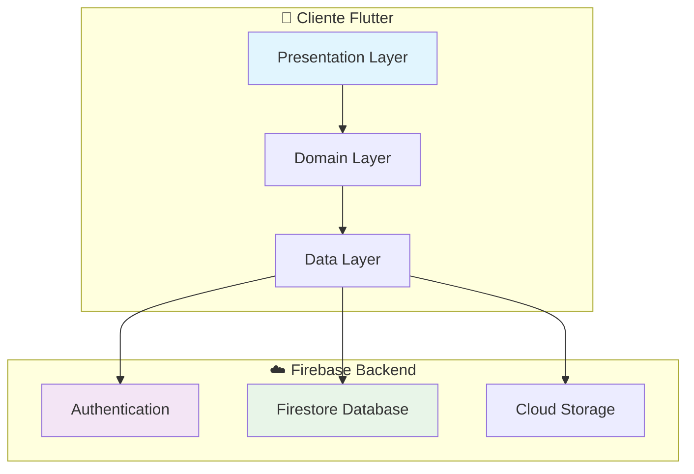
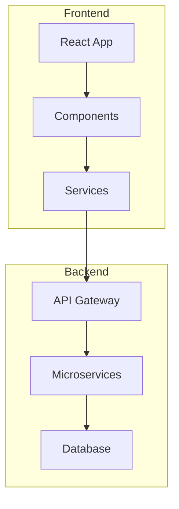
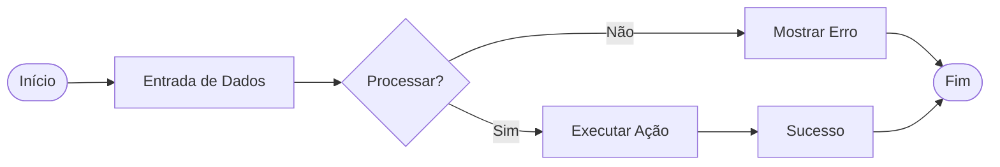

# MermaidFullscreen Component

Componente React para visualização de diagramas Mermaid em tela cheia com funcionalidades de zoom e pan.

## ✨ Funcionalidades

- **🖼️ Tela Cheia**: Visualização expandida do diagrama
- **🔍 Zoom**: Controle de zoom de 30% até 500%
- **🖱️ Pan**: Arrastar para navegar quando com zoom
- **⌨️ Atalhos**: Controles via teclado
- **🌓 Tema**: Suporte automático a modo claro/escuro
- **📱 Responsivo**: Interface otimizada para mobile

## 🚀 Como Usar

### Uso Básico

```tsx
import MermaidFullscreen from '@site/src/components/MermaidFullscreen';

function MyComponent() {
  return (
    <MermaidFullscreen>
      <div className="mermaid">
        {`
        graph TD
            A[Início] --> B[Processo]
            B --> C[Decisão]
            C -->|Sim| D[Ação 1]
            C -->|Não| E[Ação 2]
            D --> F[Fim]
            E --> F
        `}
      </div>
    </MermaidFullscreen>
  );
}
```

### Uso em MDX

```mdx
import MermaidFullscreen from '@site/src/components/MermaidFullscreen';

<MermaidFullscreen>



</MermaidFullscreen>
```

## ⌨️ Controles

### Teclado
- **ESC**: Sair da tela cheia
- **+** ou **=**: Aumentar zoom
- **-** ou **_**: Diminuir zoom
- **0**: Resetar zoom e posição

### Mouse
- **Clique**: Entrar/sair da tela cheia
- **Scroll**: Zoom in/out (apenas em tela cheia)
- **Arrastar**: Mover diagrama (quando zoom > 100%)

### Botões
- **🖼️**: Alternar tela cheia
- **➕**: Zoom in
- **➖**: Zoom out
- **🔄**: Reset
- **❌**: Fechar

## 🎨 Personalização CSS

O componente usa variáveis CSS do Docusaurus para manter consistência com o tema:

```css
/* Personalizações globais */
.mermaid-wrapper {
  border-radius: 12px; /* Bordas mais arredondadas */
}

.fullscreen-controls {
  background: rgba(0, 0, 0, 0.8); /* Fundo mais escuro */
}

/* Dark mode customizado */
[data-theme='dark'] .mermaid-wrapper {
  border-color: #4a5568;
}
```

## 🛠️ Integração no Projeto

### 1. Registrar o Componente

Adicione ao `docusaurus.config.js`:

```js
module.exports = {
  // ... outras configurações

  plugins: [
    // ... outros plugins

    // Registrar componentes globais
    [
      '@docusaurus/plugin-content-docs',
      {
        // ... configurações
        remarkPlugins: [
          // Adicionar suporte a componentes MDX
          require('remark-mdx-images'),
        ],
      },
    ],
  ],

  themeConfig: {
    // ... outras configurações

    // Configurações do Mermaid (se usando @docusaurus/theme-mermaid)
    mermaid: {
      theme: { light: 'neutral', dark: 'dark' },
      options: {
        maxTextSize: 50000,
      },
    },
  },
};
```

### 2. Importação Global (Opcional)

Para uso mais fácil, adicione ao `src/theme/MDXComponents.js`:

```js
import MDXComponents from '@theme-original/MDXComponents';
import MermaidFullscreen from '@site/src/components/MermaidFullscreen';

export default {
  ...MDXComponents,
  MermaidFullscreen,
};
```

Assim você pode usar sem importar:

```mdx
<MermaidFullscreen>
  <!-- Seu diagrama aqui -->
</MermaidFullscreen>
```

## 📱 Responsividade

O componente é totalmente responsivo:

- **Desktop**: Controles completos com tooltips
- **Tablet**: Interface otimizada para touch
- **Mobile**: Botões maiores e melhor acessibilidade

## ♿ Acessibilidade

- **ARIA labels** em todos os botões
- **Suporte a teclado** completo
- **Focus indicators** visíveis
- **Contraste** adequado em ambos os temas
- **Screen reader** friendly

## 🔧 Solução de Problemas

### Diagrama não renderiza
```tsx
// Certifique-se que o Mermaid está carregado
import mermaid from 'mermaid';

useEffect(() => {
  mermaid.initialize({ startOnLoad: true });
}, []);
```

### Tema não muda automaticamente
```tsx
// Verifique se está usando o hook do Docusaurus
import { useColorMode } from '@docusaurus/theme-common';
```

### Zoom não funciona no mobile
```css
/* Adicione ao CSS global */
.fullscreen-overlay {
  touch-action: pan-x pan-y;
}
```

## 📋 Exemplos Práticos

### Diagrama de Arquitetura
```mdx
<MermaidFullscreen>



</MermaidFullscreen>
```

### Fluxograma de Processo
```mdx
<MermaidFullscreen>



</MermaidFullscreen>
```

---

## 🎯 Casos de Uso Ideais

- **Documentação técnica** com diagramas complexos
- **Arquiteturas de software** detalhadas
- **Fluxogramas de processo** extensos
- **Diagramas ER** de banco de dados
- **Mapas mentais** e organigramas

O componente **MermaidFullscreen** transforma qualquer diagrama em uma experiência de visualização profissional! 🚀
